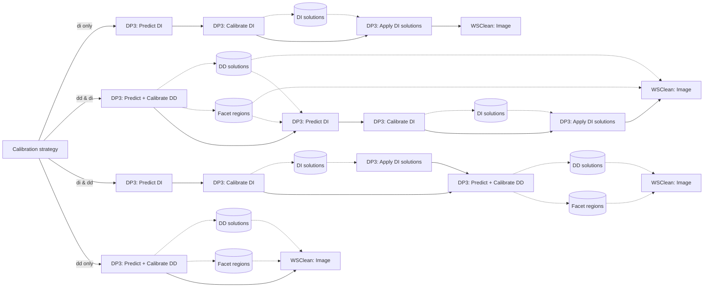

```mermaid

flowchart LR
    C["Calibration strategy"] 
    C -- di only --> predict_DI["DP3: Predict DI"] --> DI["DP3: Calibrate DI"]
    C -- dd & di --> DD1["DP3: Predict + Calibrate DD"]
    C -- di & dd --> predict_DI1["DP3: Predict DI"] --> DI1["DP3: Calibrate DI"]

    C -- dd only --> DD["DP3: Predict + Calibrate DD"]

    DI1 -.-> DI1_solutions[("DI solutions")]
    DI1 --> DD2["DP3: Predict + Calibrate DD"]
    DD2 -.-> DD2_solutions[("DD solutions")] & facets_DD2[("Facet regions")] -.-> img_DD2
    DI1_solutions -.-> apply_DI1["DP3: Apply DI solutions"] 
    DD2 & apply_DI1
    apply_DI1 --> DD2

    DI -.-> DI_solutions[("DI solutions")] .-> apply_DI["DP3: Apply DI solutions"] 
    DI --> apply_DI --> img_DI

    DD -.-> DD_solutions[("DD solutions")] & facets_DD[("Facet regions")] -.-> img_DD
    DD --> img_DD

    DD1 -.-> DD1_solutions[("DD solutions")] & facets_DD1[("Facet regions")]
    DD1 --> predict_DI2["DP3: Predict DI"] --> DI2["DP3: Calibrate DI"]
    DI2 -.-> DI2_solutions[("DI solutions")] -.-> apply_DI2["DP3: Apply DI solutions"] 
    DI2 --> apply_DI2 --> img_DI2
    

    facets_DD1 &  DD1_solutions -.-> img_DI2
    facets_DD1 &  DD1_solutions -.-> predict_DI2

    img_DD["WSClean: Image"]
    img_DI["WSClean: Image"]
    img_DI2["WSClean: Image"]
    img_DD2["WSClean: Image"]

```