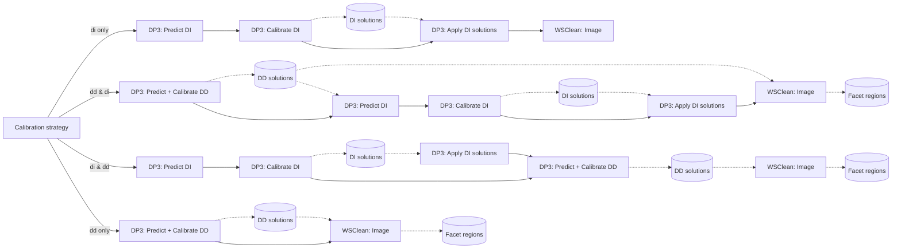

# Calibration Strategy

Calibration produces h5parm solution products. The image flow owns per-sector
WSClean facet-region generation for imaging. Calibration-side image-based
prediction and screen generation use a separate field-level region file inside
the calibration flow when those branches are enabled.

## Which Solutions Are Applied When

Calibration pre-application and imaging applycal use similar DP3 tokens, but
they are different stages:

- DI-only calibration produces a scalar DI h5parm for later prediction or
  imaging. If the DI strategy includes fast and medium phase solves,
  `combine_h5parms.py` combines them with `p1p2_scalar` into
  `di-solutions.h5`. That combined product has one `phase000` soltab.
- DI-then-DD calibration pre-applies `di-solutions.h5` before the DD solve.
  DP3 receives `applycal.steps=[fastphase]` for the scalar phase product
  because `fastphase` is the applycal step wired to the selected `phase000`
  soltab. Medium phase is already included in the combined scalar h5parm; it is
  not passed as a separate DD pre-apply step.
- DD-only calibration solves directly against the DD model without a DI
  pre-apply product. DD products are collected and combined for later
  prediction or imaging.
- Imaging preparation applies final calibration products to imaging
  visibilities. This stage can use explicit `mediumphase` steps when a separate
  medium-phase product is selected, because it is no longer the DD calibration
  pre-apply path.

