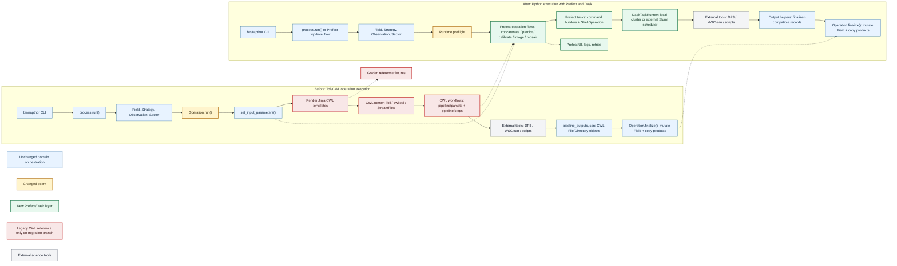

# Rapthor Prefect and Dask Migration Plan

This document outlines a staged plan for migrating Rapthor from Toil/CWL-based
operation execution to pure Python orchestration using Prefect and Dask. It is
based on a review of this repository, the prototype in
`../ska-sdp-rapthor-prefect-prototype`, and the Prefect-based pipeline in
`../ska-sdp-cimg`.

## Goals

- Replace CWL workflow templates and Toil/CWL runner execution with Python
  flows and tasks.
- Preserve Rapthor's science-facing behaviour, parset contract, output
  locations, restart semantics, and operation ordering during the migration.
- Use Prefect for workflow orchestration, observability, retries, and failure
  reporting.
- Use Dask for local and multi-node task execution, especially operation-level
  scatter over observations, sectors, image types, and calibration chunks.
- Keep migration incremental on the migration branch so each operation can be
  ported and tested against CWL-derived reference fixtures before the final
  cutover.

## Non-Goals For The First Migration

- Rewriting the scientific algorithms implemented by DP3, WSClean, EveryBeam,
  IDG, LoSoTo, PyBDSF, or Rapthor scripts.
- Replacing external command-line tools with native Python implementations.
- Changing user-facing strategy semantics or parset parameter names unless
  required by the Prefect/Dask implementation and documented with compatibility
  handling.
- Shipping a user-visible mixed-backend transition. The migration branch will not
  be merged to `master` until the Prefect/Dask implementation is complete.

## Branch Strategy

This migration will happen on a branch that remains separate from `master` until
it is complete. That simplifies the plan:

- `master` can continue to provide the current Toil/CWL implementation while the
  branch is in progress.
- The migration branch does not need to expose a public `cwl` versus `prefect`
  backend selector.
- The branch does not need to support mixed-backend production runs.
- CWL can remain on the branch only as an internal reference for generating
  parity fixtures and diagnosing regressions.
- Before the branch is merged, CWL runner code, CWL package data, Toil,
  StreamFlow, and cwltool should be removed from the production path.

The final merge should therefore present a single supported execution path:
Python orchestration with Prefect and Dask.

## Current Architecture Summary

Rapthor already has Python orchestration at the top level:

- `rapthor/process.py` reads the parset, creates a `Field`, chooses the
  strategy, chunks observations, and runs operation objects in science order.
- Operation classes under `rapthor/operations/` collect parameters from
  `Field`, `Sector`, and `Observation`, render Jinja CWL workflow templates,
  execute the selected CWL runner, parse CWL-shaped outputs, then mutate the
  shared `Field` in `finalize()`.
- CWL-specific code is concentrated in:
  - `rapthor/lib/operation.py`
  - `rapthor/lib/cwl.py`
  - `rapthor/lib/cwlrunner.py`
  - `rapthor/pipeline/parsets/**`
  - `rapthor/pipeline/steps/**`
- The strongest migration seam is the operation contract:
  `set_input_parameters() -> execute workflow -> outputs -> finalize()`.

The initial migration should keep `process.py` and the operation finalizers
mostly stable while swapping the execution engine under each operation.

## Architecture Diagram



## Lessons From The Prefect Prototype

The prototype demonstrates several useful patterns:

- Use `@flow` for top-level and major-cycle orchestration.
- Use `@task` for command-line work such as DP3 and WSClean.
- Use `prefect_shell.ShellOperation` for streamed command execution.
- Use `prefect_dask.DaskTaskRunner` locally or connect to an externally started
  Dask scheduler for Slurm runs.
- For multi-node Slurm, allocate nodes once, start a Dask scheduler and workers
  inside the allocation, export `DASK_SCHEDULER`, and let Prefect submit tasks
  to that cluster.

The prototype is intentionally small and should not be copied verbatim for
Rapthor's command construction. Rapthor should build commands from existing
operation inputs and CWL step definitions, then test those builders directly.

## Lessons From ska-sdp-cimg

The CIMG repository provides the cleaner production pattern:

- Use Pydantic models to make runtime configuration explicit.
- Keep command builders as ordinary pure Python functions.
- Wrap command builders in small Prefect tasks.
- Mock `prefect_shell.ShellOperation.run` in unit tests.
- Use `prefect.testing.utilities.prefect_test_harness` for flow tests.
- Keep integration tests separate and marked.
- Provide Slurm scripts for both simple production execution and development
  runs with a Prefect UI.

Rapthor should borrow this structure, but retain its existing parset and domain
model rather than replacing them up front.

## Target Architecture

Introduce a new execution layer, for example:

```text
rapthor/execution/
  __init__.py
  capabilities.py
  config.py
  outputs.py
  resources.py
  runtime.py
  shell.py
  task_runner.py
  workdirs.py
  tasks/
    dp3.py
    wsclean.py
    scripts.py
    filesystem.py
  flows/
    concatenate.py
    predict.py
    calibrate.py
    image.py
    mosaic.py
```

Recommended responsibilities:

- `capabilities.py`: runtime and feature preflight checks for strategy,
  cluster/runtime, container, and external-tool availability.
- `config.py`: runtime execution settings derived from the existing parset.
- `outputs.py`: helpers for file and directory output records. Initially these
  can preserve the current finalizer-compatible `{"class": "File", "path": ...}`
  and `{"class": "Directory", "path": ...}` structures.
- `resources.py`: per-task CPU, memory, thread, MPI, and concurrency settings.
- `runtime.py`: command environment construction, container wrapping, module or
  spack assumptions, and scratch-directory mapping.
- `shell.py`: safe command execution helpers, logging, environment handling,
  and optional dry-run support for tests.
- `task_runner.py`: Dask task runner construction for local and externally
  managed Slurm clusters.
- `workdirs.py`: deterministic task-local working directories, temp paths,
  atomic output helpers, and cleanup policy.
- `tasks/`: Prefect task wrappers around command builders and file operations.
- `flows/`: Python equivalents of current operation-level CWL DAGs.

The operation classes should stop calling `create_cwl_runner()` and instead
invoke the relevant Python flow, either directly or through a small flow
dispatcher. A generic dual-backend abstraction is not needed because the branch
will merge only after the Prefect/Dask path is complete.

## Execution Configuration

Do not add a user-facing `execution_backend` option. Before this branch merges,
Rapthor should have one production execution path: Prefect/Dask.

New optional settings may be needed under `[cluster]` or a dedicated execution
section:

- `prefect_task_runner = local_dask|external_dask|sync`
- `dask_scheduler = None`
- `prefect_stream_output = True`
- `prefect_retries = 0`
- `prefect_log_commands = True`

Prefer conservative defaults that preserve single-machine behaviour. Existing
`cwl_runner` and CWL-specific container options can stay on the branch while they
are still useful for reference runs, but they should be removed or replaced
before the final merge.

Every operation-level Prefect flow must actually consume this configuration.
Do not treat `ExecutionConfig.task_runner` as metadata only: flow entry points
should construct the configured runner with `build_task_runner()` and execute
with that runner. Scattered independent work, for example calibration solve
chunks, prediction sectors, imaging sectors, mosaic image types, and
concatenation epochs, should be submitted as Prefect task futures so Dask can
run them concurrently. Downstream collection, combination, plotting, and
finalizer-compatible result assembly must wait on the required futures before
starting.

## Replacement Policy

Because the migration branch is not merged until complete, Rapthor does not need
to carry production compatibility code for partially ported operations:

- Implement operation flows incrementally on the branch.
- Test each flow directly before it is wired into the main pipeline.
- Keep CWL only as a reference source for fixtures and comparison while parity is
  being established.
- Make one final cutover that replaces the CWL runner path with Prefect/Dask for
  the whole supported pipeline.
- Delete the CWL production path before merge, rather than deprecating it after
  merge.

## Cutover Decisions

The following decisions are accepted for the final migration shape:

- Keep `process.run()` as the CLI-compatible entry point. At cutover it should
  become a thin wrapper around the Prefect top-level flow rather than a parallel
  orchestration implementation.
- Keep operation classes through the cutover as adapters that gather operation
  inputs, call the matching Prefect flow, persist finalizer-compatible output
  records, and run existing `finalize()` logic. Replace operation classes only
  later if there is a clear reason.
- Treat each operation as a Prefect subflow from the top-level process flow.
  Use Dask-distributed Prefect tasks inside those subflows for the smallest
  scientifically safe work units, such as calibration chunks, prediction
  sectors, imaging sectors, mosaic image types, and independent h5parm
  collection or plotting work.
- Do not pass live `Field`, `Sector`, or `Observation` instances into
  Prefect/Dask tasks. Operation flows may be called from driver-side operation
  objects, but worker tasks must receive serializable payloads before real
  distributed execution is enabled.
- Make preflight strict before the final merge. The first supported feature
  matrix must explicitly cover or reject DI/DD strategy combinations,
  image-based predict, full Jones, hybrid screens, normalization, QUV, image
  cubes, compression, MPI WSClean, restart, and the supported runtime/container
  modes.
- Define task granularity and resource ownership before Slurm work: calibration
  solve chunks, prediction sectors, imaging sectors, mosaic image types, and
  h5parm collection/plotting can run through Dask futures, while MPI WSClean
  remains an exclusive task that cannot oversubscribe the same node allocation.
- Keep CWL on the branch as a reference implementation until the explicit
  CWL-to-Prefect equivalence suite passes. Remove CWL production code and
  dependencies in one cleanup phase after that gate.
- Treat the CWL removal gate as: golden command parity, output-contract parity,
  finalizer-state parity, mocked process-flow tests, and focused real
  integration parity all pass for the supported feature matrix.

## Capability Preflight

The final Prefect/Dask pipeline still needs an explicit preflight step, but it no
longer needs to model "ported" versus "unported" operations for users. The
preflight should answer questions such as:

- Is this strategy within the feature set supported by the completed migration?
- Is the requested runtime available, for example local Dask, external Dask,
  Slurm, MPI WSClean, container execution, or no-container execution?
- Are required external tools and scripts discoverable before the run starts?
- Are resource settings valid for the selected local or Slurm allocation?

The execution layer should expose an interface equivalent to:

```text
preflight_execution(field, strategy_steps, execution_config) -> None
```

Failures should include the unsupported feature name and a short message that
tells the user which parset option, strategy feature, runtime setting, or missing
tool caused the failure. Full pipeline runs must run this preflight before the
first operation.

## Flow And Task Boundary

Rapthor should use Prefect subflows at operation boundaries and Prefect tasks
inside those operation subflows for distributed work:

```text
process_flow
  -> calibrate_flow(...)      # operation subflow
       -> ddecal_chunk_task.map(...)
       -> collect_h5parms_task(...)
       -> plot_solutions_task.map(...)
  -> image_flow(...)          # operation subflow
       -> image_sector_task.map(...)
       -> diagnostics_task.map(...)
  -> mosaic_flow(...)         # operation subflow
       -> mosaic_image_type_task.map(...)
```

Do not make a whole operation a single Prefect task. That would hide the
operation's internal DAG from Prefect, weaken failure attribution and logging,
and make it easier to serialize live domain objects into Dask workers. Operation
subflows should organize, name, observe, and assemble the work; tasks should be
the actual distributable units.

Parallelism should live at the smallest scientifically safe work unit:

- calibration solve chunks
- observations or epochs for concatenation
- sectors for prediction and imaging
- image products and image types for mosaicking
- h5parm collection, plotting, and post-processing steps where independent
- compression, catalog, diagnostic, and filesystem materialization tasks where
  independent

MPI WSClean remains a controlled special case with exclusive resource ownership
inside the relevant operation subflow.

## Task Payload And State Boundary

Prefect and Dask tasks should not receive or mutate live `Field`, `Sector`, or
`Observation` objects. Those objects remain part of the driver-side Rapthor
domain model.

The boundary should be:

- Operation classes collect Python-native input dictionaries from the domain
  model.
- Prefect flows and tasks receive only serializable payloads: paths, strings,
  numbers, booleans, lists, dicts, and output specifications.
- External tasks produce output records and files, not mutated domain objects.
- Existing operation finalizers remain responsible for applying output records
  back to `Field`, `Sector`, and `Observation` state.

This keeps distributed workers from accidentally mutating state in another
process and makes task inputs easier to test, serialize, log, and cache.

## Runtime, Resources, And Filesystem Safety

The Prefect/Dask execution layer must preserve the important runtime behaviour
currently handled by CWL runners:

- Container settings: `use_container`, `container_type`, and no-container
  execution must have an explicit Prefect runtime mapping before those
  configurations are supported.
- Environment settings: command environments, module or spack assumptions,
  thread variables such as `OPENBLAS_NUM_THREADS`, and preserved environment
  variables must be centralized and testable.
- Scratch settings: `dir_local`, `local_scratch_dir`, and `global_scratch_dir`
  must map to deterministic task-local temporary directories.
- Task isolation: scattered tasks must write into unique working directories or
  unique output names so concurrent Dask execution cannot collide.
- Atomicity: tasks should write to temporary paths and move into final output
  paths where practical, especially for JSON outputs and small generated files.
- Resource control: DP3, WSClean, scripts, and MPI jobs need declared CPU,
  memory, thread, and concurrency limits. Dask worker count alone is not enough.
- MPI exclusivity: MPI WSClean should remain a controlled special case so it
  does not run concurrently with tasks that consume the same node allocation.

## Restart And Output Semantics

Preserve the existing operation-level restart contract:

- Each operation keeps a working directory under `dir_working/pipelines/<op>`.
- Each operation writes `.done` when completed.
- Each operation writes `.outputs.json`.
- On restart, a completed operation loads `.outputs.json` and skips execution.
- Finalizers continue to copy or move products into `images`, `solutions`,
  `skymodels`, `plots`, `regions`, and `visibilities`.

Within a Prefect operation flow, retries and partial task caching can be added
later. The first implementation should keep operation-level restart behaviour
simple and compatible with current `modifystate` expectations.

## Staged Implementation

### Stage 0: Baseline And Design Guardrails

- Record current non-integration and focused integration test results.
- Identify the operation and feature matrix that must be complete before the
  migration branch can merge.
- Add a short developer document describing the execution-layer shape and output
  object contract.
- Record the branch policy: no public mixed-backend transition and no merge to
  `master` until the Prefect/Dask path is complete.
- Define the serializable task-payload contract and the rule that Prefect/Dask
  tasks do not mutate live Rapthor domain objects.
- Inventory current CWL runner runtime behaviour: containers, scratch paths,
  preserved environment, MPI configuration, temporary output directories, and
  logging.
- Define a resource model for external commands: per-task threads, memory,
  process count, MPI exclusivity, and maximum concurrent external jobs.
- Capture representative CWL-generated command lines and output contracts that
  will become golden parity fixtures for the Python path.
- Keep CWL available on the branch only as a reference source.

Deliverables:

- Baseline test snapshot.
- Execution-layer design notes.
- Initial issue list for feature gaps.
- Preflight design and required feature matrix.
- Runtime parity inventory for container, scratch, environment, and MPI
  behaviour.
- Resource model notes and first-pass concurrency defaults.
- Golden command fixtures for common DP3, WSClean, script, `taql`, `fpack`, and
  MPI WSClean cases.
- Golden output-contract fixtures for each operation's expected output keys,
  nested shapes, filenames, optional outputs, and finalizer state changes.

### Stage 1: Add Execution Layer Skeleton

Status: partially complete. PR 1 added the dependency-free execution skeleton,
preflight checks, finalizer-compatible output records, initial concatenate
reference fixtures, package metadata, and focused tests. The production runner is
unchanged.

- Add the `rapthor/execution/` package without changing the production runner
  yet.
- Add execution config models or helpers for Prefect, Dask, Slurm, resources,
  runtime environment, and logging.
- Add the preflight interface for runtime, feature, tool, and resource checks.
- Add output-record helpers that match the current finalizer contract.
- Add a flow dispatcher or naming convention that maps operation classes to
  operation flows.
- Keep `Operation.run()` on the CWL path until all required operation flows have
  been ported and tested directly.

Remaining Stage 1 work:

- Add the operation-flow dispatcher or naming convention once the first concrete
  operation flow exists.
- Expand preflight inputs from simple feature/tool lists to strategy-derived
  feature checks.
- Decide whether execution config should be backed by Pydantic before command
  builders and task payload models are added.

Tests:

- Unit tests for execution config parsing and conservative defaults.
- Unit tests for output-record helpers.
- Preflight tests for unsupported strategy features, missing external tools,
  unsupported container settings, invalid resources, and unsupported runtime
  modes.
- Tests that the operation-flow dispatcher can find implemented flows and fails
  clearly for branch-internal missing flows.

PR 1 verification:

- `python3 -m pytest tests/execution tests/lib/test_parset.py` in the
  devcontainer: 52 passed.
- `python3 -m ruff check rapthor/execution tests/execution pyproject.toml` in the
  devcontainer: passed.
- `python3 -m ruff format --check rapthor/execution tests/execution` in the
  devcontainer: passed.
- `git diff --check`: passed.

### Stage 2: Shared Command And Output Primitives

Status: partially complete. PR 2 added import-safe task primitives for command
normalization, shell execution, task-runner construction, runtime environment,
work directories, resource requests, and serializable payload validation. The
helpers can still be tested with injected fakes for shell execution and Dask task
runner construction, but Prefect/Dask are now core dependencies and operation
flows can use Prefect decorators directly.

- Add command-builder functions for common tool classes:
  - DP3
  - WSClean serial
  - WSClean MPI
  - Rapthor Python scripts
  - `taql`
  - `fpack`
- Add Prefect shell task wrappers for those builders.
- Add output helpers that create and validate finalizer-compatible output
  records.
- Add task runner creation based on local Dask or external scheduler address.
- Add an early, mocked top-level Prefect flow skeleton that mirrors
  `process.run()` ordering without yet replacing the production operation runner.
- Add serializable task-payload models or validators for operation inputs.
- Add runtime environment builders for no-container execution first, with
  explicit unsupported errors for unimplemented container modes.
- Add workdir helpers for per-task directories, temp files, atomic moves, and
  cleanup.
- Add resource-setting helpers for command threads, memory, MPI exclusivity, and
  maximum external-job concurrency.

Remaining Stage 2 work:

- Add real DP3, WSClean, script, `taql`, `fpack`, and MPI WSClean command
  builders.
- Add actual Prefect `@task` wrappers now that Prefect/Dask dependencies are core.
- Expand golden command fixtures beyond the initial concatenate reference case.

Tests:

- Pure unit tests for command builders.
- Golden command parity tests comparing Python command builders against
  representative CWL-generated command lines.
- Shell task tests that mock `ShellOperation.run`.
- Output helper tests for files, directories, nested lists, missing outputs, and
  JSON serialization.
- Flow tests using `prefect_test_harness` and mocked shell execution.
- Top-level flow skeleton tests for strategy ordering, cycle numbering,
  final-pass decisions, and selfcal convergence branching with mocked
  operations.
- Serialization tests proving task payloads contain only serializable values and
  do not carry live `Field`, `Sector`, or `Observation` instances.
- Runtime tests for environment construction, scratch directory selection,
  unsupported container settings, and atomic output writes.
- Resource tests for command thread counts, memory settings, MPI exclusivity,
  and external-job concurrency limits.

PR 2 verification:

- `python3 -m pytest tests/execution tests/lib/test_parset.py` in the
  devcontainer: 81 passed.
- `python3 -m ruff check rapthor/execution tests/execution pyproject.toml` in the
  devcontainer: passed.
- `python3 -m ruff format --check rapthor/execution tests/execution` in the
  devcontainer: passed.
- `git diff --check`: passed.

### Stage 3: Port Concatenate

This is the smallest operation and should be the first real flow parity target.

Status: complete for direct flow parity in PR 3, and operation-run cutover is
complete for Concatenate in PR 27. The Concatenate operation now has a
finalizer-compatible Python flow, a Prefect task entry point, command parity
coverage, output-shape validation, missing-output failure coverage, mocked
Prefect flow tests, and operation-level restart coverage.

- Translate `concatenate_pipeline.cwl` into a Python flow that scatters
  `concat_ms.py` or equivalent `taql` calls over epochs.
- Reuse `Concatenate.set_input_parameters()` and `Concatenate.finalize()`.
- Return `concatenated_filenames` using the same output shape consumed by the
  current finalizer.

Tests:

- Added direct flow and task-wrapper tests for command execution with mocked
  `ShellOperation`.
- Added command parity coverage for frequency concatenation against the
  CWL-derived fixture.
- Added output-contract and finalizer-state coverage proving
  `Concatenate.finalize()` accepts Prefect-produced records.
- Added payload validation for mismatched inputs, non-basename outputs, and
  duplicate output paths.
- Added failure coverage for shell failures and missing expected output
  directories.

Remaining Stage 3 work before final cutover:

- Add a real lightweight concatenate integration test if suitable Measurement
  Set fixtures and `concat_ms.py` dependencies are available in CI.

### Stage 4: Port Mosaic

Mosaic has manageable scatter and mostly calls Rapthor scripts.

Status: complete for direct flow parity in PR 4, and operation-run cutover is
complete for Mosaic in PR 28. The Mosaic operation now has a
finalizer-compatible Python flow, command builders for the script steps and
optional compression, payload validation, mocked Prefect flow coverage,
skip-processing coverage, compressed-output coverage, finalizer-state coverage,
and operation-level restart coverage.

- Translate `mosaic_pipeline.cwl` and `mosaic_type_pipeline.cwl`.
- Preserve `skip_processing` behaviour for single-sector imaging.
- Preserve optional compression.
- Keep output filenames identical.

Tests:

- Added command-builder and golden command parity tests for
  `make_mosaic_template.py`, `regrid_image.py`, `make_mosaic.py`, and `fpack`.
- Added payload serialization and validation tests for multi-sector mosaic
  inputs and single-sector skip processing.
- Added direct runner and Prefect harness tests with mocked shell execution.
- Added output-contract coverage for normal and compressed mosaic outputs.
- Added finalizer-state coverage proving `Mosaic.finalize()` accepts
  Prefect-produced records and copies field images into the expected location.
- Added failure coverage for missing expected mosaic outputs.

Remaining Stage 4 work before final cutover:

- Replace or rework the currently placeholder `tests/operations/test_mosaic.py`
  cases when the production runner is cut over.
- Add a real image-to-mosaic integration test on the Prefect path once the Image
  flow is ported or suitable lightweight FITS fixtures are available.

### Stage 5: Port Predict

Predict introduces DP3 scatter and model subtraction.

Status: complete for direct flow parity on the migration branch, and
operation-run cutover is complete for Predict in PR 29.

- Translate `predict_di_pipeline.cwl`, `predict_pipeline.cwl`, and any
  non-calibrating predict variant that is still active.
- Split command construction from task submission:
  - predict model data per sector/observation
  - add sector models for DI prediction
  - subtract sector models for DD prediction
- Preserve handling of DD, DI, peeling, reweighting, and h5parm selection.

Tests:

- Added unit tests for DI and DD command construction.
- Added golden command parity tests for `predict_model_data`, `add_sector_models`,
  and `subtract_sector_models`.
- Added tests for scatter length, output shape, DI nested outputs, DD peeling
  outputs, and reweighting command flags.
- Added field mutation coverage around `Predict.finalize()`.
- Added mocked DP3/add/subtract execution tests using the Prefect test harness.
- Added failure tests for missing predicted model data, missing post-processing
  outputs, and shell failures.
- Added output filtering so DD collection does not accidentally treat
  intermediate `_modeldata` directories as final subtraction outputs when the
  Python flow uses a shared operation working directory.
- Added operation-run coverage for DI prediction, DI restart reuse, and DD
  subtract-model prediction through the Prefect path.

Remaining Stage 5 work before final cutover:

- Add real lightweight script or Measurement Set coverage for
  `add_sector_models.py` and `subtract_sector_models.py` if suitable fixtures are
  available in CI.
- Revisit task-local working directories when the final Dask execution layout is
  introduced; the current direct-flow parity path preserves output contracts by
  filtering intermediates.

### Stage 6: Port Imaging Incrementally

Image is the largest migration target. Do it by feature slice rather than all
at once.

Status: serial no-DDE, facet, screen, cube, normalization, clean-disabled,
full-Stokes, and MPI WSClean image-flow slices are complete for direct-flow
parity on the migration branch. Real external-tool imaging coverage remains
outstanding.

Suggested slices:

1. Initial image and no-DDE Stokes I imaging.
2. Prepare imaging data with DP3 and time concatenation.
3. WSClean serial no-DDE imaging.
4. Mask generation and source filtering.
5. Facet imaging with h5parm and region file generation.
6. Normalization imaging.
7. Image cubes.
8. Full-Stokes imaging.
9. Screen/hybrid imaging.
10. MPI WSClean.

Keep `Image.set_input_parameters()` as the source of truth initially. The Python
flow should consume `input_parms` and emit the same output keys currently parsed
from CWL.

Tests:

- Added command-builder tests for the no-DDE Stokes-I slice:
  `prepare_imaging_data`, time concatenation, mask creation, serial WSClean,
  beam checking, filtering, and diagnostics.
- Added golden command parity tests for no-DDE prepare, concatenate, blank mask,
  and WSClean commands.
- Added a mocked no-DDE flow test covering DP3 prepare, time concatenation,
  `blank_image.py`, WSClean, beam checks, `filter_skymodel.py`, and
  `calculate_image_diagnostics.py`.
- Added `ImageInitial.finalize()` coverage against Prefect-produced no-DDE
  output records.
- Added output-contract fixtures for no-DDE Stokes-I images, skymodels,
  visibilities, masks, diagnostics, offsets, and plots.
- Added serial full-Stokes WSClean command-builder coverage for joined and
  linked polarization modes.
- Added direct-flow tests for full-Stokes no-DDE imaging, Q/U/V output discovery,
  full-Stokes image cubes, and finalizer-compatible full-Stokes outputs.
- Added MPI WSClean command-builder coverage for no-DDE, facet, and screen
  imaging.
- Added mocked direct-flow tests for MPI no-DDE, facet, and screen imaging,
  including launcher arguments, per-task thread environment, and the MPI facet
  argument differences from serial WSClean.
- Rework relevant `tests/operations/test_image.py` cases around command builders,
  flow structure, and finalizer-compatible output records.
- Replace CWL-specific rendered-template assertions with command-builder and
  flow-structure assertions for the Prefect/Dask path.
- Added output-contract fixtures for optional masks, cubes, filtered model
  images, compressed FITS files, region files, and full-Stokes products.
- Restart/failure tests for failed WSClean, missing diagnostics JSON, corrupt
  diagnostics JSON, failed finalizer copy, and rerun after deleting `.done`.
- Filesystem isolation tests for image cubes, compressed outputs, and later
  multi-process/MPI imaging paths.

### Stage 7: Port Calibration Incrementally

Calibration is the other high-risk area because it includes solve planning,
conditional branches, h5parm collection, plotting, combination, and source
adjustment.

Status: DI full-Jones, DI scalar-phase, DD fast-phase, DD medium-phase, DD
slow-gain, DD source-adjustment, pre-application, image-based prediction, and
IDG/screen-generation slices are complete for mocked execution, and solve chunks
are submitted as explicit Prefect futures so Dask can parallelise them. Later
h5parm post-processing, restart/failure coverage, CWL-to-Prefect equivalence,
and real external-tool calibration coverage remain outstanding.

Suggested slices:

1. DI full-Jones calibration. Complete.
2. DI scalar phase calibration. Complete.
3. DD fast phase calibration without image-based prediction. Complete.
4. DD medium phase and slow gains. Complete.
5. DD source adjustment and facet-region contract. Complete.
6. Pre-application of DI solutions before DD solves. Complete.
7. DD image-based prediction. Complete.
8. IDG/screen generation. Complete for mocked execution.
9. Plotting and h5parm post-processing.

Reuse the existing solve planner in `rapthor/operations/calibrate.py`.

Map `CALIBRATION_STRATEGY.md` to explicit acceptance paths before calibration
cutover: DI-only, DD-only, DI-then-DD, and DD-then-DI. Preserve the hand-offs
shown in that strategy: DI solutions can be applied before DD calibration, DD
solutions can be reused by later prediction or imaging, and DD facet-region
artifacts have an explicit owner and consumer.

Continue using the configured Prefect task runner and explicit Prefect futures
for calibration solve scatter. The collection step must depend on all solve
futures and should not start until every chunk has produced its h5parm output.

Tests:

- Added DI full-Jones DDECal, h5parm collection, and plot command-builder tests.
- Added a DI full-Jones golden command fixture and output-contract fixture.
- Added serializable payload tests for DI full-Jones operation inputs.
- Added mocked direct-flow and Prefect harness tests for DI full-Jones solve
  scatter, h5parm collection, phase plotting, output records, and missing solve
  output failure.
- Added DI scalar-phase DDECal and h5parm combination command-builder tests.
- Added DI scalar-phase golden command and output-contract fixtures.
- Added serializable payload tests for the two-solve DI scalar-phase shape,
  including per-chunk solve1/solve2 metadata.
- Added mocked direct-flow tests for DI scalar-phase solve scatter, fast/medium
  h5parm collection, phase plotting, combination, and final output records.
- Added DD fast-phase DDECal command-builder parity, output-contract,
  serializable payload, mocked flow, and unsupported-slice tests.
- Added DD fast+medium DDECal command-builder parity, output-contract,
  serializable payload, mocked flow, and h5parm combination tests.
- Added DD slow-gain flow coverage for solve3/solve4 sequencing, slow-gain
  processing, slow phase/amplitude plotting, medium2 collection/plotting, and
  final h5parm combination, including the solve3-only `p1a2` combination path.
- Added `process_gains.py` command-builder coverage and fixture parity for
  slow-gain normalization, smoothing, flagging, maximum station delta, scaled
  deltas, and phase-centre options.
- Added `adjust_h5parm_sources.py` command-builder coverage, fixture parity,
  multi-direction DD flow coverage, and single-direction skip coverage.
- Added `idgcal_solve_phase`, `idgcal_solve_phase_and_gain`, and
  `collect_screen_h5parms.py` command-builder coverage and fixture parity.
- Added serializable payload, mocked direct-flow, Prefect harness, and
  operation-run coverage for DD screen generation, including phase-only and
  phase-plus-slow-gain IDGCal branches.
- Clarified the facet-region ownership contract: image owns per-sector WSClean
  facet-region generation, while calibration-side image-based prediction or
  screen generation owns its field-level region file when those branches are
  ported.
- Added task-runner wiring tests proving `local_dask` and `external_dask`
  configuration is passed to Prefect operation flows.
- Added calibration concurrency-order tests proving all solve chunks are submitted
  before h5parm collection starts, and that collection receives resolved output
  records from every chunk.
- Continue adding command parity and mocked-flow tests for any remaining
  calibration post-processing, restart, and failure branches.
- Existing solve-planner tests remain backend-independent.
- Mocked flow tests for all solve lists supported by `CALIBRATION_STRATEGY.md`.
- Mocked strategy-level tests for DI-only, DD-only, DI-then-DD, and DD-then-DI
  proving the correct solution and region artifacts move between operation
  flows.
- Integration tests for DI-only, DD-only, DI-then-DD, DD-then-DI, and screen
  generation using the Prefect/Dask flow once command execution is available.
- Output-contract and finalizer-state tests for every stable solution product,
  diagnostic product, and plotted product.
- Failure tests for missing h5parm outputs, failed h5parm combination, invalid
  solution tables, failed plotting, and restart after partial calibration output.
- Resource and isolation tests for scattered solve chunks, h5parm collection,
  plotting outputs, and screen-generation outputs.

### Stage 8: Cut Over To The Prefect Top-Level Flow

After the early mocked skeleton is in place and all required operation-level
Prefect flows are working, make the top-level Prefect flow executable for real
runs and route the CLI through it.

Status: started. `rapthor.execution.flows.process` now mirrors both
`process.run_steps()` operation ordering and the mocked `process.run()` lifecycle
with injectable operation constructors, lifecycle hooks, and process-level
preflight. `process.run()` remains the CLI-compatible legacy entry point while
the Prefect top-level flow stays available side-by-side for equivalence checks
against the CWL-era orchestration baseline. The branch-internal operation-adapter
path is active for Concatenate, Mosaic, Predict, Image, and Calibrate:
`Operation.run()` has an overridable workflow execution hook, and ported
operations use it to invoke Prefect flows while preserving `.done`,
`.outputs.json`, input JSON, and finalizer semantics.

- Keep `process.run()` as the legacy CLI entry point until the Prefect top-level
  flow has passed equivalence checks against the CWL baseline.
- Add `rapthor.execution.flows.process` with a Prefect flow that mirrors current
  `process.run_steps()` sequencing and the mocked `process.run()` lifecycle.
  Initial skeleton complete for parset loading, logging setup, concatenation,
  strategy setup, validation, initial sky-model generation, chunking,
  selfcal/final cycle orchestration, repeated final cycles, and report
  generation. Initial process-level preflight is wired before the first
  operation runs. Remaining work is real operation-flow cutover and the final
  supported feature matrix.
- Run operation flows as subflows from the top-level process flow. Use
  Dask-distributed tasks inside each operation subflow for the smallest safe
  parallel work units.
- Continue to respect selfcal convergence checks between cycles.
- Encode the four calibration strategy paths from `CALIBRATION_STRATEGY.md` in
  top-level orchestration tests: DI-only, DD-only, DI-then-DD, and DD-then-DI.
  Initial `run_process_steps()` and Prefect-harness coverage complete.
- Verify top-level data hand-offs explicitly: DI calibration products feed DD
  pre-apply, DD calibration products feed later prediction or imaging, and the
  agreed facet-region artifact is available to its consumer. Initial mocked
  hand-off coverage complete for the four strategy paths.
- Continue replacing any remaining operation execution branches with Python
  flows by overriding the workflow execution hook in each operation adapter.
- Remove branch-only CWL references from production execution code.

Tests:

- Mock operation classes and verify ordering through the Prefect top-level flow.
  Initial strategy-ordering matrix complete.
- Use `prefect_test_harness`.
- Keep current `tests/test_process.py` coverage backend-independent.
- Add full mocked-process tests for initial sky model generation, no-selfcal
  image-only strategy, selfcal convergence, selfcal divergence/failure,
  repeated final cycles, and preflight failure detection. Initial sky model
  generation, no-selfcal image-only execution, repeated final cycles, missing
  input-solution failure, and selfcal convergence stop coverage are complete.
- Add full mocked-process tests for DI-only, DD-only, DI-then-DD, and
  DD-then-DI ordering and artifact hand-offs. Initial step-level Prefect coverage
  complete.
- Add preflight tests that inspect the chosen strategy and fail before execution
  when any required operation or feature slice is unsupported. Initial mocked
  preflight coverage is complete.

### Stage 9: Slurm And Multi-Node Execution

Start with the prototype's safer Slurm model:

- Slurm allocation starts one Dask scheduler and one worker per node.
- `DASK_SCHEDULER` is exported.
- Rapthor uses `DaskTaskRunner(address=...)`.
- MPI WSClean remains an explicitly controlled task so it can reserve/process
  nodes without Dask oversubscription.

Add scripts modelled after the prototype and CIMG:

- Simple production Slurm script with an ephemeral Prefect server.
- Development script that reports to a persistent Prefect server.
- Optional benchmark monitor integration if required by the deployment
  environment.

Tests:

- Unit tests for task runner selection.
- Unit tests for `DASK_SCHEDULER` handling, failed scheduler connection,
  local-cluster defaults, thread counts, memory settings, and Slurm node/task
  mapping.
- Command tests for MPI WSClean launch arguments and checks that Dask worker
  counts do not oversubscribe DP3/WSClean thread settings.
- Tests for maximum concurrent external jobs and MPI exclusivity controls.
- Script lint/smoke checks where possible.
- Manual or CI-marked integration tests on the target Slurm environment.

### Stage 10: Final Cleanup And Merge Readiness

Only after Prefect/Dask parity is demonstrated on the migration branch:

- Run the dedicated CWL-to-Prefect equivalence suite and record the passing
  baseline before deleting CWL code or dependencies.
- Remove Toil, StreamFlow, and cwltool dependencies.
- Remove `rapthor/pipeline/parsets/**` and `rapthor/pipeline/steps/**` once no
  tests or docs depend on them.
- Remove `rapthor/lib/cwl.py`, `rapthor/lib/cwlrunner.py`, and any CWL-only
  operation plumbing that is no longer used.
- Remove CWL test utilities only after useful reference fixtures and parity
  expected artifacts have been moved into Prefect/Dask test fixtures.
- Update package data so CWL files are not shipped.
- Run the final non-integration and focused integration suites before merging to
  `master`.

## Migration Completion Issue Backlog

Use these issues in order to finish the CWL-to-Prefect migration. CWL remains
the branch-local reference implementation until the equivalence gate below is
closed. Do not delete CWL runner code, CWL package data, Toil, StreamFlow,
cwltool, CWL-rendering tests, or CWL-derived fixtures before Issue 9 has passed
for the supported merge feature matrix.

For every issue that changes operation execution, run both the new Prefect tests
and the existing CWL-reference tests for the touched operation. Prefect tests are
additive until the equivalence suite proves that the Prefect path produces the
same user-visible results.

### Issue 1: Freeze The Supported Merge Feature Matrix

Status: complete for the initial branch-local supported/deferred matrix and
process-preflight coverage.

Goal: define exactly what must be equivalent before the branch can merge.

Tasks:

- List the supported strategy and feature combinations that must pass before
  cutover: DI-only, DD-only, DI-then-DD, DD-then-DI, normalization, peeling,
  facets, screens, QUV or clean-disabled imaging, image cubes, restart, and the
  selected Slurm/MPI mode.
- Mark explicitly unsupported or deferred combinations and ensure process-level
  preflight rejects them before any external command runs.
- Map each supported combination to one or more small parsets or fixtures that
  can be used by the equivalence suite.
- Record which tests are unit, mocked-flow, focused integration, internet, or
  target-environment Slurm tests.

Done when:

- The feature matrix is documented in the plan or test fixtures.
- Preflight tests cover both supported and unsupported entries.
- Every later equivalence or integration issue can point to a concrete matrix
  entry.

Completed in this issue:

- Added `tests/execution/fixtures/supported_merge_feature_matrix.json` as the
  initial machine-readable merge matrix.
- Recorded supported entries for DI-only, DD-only, DI-then-DD, DD-then-DI,
  DI full-Jones, DD slow-gain, hybrid screens, normalization, peeling,
  full-Stokes clean-disabled imaging, image cubes, shared facet read/write, MPI
  WSClean, and restart.
- Recorded deferred entries for container execution, Slurm external-Dask setup,
  and unknown calibration modes.
- Added process-preflight tests proving supported entries are accepted and
  deferred entries fail with the expected preflight issue codes.
- Added `mpi_wsclean` to process-level feature collection so the supported Image
  MPI slice is visible to the matrix and future equivalence harness.

Remaining follow-up:

- Extend the matrix as Issue 2 introduces concrete equivalence parsets and as
  Issue 7 finalizes the selected Slurm execution mode.
- Keep CWL runnable as the reference path until Issue 9 passes for every
  supported matrix entry.

Verified in the running dev container:

- `python3 -m json.tool tests/execution/fixtures/supported_merge_feature_matrix.json`:
  passed.
- `python3 -m pytest tests/execution/test_process_flow.py -q --tb=short`: 18
  passed, 1 warning.
- `python3 -m ruff check rapthor/execution/flows/process.py
  tests/execution/test_process_flow.py`: passed.
- `python3 -m ruff format --check rapthor/execution/flows/process.py
  tests/execution/test_process_flow.py`: 2 files already formatted.

### Issue 2: Build The CWL-to-Prefect Equivalence Harness

Goal: run the same small parset through the CWL reference path and the
Prefect/Dask path in isolated working directories, then compare the results.

Tasks:

- Add test helpers that create separate CWL and Prefect run directories from the
  same parset and normalize run-specific paths.
- Add a runner API that can invoke the retained CWL path and the side-by-side
  Prefect path without changing the public CLI route.
- Add backend-neutral comparison helpers for operation ordering, `.done`,
  `.outputs.json`, output-record keys and shapes, product basenames, reports,
  logs, and finalizer-visible field state.
- Add numerical comparison helpers for FITS and h5parm products, using
  tolerances only where external-tool nondeterminism requires them.
- Start with one cheap smoke parset before expanding to the full feature matrix.

Done when:

- A first equivalence test can run both backends and report a structured diff.
- Exact comparisons are enforced for naming, output-record shape, operation
  ordering, and restart semantics.
- Numeric comparisons are tolerance-based and documented.

Status: complete for the initial harness slice.

Completed:

- Added `rapthor/execution/equivalence.py` with isolated CWL and Prefect run
  directories, per-backend parset copies, injectable backend runners, and
  default runner adapters for the retained legacy `process.run()` path and the
  side-by-side `process_flow()` path. This does not change the public CLI route.
- Added backend-neutral summary collection for operation ordering, `.done`,
  `.outputs.json` and temporary `pipeline_outputs.json` output records, product
  basenames, diagnostics reports, and finalizer-visible field state snapshots.
- Added structured diff helpers plus `assert_backend_equivalent()` so future
  integration tests can fail with path-specific CWL-vs-Prefect differences.
- Added FITS and h5parm numeric comparison helpers with explicit `rtol`/`atol`
  tolerances. The h5parm helper imports `h5py` lazily so the harness can still
  run in minimal environments.
- Added `tests/execution/test_equivalence.py` with a cheap smoke comparison
  using injectable fake runners, output-record path normalization, structured
  diff checks, missing `.done` detection, temporary CWL `pipeline_outputs.json`
  compatibility, and FITS tolerance coverage. h5parm tolerance coverage is
  present but skips when `h5py` is not installed in the current environment.

Remaining follow-up:

- Wire the harness into the first real CWL and Prefect smoke parset once the
  top-level Prefect process flow has enough operation coverage to produce a
  comparable end-to-end working directory.
- Expand the harness across every supported feature-matrix entry in Issue 9.

Verified in the running dev container:

- `python3 -m pytest tests/execution/test_equivalence.py -q --tb=short`: 6
  passed, 1 skipped (`h5py` not installed), 1 warning.
- `python3 -m pytest tests/execution/test_equivalence.py
  tests/execution/test_process_flow.py -q --tb=short`: 24 passed, 1 skipped,
  1 warning.
- `python3 -m ruff check rapthor/execution/equivalence.py
  tests/execution/test_equivalence.py`: passed.
- `python3 -m ruff format --check rapthor/execution/equivalence.py
  tests/execution/test_equivalence.py`: 2 files already formatted.
- `python3 -m json.tool tests/execution/fixtures/supported_merge_feature_matrix.json`:
  passed.

### Issue 3: Finish Operation Parity Gates

Goal: make every ported operation satisfy the full parity gate list before it is
treated as migrated.

Tasks:

- Concatenate: add lightweight real integration coverage if suitable Measurement
  Set fixtures and dependencies are available.
- Mosaic: replace or rework placeholder operation tests and add a real
  image-to-mosaic integration path once suitable FITS or Image-flow products are
  available.
- Predict: add real lightweight script or Measurement Set coverage for
  `add_sector_models.py` and `subtract_sector_models.py`, and revisit
  task-local working directories for the final Dask layout.
- Image: add real external-tool coverage for no-DDE, facet, screen, full-Stokes,
  cube, normalization, and MPI WSClean branches selected by the feature matrix.
- Calibrate: complete plotting and h5parm post-processing, restart and failure
  branches, and real external-tool coverage for DI-only, DD-only, DI-then-DD,
  DD-then-DI, and screen generation.
- For each operation, keep command parity, output-contract parity, field-state
  parity, restart parity, failure parity, mocked-flow parity, and focused
  integration parity visible in the tests.

Done when:

- Each supported operation has evidence for every parity gate.
- Existing CWL-reference tests for the operation still pass.
- Prefect operation-run tests are additive and do not replace CWL-reference
  coverage until Issue 9 is complete.

Status: in progress.

Completed in the first Issue 3 slice:

- Replaced the placeholder `tests/scripts/test_concat_ms.py` coverage with a
  lightweight real Measurement Set script path for Concatenate. The tests now
  copy the `test_ms` fixture through the single-input `concat_ms()` branch,
  exercise the CLI entry point, reject an existing output without overwrite,
  build the DP3 frequency-concat command from real Measurement Set metadata,
  and check the TAQL time-concat command shape.
- Kept this slice free of DP3 execution by using the existing single-input copy
  branch for the real filesystem integration, while still preserving command
  parity checks for the multi-input DP3 path.

Completed in the second Issue 3 slice:

- Replaced the placeholder `tests/operations/test_mosaic.py` tests with real
  Mosaic operation coverage.
- Added operation-level assertions for `uses_python_flow()`,
  `set_parset_parameters()`, slurm `max_cores` handling, operation-derived
  image-name selection, two-sector CWL-compatible input records, supplementary
  and filtered image products, single-sector skip-processing inputs, finalizer
  field-state updates, and compressed processed mosaic products.
- Kept the coverage paired with the existing Prefect Mosaic flow tests so
  operation-generated inputs, finalizer expectations, and flow output records
  stay aligned.

Completed in the third Issue 3 slice:

- Strengthened Predict script parity coverage for `add_sector_models.py` and
  `subtract_sector_models.py` using real copied Measurement Sets from the
  existing `test_ms` fixture.
- Added an `add_sector_models.py` test proving the script copies the input
  `DATA` column and writes `MODEL_DATA` as the sum of multiple sector model
  Measurement Sets.
- Replaced placeholder `subtract_sector_models.py` tests with a real
  two-sector subtraction case proving each output Measurement Set contains the
  input data minus the other sector model.
- Added lightweight unit assertions for `CovWeights.get_nearest_frequstep()` and
  phase-only `readGainFile()` unity-gain behaviour without requiring an h5parm
  amplitude-gain file.
- Kept the tests free of DP3 execution by using pre-existing Measurement Set
  copies and forcing a single script chunk.

Completed in the fourth Issue 3 slice:

- Replaced placeholder image-cube script tests with real FITS coverage for
  `make_image_cube.py`.
- Added tests proving channel images are ordered by frequency in the output
  cube, beam/frequency metadata files are written in that same order, and
  default metadata filenames are created.
- Fixed `FITSCube.make_header()` for the single-channel cube case so `CDELT3`
  remains finite instead of writing `NaN` into the FITS header.
- Replaced placeholder `make_catalog_from_image_cube.py` coverage with mocked
  PyBDSF-boundary tests that still exercise cube beam/frequency parsing,
  rms-box string parsing, PyBDSF argument forwarding, catalog writing, and
  missing metadata-file failures.
- Kept this slice free of WSClean/PyBDSF execution while exercising real FITS
  cube products and the catalog-script contract used by Image cube runs.

Completed in the fifth Issue 3 slice:

- Replaced placeholder Mosaic helper script tests for `make_mosaic.py`,
  `make_mosaic_template.py`, and `regrid_image.py` with real tiny-FITS
  coverage.
- Added `make_mosaic.py` tests proving finite regridded images are averaged
  correctly, `NaN` pixels are ignored, and skip mode copies the first input
  image.
- Added `make_mosaic_template.py` tests proving a zero-valued template with
  mosaic metadata is created from sector images and vertices files, and skip
  mode avoids creating output.
- Added `regrid_image.py` tests proving same-WCS reprojection produces an output
  with the template header and finite data, and skip mode copies the input image.
- Paired the helper-script coverage with the existing Mosaic Prefect flow and
  operation tests so script behaviour, command builders, flow output records,
  and finalizer expectations stay aligned.

Completed in the sixth Issue 3 slice:

- Replaced placeholder `process_gains.py` tests with deterministic in-memory
  soltab coverage for the calibration h5parm post-processing helper.
- Added tests for station/direction amplitude normalization, the
  `scale_delta_with_dist` phase-center validation, core-station smoothing,
  smoothing-box selection, log-space median amplitude calculation, amplitude
  flagging thresholds, invalid flagging thresholds, and phase/amplitude flag
  transfer.
- Added a `main()` dispatch test with a fake h5parm object so string booleans,
  automatic reference-station selection, flagging, smoothing, normalization, and
  close handling stay covered without requiring a real h5parm file.
- Paired the helper coverage with the calibration Prefect flow tests so the
  mocked flow command path and the script's array-level behaviour are both under
  regression.

Completed in the seventh Issue 3 slice:

- Replaced placeholder `combine_h5parms.py` tests with deterministic in-memory
  LoSoTo-like solset and soltab fakes.
- Added value-level coverage for polarization averaging, single-solution
  interpolation, flagged-solution interpolation, solset copying, invalid mode
  rejection, and each supported combine mode used by the calibration flow:
  `p1a2`, `p1p2_scalar`, `p1a1a2`, `p1p2a2`, `p1p2a2_diagonal`, and
  `p1p2a2_scalar`.
- Covered the important calibration combination semantics explicitly: keep
  phase1 plus amp2, multiply amplitude1 and amplitude2, sum interpolated phase
  products, preserve diagonal polarizations when requested, and scalar-average
  phase/amplitude polarizations when requested.
- Paired this script-level coverage with the calibration Prefect flow tests so
  command construction and h5parm-combination semantics are both under
  regression before the CWL reference path is retired.

Completed in the eighth Issue 3 slice:

- Replaced placeholder `adjust_h5parm_sources.py` tests with deterministic
  sky-model and h5parm fakes.
- Added source-table rewrite coverage proving h5parm directions are matched to
  sky-model patch coordinates, the old `source` table is removed, a new table is
  created with the expected descriptor, and coordinates are written in radians.
- Added failure coverage for sky-model/h5parm direction-count mismatch and for
  an h5parm direction that is absent from the sky model.
- Added direction-independent solution coverage proving the script uses all
  sky-model patches, appends a `dir` axis, duplicates values and weights across
  directions, deletes the original soltab, and recreates it with the expected
  axes and patch names.
- Paired this script-level coverage with the calibration Prefect flow tests so
  the command path and source-coordinate adjustment semantics are both under
  regression.

Remaining follow-up:

- Add Concatenate multi-input DP3/TAQL integration only in an environment that
  provides those tools.
- Add real image-to-mosaic integration coverage from Image-flow products once
  suitable FITS fixtures are available in CI/staging.
- Continue the parity-gate work for Image and Calibrate, including real h5parm
  integration coverage for `combine_h5parms.py` and `adjust_h5parm_sources.py`,
  plus any target-environment Predict integration that requires external DP3
  products.

Verified in the running dev container:

- `python3 -m pytest tests/scripts/test_concat_ms.py -q --tb=short`: 5 passed.
- `python3 -m pytest tests/scripts/test_concat_ms.py
  tests/execution/test_concatenate_flow.py
  tests/lib/test_cwl.py::test_concatenate_workflow
  tests/execution/test_reference_fixtures.py -q --tb=short`: 25 passed,
  1 warning.
- `python3 -m ruff check tests/scripts/test_concat_ms.py`: passed.
- `python3 -m ruff format --check tests/scripts/test_concat_ms.py`: 1 file
  already formatted.
- `python3 -m pytest tests/operations/test_mosaic.py -q --tb=short`: 8
  passed, 1 warning.
- `python3 -m pytest tests/operations/test_mosaic.py
  tests/execution/test_mosaic_flow.py -q --tb=short`: 20 passed, 1 warning.
- `python3 -m ruff check tests/operations/test_mosaic.py`: passed.
- `python3 -m ruff format --check tests/operations/test_mosaic.py`: 1 file
  already formatted.
- `python3 -m pytest tests/scripts/test_add_sector_models.py
  tests/scripts/test_subtract_sector_models.py -q --tb=short`: 6 passed.
- `python3 -m pytest tests/scripts/test_add_sector_models.py
  tests/scripts/test_subtract_sector_models.py tests/execution/test_predict_flow.py
  tests/operations/test_predict.py -q --tb=short`: 71 passed, 4 warnings.
- `python3 -m ruff check tests/scripts/test_add_sector_models.py
  tests/scripts/test_subtract_sector_models.py`: passed.
- `python3 -m ruff format --check tests/scripts/test_add_sector_models.py
  tests/scripts/test_subtract_sector_models.py`: 2 files already formatted.
- `python3 -m pytest tests/scripts/test_make_image_cube.py
  tests/scripts/test_make_catalog_from_image_cube.py -q --tb=short`: 5 passed.
- `python3 -m pytest tests/scripts/test_make_image_cube.py
  tests/scripts/test_make_catalog_from_image_cube.py tests/execution/test_image_flow.py
  tests/operations/test_image.py -q --tb=short`: 143 passed, 13 warnings.
- `python3 -m ruff check rapthor/lib/fitsimage.py
  tests/scripts/test_make_image_cube.py
  tests/scripts/test_make_catalog_from_image_cube.py`: passed.
- `python3 -m ruff format --check tests/scripts/test_make_image_cube.py
  tests/scripts/test_make_catalog_from_image_cube.py`: 2 files already
  formatted.
- `python3 -m pytest tests/scripts/test_make_mosaic.py
  tests/scripts/test_make_mosaic_template.py tests/scripts/test_regrid_image.py
  -q --tb=short`: 6 passed.
- `python3 -m pytest tests/scripts/test_make_mosaic.py
  tests/scripts/test_make_mosaic_template.py tests/scripts/test_regrid_image.py
  tests/execution/test_mosaic_flow.py tests/operations/test_mosaic.py -q
  --tb=short`: 26 passed, 1 warning.
- `python3 -m ruff check tests/scripts/test_make_mosaic.py
  tests/scripts/test_make_mosaic_template.py tests/scripts/test_regrid_image.py`:
  passed.
- `python3 -m ruff format --check tests/scripts/test_make_mosaic.py
  tests/scripts/test_make_mosaic_template.py tests/scripts/test_regrid_image.py
  tests/scripts/test_process_gains.py`: 4 files already formatted.
- `python3 -m pytest tests/scripts/test_process_gains.py -q --tb=short`: 11
  passed.
- `python3 -m pytest tests/scripts/test_process_gains.py
  tests/execution/test_calibrate_flow.py -q --tb=short`: 62 passed, 1 warning.
- `python3 -m ruff check tests/scripts/test_process_gains.py`: passed.
- `python3 -m ruff format --check tests/scripts/test_process_gains.py`: 1 file
  already formatted.
- `python3 -m pytest tests/scripts/test_combine_h5parms.py -q --tb=short`: 15
  passed.
- `python3 -m pytest tests/scripts/test_combine_h5parms.py
  tests/execution/test_calibrate_flow.py -q --tb=short`: 66 passed, 1 warning.
- `python3 -m ruff check tests/scripts/test_combine_h5parms.py`: passed.
- `python3 -m ruff format --check tests/scripts/test_combine_h5parms.py`: 1
  file already formatted.
- `python3 -m pytest tests/scripts/test_adjust_h5parm_sources.py -q
  --tb=short`: 4 passed.
- `python3 -m pytest tests/scripts/test_adjust_h5parm_sources.py
  tests/execution/test_calibrate_flow.py -q --tb=short`: 55 passed,
  1 warning.
- `python3 -m ruff check tests/scripts/test_adjust_h5parm_sources.py`: passed.
- `python3 -m ruff format --check tests/scripts/test_adjust_h5parm_sources.py`:
  1 file already formatted.
- `git diff --check`: passed.

### Issue 4: Complete Top-Level Prefect Process Equivalence

Goal: prove the side-by-side Prefect top-level process flow preserves the legacy
process lifecycle before routing the CLI through it.

Tasks:

- Keep `process.run()` on the legacy route while `process_flow()` is exercised
  directly by tests.
- Add top-level tests for initial sky-model generation, selfcal convergence,
  selfcal divergence/failure, repeated final cycles, final-only image runs,
  missing input-solution failures, and process-level preflight failures.
- Compare DI-to-DD, DD-to-predict, DD-to-image, and facet-region hand-offs across
  the CWL and Prefect paths.
- Verify cycle numbering, final-cycle flags, screen generation/application,
  peeling restrictions, QUV flags, image-cube flags, and report generation.

Done when:

- The Prefect process flow passes mocked lifecycle tests for the supported
  matrix.
- Equivalence tests show the same operation sequence and finalizer-visible state
  as the retained legacy process route.

Status: complete.

Completed in the first Issue 4 slice:

- Extended the top-level Prefect process-flow recorder so image-time flags are
  captured for lifecycle assertions.
- Added selfcal divergence and failure tests proving `run_process_steps()` stops
  after the current cycle, preserves the reported selfcal state, and does not
  execute subsequent strategy steps.
- Added initial-sky-model skip coverage proving a requested initial sky model is
  disabled when the strategy has no calibration step, without running
  `ImageInitial`.
- Added Prefect `process_flow()` coverage for the final-only image path that
  rejects peeling when no input sky model is supplied.
- Added final hybrid-screen coverage proving DD prediction is skipped when
  screens are generated, outlier peeling is disabled, QUV/clean/image-cube
  flags are set for the final image, screens are applied, and the final major
  iteration is not skipped.

Completed in the second Issue 4 slice:

- Added direct equivalence tests between legacy `rapthor.process.run_steps()`
  and Prefect-side `run_process_steps()` using the same recording operation
  classes and independent `RecordingField` instances.
- Covered the supported calibration strategy matrix directly across both
  implementations, including DI-only, DD-only, DI-then-DD, and DD-then-DI
  hand-offs.
- Added direct equivalence coverage for non-final DD prediction with flux-scale
  normalization, proving DD predict, `ImageNormalize`, `Image`, and `Mosaic`
  ordering and field flags match the legacy route.
- Added direct equivalence coverage for final full-Stokes image-cube flags,
  proving QUV polarization selection, clean disabling, cube enablement, Stokes
  filtering, and final-major-iteration handling match the legacy route.
- Updated the recording field fixture with the real field's default screen
  flags so DD prediction without calibration follows the same assumptions as
  production.

Completed in the third Issue 4 slice:

- Added top-level equivalence helpers that run legacy `rapthor.process.run()`
  and Prefect-side `run_process()` against shared parset, strategy, field, and
  operation fixtures, then compare lifecycle events and final field-visible
  state while ignoring Prefect's additional preflight event.
- Added top-level equivalence coverage for final-only imaging, selfcal with
  initial skymodel generation and repeated final cycles, concatenation before
  strategy selection, and final hybrid-screen QUV image-cube runs.
- Fixed the Prefect process skeleton to match legacy lifecycle ordering by
  running frequency concatenation before strategy selection. A targeted
  `concatenate` preflight now runs before that external operation, and the full
  strategy-derived preflight still runs afterward.
- Kept the `concatenate` feature in the full requested-feature set even if
  concatenation mutates the field before full feature collection.

Completed in the fourth Issue 4 slice:

- Added shared top-level validation-failure equivalence tests for final-only
  runs, proving legacy `process.run()` and Prefect-side `run_process()` raise
  the same errors when input calibration solutions are missing.
- Added equivalent shared failure coverage for outlier and bright-source
  peeling requests when no input sky model is supplied.


Verified in the running dev container:

- `python3 -m pytest tests/execution/test_process_flow.py -q --tb=short`: 23
  passed, 1 warning.
- `python3 -m pytest tests/execution/test_process_flow.py tests/test_process.py
  -q --tb=short`: 44 passed, 1 warning.
- `python3 -m pytest tests/execution/test_process_flow.py -q --tb=short`: 29
  passed, 1 warning.
- `python3 -m pytest tests/execution/test_process_flow.py tests/test_process.py
  -q --tb=short`: 50 passed, 1 warning.
- `python3 -m pytest tests/execution/test_process_flow.py -q --tb=short`: 32
  passed, 1 warning.
- `python3 -m pytest tests/execution/test_process_flow.py tests/test_process.py
  -q --tb=short`: 53 passed, 1 warning.
- `python3 -m ruff check rapthor/execution/flows/process.py
  tests/execution/test_process_flow.py`: passed.
- `python3 -m ruff format --check rapthor/execution/flows/process.py
  tests/execution/test_process_flow.py`: 2 files already formatted.
- `python3 -m ruff check tests/execution/test_process_flow.py`: passed.
- `python3 -m ruff format --check tests/execution/test_process_flow.py`: 1 file
  already formatted.
- `python3 -m pytest tests/execution/test_process_flow.py -q --tb=short`: 35
  passed, 1 warning.
- `python3 -m pytest tests/execution/test_process_flow.py tests/test_process.py
  -q --tb=short`: 56 passed, 1 warning.
- `ruff check tests/execution/test_process_flow.py`: passed.
- `ruff format --check tests/execution/test_process_flow.py`: 1 file already
  formatted.
- `git diff --check`: passed.

### Issue 5: Complete Restart, Failure, And `modifystate` Coverage

Goal: preserve Rapthor's restart semantics with Prefect-produced operation
state.

Tasks:

- For every supported operation, test first successful run, skip on `.done`,
  rerun after deleting `.done`, missing `.outputs.json`, corrupt
  `.outputs.json`, shell failure, missing expected output, and finalizer failure.
- Add focused restart integrations for injected failures in `Predict`, `Image`,
  and `Calibrate`.
- Extend `bin/rapthor -r` tests so reset works with Prefect-produced
  `.outputs.json` files and preserves reusable upstream products.
- Verify partial outputs from failed attempts are either cleaned safely or
  overwritten on rerun.

Done when:

- Restart and reset behaviour matches the CWL reference path for supported
  operations.
- Failed Prefect tasks never mark an operation as done.

Status: complete for operation/base-state restart semantics and mocked
operation-adapter failure coverage. Real external-tool integration refreshes
remain tracked under Issues 8 and 9.

Completed in the first Issue 5 slice:

- Replaced the placeholder `tests/lib/test_operation.py` coverage with focused
  base `Operation` contract tests.
- Covered Python-flow setup without CWL template rendering, successful
  execution, `.outputs.json` persistence, `.done` creation, restart reuse from
  persisted outputs, and rerun after deleting `.done`.
- Added failure-path coverage proving a `.done` marker with missing or corrupt
  `.outputs.json` fails before workflow execution, failed workflow execution
  does not create `.done` or `.outputs.json`, and finalizer failure also leaves
  the operation unmarked as done.
- Updated base operation output loading so a stale `.done` marker with missing
  or invalid `.outputs.json` raises an operation-specific error message.

Completed in the second Issue 5 slice:

- Replaced the placeholder `tests/test_modifystate.py` coverage with mocked
  `modifystate.run()` reset tests.
- Added reset coverage for Prefect-produced operation state: selecting
  `image_1` deletes that operation and downstream `mosaic_1` state while
  preserving upstream `calibrate_1` and `predict_1` `.done` markers,
  `.outputs.json` files, and reusable product directories.
- Added no-state coverage proving the reset command exits cleanly when no
  pipeline operation directories exist.

Completed in the third Issue 5 slice:

- Added Predict operation-level injected-failure coverage for Prefect execution.
- Verified `Predict.run()` does not create `.done` or `.outputs.json` when the
  underlying shell operation fails or when expected predicted Measurement Set
  outputs are missing.
- Verified failed DI prediction leaves the field observation unfinalized, keeping
  `ms_predict_di_filename` unset and the original observation infix unchanged.

Completed in the fourth Issue 5 slice:

- Added Image operation-level injected-failure coverage for Prefect execution.
- Verified `Image.run()` does not create `.done` or `.outputs.json` when the
  underlying shell operation fails or when the expected prepared imaging
  Measurement Set is missing.
- Verified failed imaging leaves finalizer-visible field state unchanged:
  no image/skymodel filenames are assigned, sector diagnostics remain empty,
  and flux-ratio fields remain unset.

Completed in the fifth Issue 5 slice:

- Added Calibrate operation-level injected-failure coverage for Prefect
  execution, covering both shell failure and missing DI full-Jones h5parm
  output.
- Verified failed Calibrate runs do not create `.done` or `.outputs.json`, do
  not persist operation outputs, do not set h5parm field attributes, do not scan
  h5parms, and do not append calibration diagnostics.
- Added Concatenate and Mosaic operation-level failure coverage so all currently
  supported Prefect operation adapters assert that shell failures and missing
  expected outputs leave no restart markers and no finalizer-visible field
  mutation.
- Closed Issue 5 at the unit/adapter level: common `.done`/`.outputs.json`
  semantics are covered in base `Operation` tests, reset compatibility is
  covered in `modifystate` tests, and each supported operation adapter now has
  no-marker failure coverage. Remaining real external-tool restart integration
  work is part of Issues 8 and 9.

Verified in the running dev container:

- `python3 -m pytest tests/lib/test_operation.py -q --tb=short`: 9 passed.
- `ruff check rapthor/lib/operation.py tests/lib/test_operation.py`: passed.
- `ruff format --check rapthor/lib/operation.py tests/lib/test_operation.py`: 2
  files already formatted.
- `python3 -m pytest tests/test_modifystate.py -q --tb=short`: 2 passed.
- `python3 -m pytest tests/lib/test_operation.py tests/test_modifystate.py -q
  --tb=short`: 11 passed.
- `ruff check tests/test_modifystate.py`: passed.
- `ruff format --check tests/test_modifystate.py`: 1 file already formatted.
- `python3 -m pytest tests/execution/test_predict_flow.py -q --tb=short`: 22
  passed, 6 warnings.
- `ruff check tests/execution/test_predict_flow.py`: passed.
- `ruff format --check tests/execution/test_predict_flow.py`: 1 file already
  formatted.
- `python3 -m pytest tests/execution/test_image_flow.py -q --tb=short -k
  "image_operation_run_uses_prefect_flow or image_operation_run_reuses or
  image_operation_run_failure"`: 12 passed, 43 deselected, 13 warnings.
- `python3 -m pytest tests/execution/test_image_flow.py -q --tb=short`: 55
  passed, 14 warnings.
- `ruff check tests/execution/test_image_flow.py`: passed.
- `ruff format --check tests/execution/test_image_flow.py`: 1 file already
  formatted.
- `python3 -m pytest tests/execution/test_concatenate_flow.py
  tests/execution/test_mosaic_flow.py tests/execution/test_calibrate_flow.py -q
  --tb=short -k "operation_run_failure or operation_run_uses_prefect_flow or
  operation_run_reuses"`: 20 passed, 65 deselected, 1 warning.
- `python3 -m pytest tests/execution/test_concatenate_flow.py
  tests/execution/test_mosaic_flow.py tests/execution/test_calibrate_flow.py -q
  --tb=short`: 85 passed, 1 warning.
- `ruff check tests/execution/test_concatenate_flow.py
  tests/execution/test_mosaic_flow.py tests/execution/test_calibrate_flow.py`:
  passed.
- `ruff format --check tests/execution/test_concatenate_flow.py
  tests/execution/test_mosaic_flow.py tests/execution/test_calibrate_flow.py`:
  3 files already formatted.

### Issue 6: Finish Runtime, Resource, And Filesystem Safety

Goal: make the Dask-distributed execution path safe for concurrent external
commands.

Tasks:

- Enforce serializable task payloads and keep live `Field`, `Sector`, and
  `Observation` objects out of worker tasks.
- Add tests for unique task-local working directories, temporary directories,
  output basenames, and atomic small-file writes.
- Add cleanup tests for temporary task directories on success and failure.
- Centralize per-command threads, memory, maximum concurrent external jobs, MPI
  exclusivity, and Dask worker count validation.
- Add preflight failures for unsupported container modes, invalid resource
  requests, missing external tools, and oversubscribed local or Slurm
  allocations.

Done when:

- Local Dask execution cannot collide on files or oversubscribe external tools
  for the supported matrix.
- Unsupported runtime/container/resource combinations fail before execution.

Status: in progress.

Completed in the first Issue 6 slice:

- Extended `WorkDirectoryLayout` with scoped task directories and explicit
  cleanup helpers.
- Added tests proving scattered task directories are unique, cleanup is
  idempotent, task scopes clean on success, preserve temporary files on failure
  by default for debugging, and can opt into cleanup-on-failure for disposable
  temporary products.
- Added centralized resource validation for command requests, including thread
  oversubscription, memory oversubscription, non-exclusive MPI requests, and MPI
  process counts that exceed configured node counts.
- Wired resource validation into execution preflight so invalid resource
  requests produce structured `PreflightIssue` codes before external commands
  run.

Verified in the running dev container:

- `python3 -m pytest tests/execution/test_workdirs.py
  tests/execution/test_resources.py tests/execution/test_capabilities.py -q
  --tb=short`: 24 passed, 1 warning.
- `ruff check rapthor/execution/__init__.py rapthor/execution/workdirs.py
  rapthor/execution/resources.py rapthor/execution/capabilities.py
  tests/execution/test_workdirs.py tests/execution/test_resources.py
  tests/execution/test_capabilities.py`: passed.
- `ruff format --check rapthor/execution/__init__.py
  rapthor/execution/workdirs.py
  rapthor/execution/resources.py rapthor/execution/capabilities.py
  tests/execution/test_workdirs.py tests/execution/test_resources.py
  tests/execution/test_capabilities.py`: 7 files already formatted.

### Issue 7: Add Slurm And Multi-Node Execution

Goal: support the selected production Slurm model using Prefect with an external
Dask scheduler.

Tasks:

- Add production and development Slurm scripts modelled after the prototype and
  CIMG.
- Support `DASK_SCHEDULER`, failed scheduler connection errors, local-cluster
  defaults, thread counts, memory settings, and Slurm node/task mapping.
- Keep MPI WSClean as an explicitly controlled task that does not oversubscribe
  Dask workers.
- Add script lint or smoke tests where possible.
- Add target-environment manual or CI-marked integration tests.

Done when:

- The selected Slurm mode is documented, smoke-tested, and covered by unit tests
  for scheduler/resource behaviour.
- MPI WSClean and Dask worker scheduling are proven not to oversubscribe nodes.

### Issue 8: Modernize Integration Tests And Logs

Goal: keep valuable end-to-end assertions while removing dependencies on CWL log
implementation details.

Tasks:

- Replace CWL-specific helpers such as `find_step_logs()` and
  `parse_dp3_args_from_log()` with backend-neutral command-log helpers.
- Keep user-facing assertions: successful CLI exit, expected operation ordering,
  final products, reports, and `Rapthor has finished :)`.
- Rewrite bright-source peeling coverage to inspect restore commands and
  products rather than Toil `when:` skip artifacts.
- Split normalization coverage so provided-sky-model coverage does not require
  the `internet` marker, while downloaded-catalog coverage stays marked
  `internet`.
- Add missing focused integration coverage for concatenation over multiple
  Measurement Sets, image-only runs with supplied h5parm/skymodel inputs, QUV or
  clean-disabled imaging, image cubes, and selected Slurm/MPI execution.

Done when:

- Integration tests can validate either backend through the same command-log and
  product assertions while CWL is retained for reference runs.
- No supported science assertion depends on exact Toil/CWL log text.

### Issue 9: Pass The Full CWL-to-Prefect Equivalence Gate

Goal: prove that the Prefect path can replace CWL for the supported merge
feature matrix.

Tasks:

- Run the equivalence harness for every supported matrix entry from Issue 1.
- Compare operation completion order, `.outputs.json` keys and shapes, product
  basenames, h5parm solset/soltab names and axes, FITS dimensions and basic
  statistics, sky-model source counts, region files, summary reports, and
  finalizer-visible state.
- Verify restart equivalence with Prefect-produced output records.
- Record the passing baseline in the plan or test documentation.

Done when:

- The dedicated equivalence suite passes for the supported merge feature matrix.
- Remaining differences are either fixed or documented as intentional,
  user-invisible differences with tests.
- This is the first point where CWL-reference tests may be replaced instead of
  only supplemented.

### Issue 10: Cut Over The Public Execution Route To Prefect

Goal: make Prefect/Dask the only production execution path on the migration
branch after equivalence is proven.

Tasks:

- Route the CLI-compatible `process.run()` entry point through the Prefect
  top-level process flow.
- Update operation-run tests so `Operation.run()` expects Prefect/Dask execution
  only.
- Remove branch-internal mixed execution paths and ensure there is no production
  `execution_backend` selector.
- Keep useful CWL-derived fixtures as static reference data, but stop invoking
  CWL runners in production tests.

Done when:

- The normal CLI path uses Prefect/Dask.
- Existing non-integration tests pass without requiring CWL execution.
- The equivalence suite from Issue 9 remains available as the justification for
  the route switch.

### Issue 11: Remove CWL Production Code, Dependencies, And Package Data

Goal: delete CWL implementation code only after the Prefect path has become the
validated production route.

Tasks:

- Remove Toil, StreamFlow, and cwltool dependencies if they are not needed for
  unrelated tooling.
- Remove `rapthor/pipeline/parsets/**`, `rapthor/pipeline/steps/**`,
  `rapthor/lib/cwl.py`, `rapthor/lib/cwlrunner.py`, and CWL-only operation
  plumbing that is no longer used.
- Move any useful reference artifacts into Prefect/Dask fixtures before deleting
  CWL test utilities.
- Update package data so CWL files are not shipped.
- Remove tests whose only purpose was proving the old CWL runner path still
  works.

Done when:

- Toil, StreamFlow, cwltool, and CWL package data can be removed without losing
  supported functionality.
- The branch has one production execution path: Prefect/Dask.

### Issue 12: Final Documentation, CI, And Merge Readiness

Goal: make the migration branch ready to merge to `master`.

Tasks:

- Update README, Sphinx docs, parset documentation, architecture docs, operation
  docs, and Slurm/Prefect UI instructions.
- Update tox, CI, installation instructions, and packaging metadata for the
  Prefect/Dask path.
- Run the final non-integration suite and the focused integration suite for the
  supported matrix.
- Record any environment-specific integration skips or xfails, especially for
  Slurm and shared facet read/write behaviour.

Done when:

- Docs describe Prefect/Dask as the supported execution path.
- CI validates the supported non-integration test suite without CWL.
- Focused integration tests cover the supported merge matrix or have explicit,
  documented target-environment gates.

## Operation Migration Matrix

| Operation | First target | Complexity | Notes |
| --- | --- | --- | --- |
| Concatenate | Stage 3 | Low | Simple scatter over epochs. Good first parity test. |
| Mosaic | Stage 4 | Low-medium | Mostly Python scripts and file handling. |
| Predict | Stage 5 | Medium | DP3 scatter plus DI/DD branch differences. |
| ImageInitial | Stage 6.1 | Medium | Useful first imaging slice. |
| ImageNormalize | Stage 6.6 | Medium-high | Depends on imaging plus normalization outputs. |
| Image | Stage 6 | High | Largest DAG and broadest feature matrix. |
| Calibrate DI | Stage 7.1-7.2 | High | Start with full-Jones, then scalar solves. |
| Calibrate DD | Stage 7.3-7.8 | Very high | Most conditional solve and h5parm logic. |

## Per-Operation Parity Gates

Before an operation can be considered ported to Prefect, it must satisfy all of
these gates:

1. Command parity:
   Representative Python-built commands match the equivalent CWL-generated
   commands for the operation's supported branches. Differences must be
   intentional, documented, and covered by tests.

2. Output contract parity:
   Prefect outputs expose the same keys, nested list shapes, file/directory
   object structure, filenames, and optional-output behaviour consumed by the
   existing finalizer.

3. Field-state parity:
   Running `finalize()` after Prefect execution mutates `Field`, `Observation`,
   and `Sector` state in the same way as the CWL-derived reference fixtures.

4. Restart parity:
   `.done`, `.outputs.json`, skip-on-restart, rerun after deleting `.done`, and
   recovery from partial or corrupt output state behave as expected.

5. Failure parity:
   Shell-command failures, missing expected outputs, invalid output files, and
   finalizer failures surface clear errors and do not mark the operation done.

6. Flow parity:
   The Prefect operation flow has mocked-flow coverage for scatter, conditional
   branches, optional outputs, and unsupported feature detection.

7. Focused integration parity:
   At least one focused integration path for the operation passes with real
   external tools, unless the operation is explicitly marked as mocked-only for
   the current milestone.

Once an operation satisfies these gates, the Prefect implementation can become
the candidate source of truth for that operation. The CWL implementation must
still remain runnable as the branch-local reference until the full
CWL-to-Prefect equivalence suite passes for the supported merge feature matrix.
After that gate, keep only the static reference fixtures needed to diagnose
regressions.

## Testing Migration Plan

### Keep Existing Tests That Are Still Valuable

- `tests/lib/test_field.py`, `tests/lib/test_strategy.py`, and most parset tests
  should remain mostly unchanged.
- Script tests under `tests/scripts/` should remain valuable because the same
  scripts will be called by Prefect tasks.
- Operation finalizer tests should remain valuable if output shapes are
  preserved.

### Replace Operation-Run Tests At Cutover

Because the migration branch will not ship a dual-backend transition, tests do
not need to be parameterized over `cwl` and `prefect`. Instead:

- Keep existing operation tests useful while their operation is being ported.
- Add direct tests for each new Python operation flow as it is implemented.
- At the cutover stage, update `operation.run()` tests to expect the Prefect/Dask
  path only.
- Remove tests whose only purpose is proving the old CWL runner path still works.

### Replace CWL-Specific Assertions Gradually

Current tests under `tests/cwl/` and CWL-rendering assertions should be replaced
by:

- Golden command parity tests.
- Command-builder unit tests.
- Flow topology tests where useful.
- Output shape tests.
- Output-contract fixture tests.
- Field-state mutation tests.
- Scatter length tests.
- Restart tests.
- Failure-mode tests.
- Logging and diagnostics tests.
- End-to-end operation tests with mocked shell execution.

Do not delete CWL tests or reference helpers until the matching operation has
Prefect/Dask parity fixtures and flow tests.

### Golden Fixture Strategy

Add small, explicit golden fixtures rather than relying on broad integration
tests to detect drift:

- Command fixtures should store the normalized command generated from the CWL
  path and compare it to the Python command builder.
- Output fixtures should store expected output keys, path basenames, object
  classes, nested list depth, optional outputs, and compressed/uncompressed
  variants.
- State fixtures should record the relevant `Field`, `Observation`, and
  `Sector` attributes before and after finalization.
- Log fixtures should assert that operation log files, command logs, and failure
  messages remain useful and discoverable.

Fixtures should be intentionally representative rather than exhaustive. The
high-risk branches need coverage: DI-only, DD-only, DI-then-DD, DD-then-DI,
facets, screens, normalization, full-Stokes, image cubes, peeling, reweighting,
shared-facet options, and MPI imaging.

Command comparison should be normalized to avoid brittle noise:

- Compare tokenized commands rather than raw strings where possible.
- Normalize absolute working directories, temporary directories, and generated
  filenames that include run-specific paths.
- Normalize harmless whitespace differences.
- Keep argument order significant unless the tool explicitly treats the order as
  irrelevant.
- Compare command environment separately from command tokens.
- Document every intentional Python-vs-CWL command delta in the fixture.

### Serialization Boundary Tests

Every Prefect task should have tests proving its input payload is safe for
distributed execution:

- No live `Field`, `Sector`, or `Observation` instances are passed to tasks.
- Task payloads are JSON-serializable or pickle-safe, depending on the chosen
  task-runner requirement.
- Task functions do not mutate driver-side domain objects.
- Flow inputs can be logged without leaking huge arrays or entire domain object
  graphs.

### Runtime Environment Tests

Runtime tests should cover behaviour that was previously handled by CWL runners:

- No-container command execution.
- Unsupported container settings fail during preflight until implemented.
- Singularity/udocker wrapping once container support is added.
- Preserved environment variables and thread variables.
- `local_scratch_dir`, `global_scratch_dir`, and deprecated `dir_local`
  selection.
- Missing external tools fail early with clear messages.
- Module or spack assumptions are documented and testable.

### Filesystem Isolation Tests

Scattered tasks must not collide when Dask runs them concurrently. Add tests for:

- Unique task-local working directories.
- Unique temporary directories for WSClean and DP3.
- Unique output basenames for sector, observation, image-type, and solve-chunk
  scatter.
- Atomic writing or replacement of `.outputs.json` and small generated files.
- Cleanup behaviour for temporary task directories on success and failure.

### Resource-Control Tests

External tools can consume many cores and large memory allocations. Tests should
cover:

- Per-command thread counts from parset values.
- Memory settings passed to WSClean and Dask workers.
- Maximum concurrent external commands.
- MPI WSClean exclusivity.
- Dask worker count versus external command thread count.
- Behaviour when resource settings are invalid or oversubscribe the selected
  local/Slurm allocation.

### Mocking Strategy

Follow CIMG's pattern:

- Mock `prefect_shell.ShellOperation.run` for most unit tests.
- Use `prefect_test_harness` for flow tests.
- Materialize expected output files and directories in temporary directories so
  existing finalizers can run.
- Keep real external command execution in integration tests only.
- Mock Dask task-runner construction in unit tests unless the test explicitly
  checks local Dask execution.
- Include negative mocks for failed shell commands, non-zero return paths,
  missing files, and malformed JSON.

### Restart And Failure Matrix

Every ported operation should have focused tests for:

- First successful run creates expected outputs, `.outputs.json`, and `.done`.
- Second run with `.done` present loads `.outputs.json` and skips execution.
- Deleting `.done` reruns the operation.
- Missing `.outputs.json` with `.done` present fails clearly.
- Corrupt `.outputs.json` fails clearly.
- Shell command failure does not create `.done`.
- Missing expected output does not create `.done`.
- Finalizer failure does not create `.done`.
- Partial output files from a failed attempt are either cleaned up or safely
  overwritten on rerun.

### modifystate Compatibility Tests

The `bin/rapthor -r` reset path should keep working with the Prefect/Dask path.
Add tests that:

- Reset one operation and rerun it with Prefect outputs.
- Reset downstream operations without corrupting upstream `.outputs.json` files.
- Delete `.done` markers while preserving reusable products where current
  behaviour expects that.
- Reload Prefect-produced output records after reset.
- Preserve compatibility with existing operation names and working directory
  layout.

### Logging And Observability Tests

The Prefect/Dask path should preserve Rapthor's practical debuggability:

- Operation log directories are created in the expected locations.
- Command strings and relevant environment settings are logged.
- Shell stdout/stderr are streamed or captured according to execution settings.
- Prefect task and flow names include operation names and cycle numbers.
- Failure messages identify the operation, task, command, and missing or invalid
  output.

### Integration Strategy

Use markers to keep expensive or environment-sensitive tests explicit:

- `integration`: real DP3/WSClean/EveryBeam/IDG/Casacore execution.
- `internet`: tests that require downloads or catalog access.
- Do not add backend parameters; integration tests should target the final
  Prefect/Dask path once the relevant operation is ported.

Recommended focused integration sequence:

1. Concatenate with small Measurement Sets.
2. Mosaic from small mocked or prebuilt FITS products.
3. Predict DI/DD with small test Measurement Sets.
4. Initial image.
5. DI calibration.
6. DD calibration.
7. Full selfcal process.
8. Restart after injected failure.

High-risk integration combinations:

- DI-only, DD-only, DI-then-DD, and DD-then-DI calibration strategies.
- Facet imaging with and without shared-facet read/write options.
- Normalization followed by final imaging.
- Full-Stokes imaging and clean-disabled full-Stokes imaging.
- Image cube generation.
- Peeling and reweighting.
- MPI WSClean on the target Slurm environment.
- Restart after failure in `Predict`, `Image`, and `Calibrate`.

Current integration test review:

- Existing `tests/integration` coverage is valuable and should be retained as
  the starting end-to-end suite: CLI smoke tests, DI calibration variants, DD
  calibration variants, mixed DI/DD ordering, normalization, shared facet
  read/write, bright-source peeling, and restart after an injected image-stage
  failure are already represented.
- Many integration tests currently assert CWL implementation details:
  `CWLJob_*pipeline_parset.cwl.*` log names, `.cwl` step names, and Toil skip
  behaviour. Before CWL removal, replace `find_step_logs()` and
  `parse_dp3_args_from_log()` with backend-neutral command-log helpers that can
  inspect Prefect task logs or the execution-layer command log format.
- Keep user-facing completion assertions such as successful CLI exit, expected
  operation ordering, final products, and `Rapthor has finished :)`, but avoid
  depending on exact CWL runner log text unless the Prefect path intentionally
  preserves it.
- Rewrite the bright-source peeling test so it verifies whether restore commands
  ran and whether expected products exist, rather than relying on Toil's skipped
  `when:` log artifacts.
- Keep the restart test concept, but extend it beyond image-stage failure. Add
  focused restart integrations for injected failure in `Predict` and
  `Calibrate`, and verify `.done` and `.outputs.json` reuse with
  Prefect-produced output records.
- Split normalization coverage so the provided-sky-model case can run without
  the `internet` marker. Keep downloaded-catalog normalization as a separate
  `internet` test.
- Keep `shared_facet_rw=True` supported in the Prefect path. The current xfail
  reflects macOS and intermittent CI/CD instability, not an unsupported science
  feature; staging coverage should remain the source of truth for this option.
  Gate local/CI integration runs with environment-aware skips or xfails rather
  than rejecting the parset in preflight.
- Add missing focused integration coverage for concatenation over multiple
  Measurement Sets, image-only runs with supplied h5parm/skymodel inputs, QUV
  or clean-disabled imaging, image cube generation, and the selected Slurm/MPI
  execution mode.

CWL-to-Prefect equivalence suite before CWL removal:

- Add a dedicated parity suite that runs the same small parsets through the CWL
  reference path and the Prefect/Dask path in isolated working directories while
  CWL is still present on the migration branch.
- Treat CWL as the reference implementation until that suite passes, not as
  already-retired code. Operation tests that mock CWL execution, inspect
  rendered CWL, or assert CWL output-record shapes should remain enabled and
  should be kept passing during each operation adapter cutover.
- Treat Prefect operation-run tests as additive coverage during the migration.
  They should prove the new orchestration path, but they should not replace the
  CWL-reference tests until the equivalence suite has demonstrated parity.
- For each operation adapter PR, run both the new Prefect flow/operation tests
  and the existing CWL-reference operation tests for the touched operation.
- Cover at minimum DI-only, DD-only, DI-then-DD, DD-then-DI, normalization,
  peeling, restart, and a representative imaging/mosaic case.
- Compare operation completion order, `.outputs.json` keys and shapes, product
  basenames, h5parm solset/soltab names and axes, FITS dimensions and basic
  statistics within tolerances, sky-model source counts, region files, summary
  report contents, and final field/finalizer-visible state.
- Use tolerances for numeric products affected by external-tool nondeterminism,
  but require exact matches for product naming, output-record structure,
  operation ordering, and restart semantics.
- Do not delete CWL runner code, CWL package data, Toil, StreamFlow, or cwltool
  until this equivalence suite passes for the supported merge feature matrix.

## Documentation Updates

Update docs as each stage lands:

- `README.md`: high-level statement that Rapthor now runs through Prefect/Dask.
- `docs/source/running.rst`: how to run the Prefect/Dask pipeline locally and on
  Slurm.
- `docs/source/parset.rst`: new cluster/execution options and removed CWL runner
  options.
- `docs/source/structure.rst`: replace CWL architecture details with Python
  execution layer details.
- `docs/source/operations.rst`: update operation descriptions to describe the
  Python flow structure where useful.
- Add Slurm/Prefect UI instructions based on the prototype and CIMG scripts.

## Dependency And Packaging Plan

During branch development, Prefect/Dask and CWL dependencies may coexist so
reference comparisons can run. Before merging to `master`:

- Keep Prefect/Dask dependencies as production execution dependencies. The core
  dependency uses `prefect[dask,shell]` so the Dask task runner and shell
  operation integrations are installed with Prefect.
- Remove `cwltool`, `toil[cwl]`, and `streamflow` unless they are still needed
  for unrelated tooling.
- Update tox, CI, docs, and installation instructions so normal test and runtime
  environments cover the Prefect/Dask path.
- Keep package-data cleanup explicit when removing CWL so
  `rapthor/pipeline/**` is not shipped after it is no longer used.

## Risks And Mitigations

- Risk: output naming drift breaks finalizers and downstream operations.
  Mitigation: preserve finalizer-compatible output records initially and add
  parity tests.

- Risk: Prefect task retries rerun non-idempotent external commands.
  Mitigation: default retries to zero; add idempotency checks before enabling
  retries for specific tasks.

- Risk: Dask oversubscribes nodes when DP3/WSClean also use many threads.
  Mitigation: centralize thread and worker configuration; keep MPI WSClean as a
  controlled special case.

- Risk: Slurm behaviour differs from current Toil dynamic scheduling.
  Mitigation: start with static allocations and an external Dask scheduler,
  matching the prototype's tested approach.

- Risk: removing CWL tests too early hides behavioural drift.
  Mitigation: keep CWL-derived fixtures and any needed reference helpers until
  each operation has parity tests, focused integration coverage, and the
  dedicated CWL-to-Prefect equivalence suite has passed.

- Risk: command strings become hard to maintain.
  Mitigation: use structured command builders and test them directly, following
  the CIMG pattern.

- Risk: live domain objects are accidentally passed into Dask workers and
  mutated out of process.
  Mitigation: enforce serializable task payloads and keep all `Field`, `Sector`,
  and `Observation` mutation in operation finalizers.

- Risk: scattered tasks overwrite each other's files.
  Mitigation: use deterministic task-local working directories, unique output
  basenames, and atomic writes for small generated outputs.

- Risk: container and environment behaviour drifts from current CWL execution.
  Mitigation: centralize runtime construction and add preflight/runtime parity
  tests before merging the branch.

## Open Decisions

- Whether Prefect operation flows should keep `{"class": "File", "path": ...}`
  style records long term or replace them with typed records before merge.
- Whether to introduce Pydantic models for operation inputs immediately or after
  the first operations are ported.
- How to represent task-level restart/caching without conflicting with the
  current operation-level `.done` semantics.
- How much of the existing CWL step metadata should be converted mechanically
  versus re-expressed manually as Python command builders.
- Which container modes are in scope for the first user-facing Prefect release.

Resolved decision:

- The migration happens on a branch that will not be merged to `master` until it
  is complete.
- There will be no user-facing mixed-backend transition and no production
  `execution_backend` selector.
- The final merged pipeline should use Prefect/Dask as the only supported
  execution path.
- Prefect/Dask dependencies are core dependencies, using the Prefect `dask` and
  `shell` extras.
- `process.run()` remains the CLI-compatible entry point and should delegate to
  the Prefect top-level flow at cutover.
- Operation classes remain as adapters through cutover so existing finalizers
  and field-state contracts are preserved.
- Operation-level execution units are Prefect subflows. Fine-grained,
  Dask-distributed work happens as Prefect task futures inside those subflows,
  not by wrapping each entire operation as one task.
- Serializable payloads are required before real Dask-distributed execution;
  worker tasks must not mutate live domain objects.
- CWL is retained only as a branch-local reference until the CWL-to-Prefect
  equivalence suite passes, then removed from production code and packaging.

## Initial Pull Requests

### PR 1: Execution Skeleton And Reference Fixtures

Status: complete on the migration branch.

- Add `rapthor/execution/` skeleton.
- Add execution config, preflight, and output-record helper skeletons.
- Capture initial CWL-derived command and output fixtures.
- Add tests for preflight, config defaults, and output records.

Implemented files:

- `rapthor/execution/__init__.py`
- `rapthor/execution/config.py`
- `rapthor/execution/capabilities.py`
- `rapthor/execution/outputs.py`
- `tests/execution/**`
- `pyproject.toml` package and lint-target updates.

Verified in the devcontainer with focused pytest and ruff checks.

### PR 2: Prefect Task Primitives

Status: complete on the migration branch for dependency-free primitives.

- Add task runner construction.
- Add shell task wrapper.
- Add output object helpers.
- Add runtime environment, workdir, and resource helper skeletons.
- Add serializable payload validators or models.
- Add golden command parity fixtures and command-builder tests.
- Add Prefect test harness setup.

Implemented files:

- `rapthor/execution/commands.py`
- `rapthor/execution/payloads.py`
- `rapthor/execution/resources.py`
- `rapthor/execution/runtime.py`
- `rapthor/execution/shell.py`
- `rapthor/execution/task_runner.py`
- `rapthor/execution/workdirs.py`
- `tests/execution/conftest.py`
- Additional `tests/execution/test_*.py` coverage for each primitive.

Verified in the devcontainer with focused pytest and ruff checks.

### PR 3: Concatenate Prefect Flow

Status: complete for direct flow parity on the migration branch.

- Implement the Concatenate Prefect flow.
- Exercise the flow directly without changing the production runner yet.
- Add parity tests against the current mocked CWL-derived output shape.
- Add command parity, output contract, finalizer-state, restart/failure, and
  mocked-flow tests.
- Add a small integration test if the environment supports `taql` or
  `concat_ms.py`.

Implemented files:

- `rapthor/execution/flows/__init__.py`
- `rapthor/execution/flows/concatenate.py`
- `tests/execution/test_concatenate_flow.py`
- Updates to `rapthor/execution/__init__.py`
- Updates to `tests/execution/test_reference_fixtures.py`
- Updates to `pyproject.toml` packaging and tox configuration so Prefect can
  import cleanly from the repository on Python 3.10.

Verified in the rebuilt devcontainer:

- `python3 -m pytest tests/execution tests/lib/test_parset.py`: 95 passed.
- `python3 -m ruff check rapthor/execution tests/execution pyproject.toml`:
  passed.
- `python3 -m ruff format --check rapthor/execution tests/execution`: passed.
- `python3 -c "import toml; toml.load('pyproject.toml')"`: passed, covering the
  Prefect Python 3.10 TOML parser compatibility issue.

Deferred to the cutover PR:

- Switch `Operation.run()` from CWL execution to the Python flow path.
- Add operation-level restart tests for `.done` and `.outputs.json` on the
  final Prefect/Dask execution path.
- Add real external-tool integration coverage for concatenate if lightweight
  Measurement Set fixtures are available.

### PR 4: Mosaic Prefect Flow

Status: complete for direct flow parity on the migration branch.

- Implement the Mosaic Prefect flow.
- Exercise the flow directly without changing the production runner yet.
- Add command builders for `make_mosaic_template.py`, `regrid_image.py`,
  `make_mosaic.py`, and `fpack`.
- Add parity tests against CWL-derived command and output fixtures.
- Add payload, skip-processing, compression, missing-output, mocked-flow, and
  finalizer-state tests.

Implemented files:

- `rapthor/execution/flows/mosaic.py`
- `tests/execution/test_mosaic_flow.py`
- Updates to `rapthor/execution/flows/__init__.py`
- Updates to `rapthor/execution/__init__.py`
- Updates to `tests/execution/fixtures/cwl_reference_commands.json`
- Updates to `tests/execution/fixtures/cwl_reference_outputs.json`

Verified in the rebuilt devcontainer:

- `python3 -m pytest tests/execution tests/lib/test_parset.py`: 105 passed.
- `python3 -m pytest tests/execution/test_mosaic_flow.py
  tests/execution/test_reference_fixtures.py`: 12 passed.
- `python3 -m ruff check rapthor/execution tests/execution pyproject.toml`:
  passed.
- `python3 -m ruff format --check rapthor/execution tests/execution`: passed.
- `git diff --check`: passed.

Deferred to the cutover PR:

- Switch `Operation.run()` from CWL execution to the Python flow path.
- Add operation-level restart tests for `.done` and `.outputs.json` on the final
  Prefect/Dask execution path.
- Add real image-to-mosaic integration coverage once the Image flow is ported or
  suitable lightweight FITS fixtures are available.

### PR 5: Predict Prefect Flow

Status: complete for direct flow parity on the migration branch.

- Implement the Predict Prefect flow for DI and DD prediction.
- Add command builders for `DP3` prediction, `add_sector_models.py`, and
  `subtract_sector_models.py`.
- Convert `Predict.set_input_parameters()` output into serializable task payloads
  without passing live `Field`, `Sector`, or `Observation` objects to tasks.
- Preserve h5parm, normalization, SAGECal predict, smearing, peeling,
  reweighting, and per-observation solution interval parameters.
- Return finalizer-compatible `msfiles_di_cal` and `subtract_models` output
  records.
- Filter intermediate `_modeldata` directories from DD output collection because
  the direct Python runner currently executes the predict and post-processing
  commands in the same operation working directory.

Implemented files:

- `rapthor/execution/flows/predict.py`
- `tests/execution/test_predict_flow.py`
- Updates to `rapthor/execution/flows/__init__.py`
- Updates to `rapthor/execution/__init__.py`
- Updates to `tests/execution/fixtures/cwl_reference_commands.json`
- Updates to `tests/execution/fixtures/cwl_reference_outputs.json`

Verified in the rebuilt devcontainer:

- `python3 -m pytest tests/execution/test_predict_flow.py`: 17 passed.
- `python3 -m pytest tests/execution tests/lib/test_parset.py`: 122 passed.
- `python3 -m ruff check rapthor/execution tests/execution pyproject.toml`:
  passed.
- `python3 -m ruff format --check rapthor/execution tests/execution`: passed.
- `git diff --check`: passed.

Deferred to the cutover PR:

- Switch `Operation.run()` from CWL execution to the Python flow path.
- Add operation-level restart tests for `.done` and `.outputs.json` on the final
  Prefect/Dask execution path.
- Decide whether Predict should use task-local Dask work directories or keep the
  shared operation directory with explicit intermediate filtering.
- Add real external-tool coverage for `DP3`, `add_sector_models.py`, and
  `subtract_sector_models.py` when lightweight Measurement Set fixtures are
  available.

### PR 6: Initial No-DDE Stokes-I Image Flow

Status: complete for the first direct-flow imaging slice on the migration
branch.

- Implement a no-DDE Stokes-I Prefect image flow.
- Add command builders for DP3 imaging preparation, time concatenation, blank
  mask creation, serial no-DDE WSClean, image beam checks, source filtering, and
  image diagnostics.
- Convert `Image.set_input_parameters()` output into serializable sector and
  observation payloads without passing live domain objects to tasks.
- Preserve the initial-image output contract consumed by `ImageInitial.finalize()`.
- Explicitly reject unsupported imaging branches in this slice: screens, facets,
  compression, bright-source restoration, filtered model images, and non-Stokes-I
  imaging.

Implemented files:

- `rapthor/execution/flows/image.py`
- `tests/execution/test_image_flow.py`
- Updates to `rapthor/execution/flows/__init__.py`
- Updates to `rapthor/execution/__init__.py`
- Updates to `tests/execution/fixtures/cwl_reference_commands.json`
- Updates to `tests/execution/fixtures/cwl_reference_outputs.json`

Verified in the rebuilt devcontainer:

- `python3 -m pytest tests/execution/test_image_flow.py`: 10 passed.
- `python3 -m pytest tests/execution tests/lib/test_parset.py`: 132 passed.
- `python3 -m ruff check rapthor/execution tests/execution pyproject.toml`:
  passed.
- `python3 -m ruff format --check rapthor/execution tests/execution`: passed.

Deferred to later imaging PRs:

- Completed later in PR 14: MPI WSClean variants.
- Add real external-tool coverage once lightweight Measurement Set and FITS
  fixtures are available.

### PR 7: Facet Stokes-I Image Flow

Status: complete for the next direct-flow imaging slice on the migration branch.

- Extend the Image Prefect flow from no-DDE-only to no-DDE or serial
  facet-corrected Stokes-I imaging.
- Add `make_region_file.py` command construction and execution for per-sector
  DS9 facet regions.
- Add the serial facet WSClean command builder, including
  `-apply-facet-solutions`, `soltabs`, scalar/diagonal visibility flags,
  `-parallel-gridding`, and `shared_facet_rw` split into
  `-shared-facet-reads` and `-shared-facet-writes`.
- Preserve the finalizer-compatible image output contract and add the CWL
  `sector_region_file` output for facet runs.
- Keep unsupported branches explicit: screens, compression, bright-source
  restoration, filtered model images, and non-Stokes-I imaging remain deferred.

Implemented files:

- `rapthor/execution/flows/image.py`
- `tests/execution/test_image_flow.py`
- Updates to `rapthor/execution/flows/__init__.py`
- Updates to `rapthor/execution/__init__.py`
- Updates to `tests/execution/fixtures/cwl_reference_commands.json`
- Updates to `tests/execution/fixtures/cwl_reference_outputs.json`

Verified in the rebuilt devcontainer:

- `python3 -m pytest tests/execution/test_image_flow.py`: 13 passed.
- `python3 -m pytest tests/execution tests/lib/test_parset.py`: 135 passed.
- `python3 -m ruff check rapthor/execution tests/execution pyproject.toml`:
  passed.
- `python3 -m ruff format --check rapthor/execution tests/execution`: passed.
- `python -m py_compile rapthor/execution/__init__.py
  rapthor/execution/flows/__init__.py rapthor/execution/flows/image.py
  tests/execution/test_image_flow.py`: passed.
- `python -m json.tool tests/execution/fixtures/cwl_reference_commands.json`:
  passed.
- `python -m json.tool tests/execution/fixtures/cwl_reference_outputs.json`:
  passed.
- `git diff --check`: passed.

Deferred to later imaging PRs:

- Completed later in PR 14: MPI WSClean variants.
- Add real external-tool coverage once lightweight Measurement Set and FITS
  fixtures are available.

### PR 8: Screen Stokes-I Image Flow

Status: complete for the next direct-flow imaging slice on the migration branch.

- Extend the Image Prefect flow to support serial screen-corrected Stokes-I
  imaging in addition to no-DDE and facet imaging.
- Add the screen WSClean command builder for the `wsclean_image_screens.cwl`
  parity path, including IDG gridder mode, `-major-iteration-mode single`,
  `-aterm-kernel-size 32`, `-aterm-config`, and the screen `-interval`.
- Add an a-term config helper that reproduces the CWL
  `InitialWorkDirRequirement` content for `aterm_plus_beam.cfg`.
- Validate that screen and facet modes are mutually exclusive, that screen mode
  has an h5parm, and that the screen interval is a two-element integer list.
- Preserve the existing finalizer-compatible image output contract for screen
  runs.

Implemented files:

- `rapthor/execution/flows/image.py`
- `tests/execution/test_image_flow.py`
- Updates to `rapthor/execution/flows/__init__.py`
- Updates to `rapthor/execution/__init__.py`
- Updates to `tests/execution/fixtures/cwl_reference_commands.json`
- Updates to `tests/execution/fixtures/cwl_reference_outputs.json`

Verified in the rebuilt devcontainer:

- `python3 -m pytest tests/execution/test_image_flow.py`: 16 passed.
- `python3 -m pytest tests/execution tests/lib/test_parset.py`: 138 passed.
- `python3 -m ruff check rapthor/execution tests/execution pyproject.toml`:
  passed.
- `python3 -m ruff format --check rapthor/execution tests/execution`: passed.

Deferred to later imaging PRs:

- Completed later in PR 14: MPI WSClean variants.
- Add real external-tool coverage once lightweight Measurement Set and FITS
  fixtures are available.

### PR 9: Compressed And Filtered-Model Image Outputs

Status: complete for the next direct-flow imaging slice on the migration branch.

- Add sector image compression support matching `compress_sector_images.cwl`.
- Keep uncompressed WSClean images as the inputs to beam checks, source
  filtering, and diagnostics while returning compressed `sector_I_images` and
  `sector_extra_images` when compression is enabled. In the direct Python flow,
  run compression after diagnostics so `fpack` cannot remove images that later
  steps still need in the shared operation work directory.
- Add filtered-model image support matching `make_skymodel_image.cwl`, using
  `restore_skymodel.py` after source filtering and returning
  `sector_skymodel_image_fits` only when requested.
- Validate filtered-model output filenames as per-sector basenames.
- Preserve no-DDE, facet, and screen Stokes-I output contracts while adding
  compressed and filtered-model command/output parity fixtures.

Implemented files:

- `rapthor/execution/flows/image.py`
- `tests/execution/test_image_flow.py`
- Updates to `rapthor/execution/flows/__init__.py`
- Updates to `rapthor/execution/__init__.py`
- Updates to `tests/execution/fixtures/cwl_reference_commands.json`
- Updates to `tests/execution/fixtures/cwl_reference_outputs.json`

Verified in the rebuilt devcontainer:

- `python3 -m pytest tests/execution/test_image_flow.py`: 21 passed.
- `python3 -m pytest tests/execution tests/lib/test_parset.py`: 143 passed.
- `python3 -m ruff check rapthor/execution tests/execution pyproject.toml`:
  passed.
- `python3 -m ruff format --check rapthor/execution tests/execution`: passed.

Deferred to later imaging PRs:

- Completed later in PR 14: MPI WSClean variants.
- Add real external-tool coverage once lightweight Measurement Set and FITS
  fixtures are available.

### PR 10: Image Finalizer Acceptance Coverage

Status: complete for the next direct-flow imaging test slice on the migration
branch.

- Add execution-layer finalizer acceptance coverage for regular selfcal
  `Image.finalize()` using Prefect-produced compressed and filtered-model image
  outputs.
- Verify that finalizer-compatible image records populate sector image,
  skymodel, mask, filtered-model, visibility, diagnostics, flux-ratio, and done
  state as expected.
- Add `ImageNormalize.finalize()` coverage using CWL-compatible normalization
  h5parm and image-cube records. PR 11 replaces the synthetic records from this
  first acceptance slice with Prefect-produced normalization flow outputs.
- Keep the tests scoped to finalizer acceptance; no new runtime image flow mode
  is introduced in this PR.

Implemented files:

- `tests/execution/test_image_flow.py`
- Updates to `PLAN.md`

Verified in the rebuilt devcontainer:

- `python3 -m pytest tests/execution/test_image_flow.py`: 23 passed.
- `python3 -m pytest tests/execution tests/lib/test_parset.py`: 145 passed.
- `python3 -m ruff check rapthor/execution tests/execution pyproject.toml`:
  passed.
- `python3 -m ruff format --check rapthor/execution tests/execution`: passed.

Deferred to later imaging PRs:

- Completed later in PR 14: MPI WSClean variants.
- Add real external-tool coverage once lightweight Measurement Set and FITS
  fixtures are available.

### PR 11: Image Cube And Normalization Flow Outputs

Status: complete for the next direct-flow imaging slice on the migration
branch.

- Add Python command builders for `make_image_cube.py`,
  `make_catalog_from_image_cube.py`, and `normalize_flux_scale.py`.
- Extend `image_payload_from_inputs()` with explicit `make_image_cube` and
  `normalize_flux_scale` flags and validate Stokes-I cube, source-catalog, and
  normalization h5parm output names.
- Collect WSClean Stokes-I PB channel images, build the Stokes-I image cube, and
  return `sector_image_cubes`, `sector_image_cube_beams`, and
  `sector_image_cube_frequencies` in the CWL-compatible nested output shape.
- Add the ImageNormalize path that builds a source catalog from the Stokes-I
  cube, runs flux-scale normalization, and returns `sector_source_catalog` plus
  `sector_normalize_h5parm`.
- Update the `ImageNormalize.finalize()` acceptance test to consume
  Prefect-produced normalization outputs rather than synthetic cube records.
- Allow `save_source_list=False` image runs to skip WSClean source-list records
  while still running source filtering with the CWL-compatible `none` sentinel.

Implemented files:

- `rapthor/execution/flows/image.py`
- Updates to `rapthor/execution/flows/__init__.py`
- Updates to `rapthor/execution/__init__.py`
- `tests/execution/test_image_flow.py`
- Updates to `tests/execution/fixtures/cwl_reference_commands.json`
- Updates to `tests/execution/fixtures/cwl_reference_outputs.json`
- Updates to `PLAN.md`

Verified in the rebuilt devcontainer:

- `python3 -m pytest tests/execution/test_image_flow.py`: 27 passed.
- `python3 -m pytest tests/execution tests/lib/test_parset.py`: 149 passed.
- `python3 -m ruff check rapthor/execution tests/execution pyproject.toml`:
  passed.
- `python3 -m ruff format --check rapthor/execution tests/execution`: passed.

Deferred to later imaging PRs:

- Completed later in PR 14: MPI WSClean variants.
- Add real external-tool coverage once lightweight Measurement Set and FITS
  fixtures are available.

### PR 12: Clean-Disabled Stokes-I And WSClean Temp Cleanup

Status: complete for the next direct-flow imaging hygiene slice on the migration
branch.

- Preserve clean-disabled Stokes-I behavior by covering `wsclean_niter=0`
  through the direct image flow.
- Make WSClean temporary directories deterministic per sector and remove them
  after WSClean exits.
- Cover both successful cleanup for multiple sectors and cleanup when the
  WSClean command fails.
- Keep this slice scoped to existing Stokes-I WSClean modes; full-Stokes and
  MPI were deferred to follow-up slices.

Implemented files:

- `rapthor/execution/flows/image.py`
- `tests/execution/test_image_flow.py`
- Updates to `PLAN.md`

Verified in the rebuilt devcontainer:

- `python3 -m pytest tests/execution/test_image_flow.py`: 30 passed.
- `python3 -m pytest tests/execution tests/lib/test_parset.py`: 152 passed.
- `python3 -m ruff check rapthor/execution tests/execution pyproject.toml`:
  passed.
- `python3 -m ruff format --check rapthor/execution tests/execution`: passed.

Deferred to later imaging PRs:

- Completed later in PR 14: MPI WSClean variants.
- Add real external-tool coverage once lightweight Measurement Set and FITS
  fixtures are available.

### PR 13: Full-Stokes Serial Image Flow

Status: complete for the next direct-flow imaging slice on the migration branch.

- Remove the direct-flow Stokes-I-only payload guard and classify payloads as
  Stokes-I or full-Stokes for no-DDE, facet, and screen imaging modes.
- Preserve the WSClean full-Stokes filename contract by accepting generic
  Stokes-I products such as `sector_1-MFS-image.fits` and collecting Q/U/V
  MFS, PB, residual, model, and dirty images as `sector_extra_images`.
- Keep source-list handling aligned with the operation layer: full-Stokes tests
  use `save_source_list=False`, while PyBDSF-derived skymodel/catalog outputs
  are still produced by the filter step.
- Extend image-cube handling from one Stokes-I cube to one cube per requested
  Stokes product when Q/U/V channel images are present.
- Cover both WSClean polarization-combine modes: `-join-polarizations` and
  `-link-polarizations I`.
- Add finalizer coverage proving full-Stokes Prefect outputs populate the
  sector image/model/residual/dirty attributes without creating Stokes-I
  source-list attributes.

Implemented files:

- `rapthor/execution/flows/image.py`
- `tests/execution/test_image_flow.py`
- Updates to `tests/execution/fixtures/cwl_reference_outputs.json`
- Updates to `PLAN.md`

Verified in the rebuilt devcontainer:

- `python3 -m pytest tests/execution/test_image_flow.py`: 37 passed.
- `python3 -m pytest tests/execution tests/lib/test_parset.py`: 159 passed.
- `python3 -m ruff check rapthor/execution tests/execution pyproject.toml`:
  passed.
- `python3 -m ruff format --check rapthor/execution tests/execution`: passed.

Deferred to later imaging PRs:

- Add real external-tool coverage once lightweight Measurement Set and FITS
  fixtures are available.

### PR 14: MPI WSClean Image Flow

Status: complete for the direct-flow MPI WSClean slice on the migration branch.

- Add MPI WSClean command builders for no-DDE, facet, and screen imaging.
- Use a CIMG/prototype-style launcher for direct execution:
  `mpirun --bind-to none -x OPENBLAS_NUM_THREADS -npernode 1 -np <nodes>
  wsclean-mp`.
- Add `use_mpi`, `mpi_nnodes`, and `mpi_cpus_per_task` payload support while
  keeping the science mode names as `no_dde_*`, `facet_*`, or `screens_*`.
- Run WSClean with `mpi_cpus_per_task` as the WSClean `-j` value and set
  `OMP_NUM_THREADS`/`OPENBLAS_NUM_THREADS` for the shell task.
- Preserve the existing serial command arguments where applicable, while
  matching the CWL MPI facet wrapper by omitting serial-only
  `-parallel-gridding`.
- Keep WSClean temporary-directory cleanup on both serial and MPI paths.

Implemented files:

- `rapthor/execution/flows/image.py`
- `rapthor/execution/flows/__init__.py`
- `rapthor/execution/__init__.py`
- `tests/execution/test_image_flow.py`
- Updates to `PLAN.md`

Verified in the rebuilt devcontainer:

- `python3 -m pytest tests/execution/test_image_flow.py`: 42 passed.
- `python3 -m pytest tests/execution tests/lib/test_parset.py`: 164 passed.
- `python3 -m ruff check rapthor/execution tests/execution pyproject.toml`:
  passed.
- `python3 -m ruff format --check rapthor/execution tests/execution`: passed.

Deferred to later imaging PRs:

- Add real external-tool coverage once lightweight Measurement Set and FITS
  fixtures are available.

### PR 15: DI Full-Jones Calibration Flow

Status: complete for the first mocked direct-flow calibration slice on the
migration branch.

- Add a calibration execution module with command builders for DDECal,
  `H5parm_collector.py`, and `plotrapthor`.
- Add DI full-Jones payload construction from `Calibrate.set_input_parameters()`
  style inputs.
- Support the initial Stage 7 flow shape: scatter DDECal over time chunks,
  collect solve1 h5parms into `fulljones_solutions.h5`, and plot phase
  solutions.
- Emit finalizer-compatible `combined_solutions`, `fast_phase_solutions`, and
  `fast_phase_plots` records for the current unified calibration workflow.
- Keep unsupported calibration slices explicit until later solve branches are
  added.

Implemented files:

- `rapthor/execution/flows/calibrate.py`
- `rapthor/execution/flows/__init__.py`
- `rapthor/execution/__init__.py`
- `tests/execution/test_calibrate_flow.py`
- Updates to `tests/execution/fixtures/cwl_reference_commands.json`
- Updates to `tests/execution/fixtures/cwl_reference_outputs.json`
- Updates to `PLAN.md`

Verified in the devcontainer:

- `python3 -m pytest tests/execution/test_calibrate_flow.py`: 11 passed.
- `python3 -m pytest tests/execution tests/lib/test_parset.py`: 175 passed.
- `python3 -m ruff check rapthor/execution tests/execution pyproject.toml`:
  passed.
- `python3 -m ruff format --check rapthor/execution tests/execution`: passed.

Deferred to later calibration PRs:

- DD calibration solve branches.
- DD h5parm combination and source-adjustment branches.
- Calibration finalizer-state tests against Prefect-produced records.
- Restart/failure coverage beyond missing solve output.
- Real external-tool coverage once lightweight calibration fixtures are
  available.

### PR 16: Task Runner Wiring And Scatter Parallelism

Status: complete on the migration branch.

- Make every operation-level Prefect entry point execute with the configured
  task runner from `build_task_runner(execution_config)`.
- Keep direct `run_*_flow()` helpers available for deterministic unit tests, but
  make Prefect flow entry points use explicit task submission for independent
  scatter work.
- Change calibration solve scatter from direct task calls to submitted futures,
  then resolve those futures before h5parm collection starts.
- Apply the same pattern to previously ported operation flows where their
  scatter work should be concurrent: concatenate epochs, predict model-data
  tasks, mosaic image types, and image sectors.
- Preserve sequential dependencies inside each unit of work, for example
  per-sector imaging preparation before WSClean and calibration collection after
  all solve chunks.

Tests:

- Unit tests for a small helper that applies `build_task_runner()` to a Prefect
  flow while preserving `sync` behaviour for tests.
- Prefect harness tests proving `local_dask` and `external_dask` configurations
  are passed through to operation flow execution.
- Calibration ordering tests proving all solve chunks are submitted before
  collection and plotting starts.
- Regression tests proving direct `run_*_flow()` helpers remain deterministic
  and sequential for focused mocked tests.

Implemented files:

- `rapthor/execution/task_runner.py`
- `rapthor/execution/flows/runtime.py`
- `rapthor/execution/flows/concatenate.py`
- `rapthor/execution/flows/predict.py`
- `rapthor/execution/flows/mosaic.py`
- `rapthor/execution/flows/image.py`
- `rapthor/execution/flows/calibrate.py`
- `tests/execution/test_task_runner.py`
- `tests/execution/test_calibrate_flow.py`
- Updates to `PLAN.md`

Verified in the devcontainer:

- `python -m py_compile ...`: passed for the touched execution modules and
  focused test files.
- `git diff --check`: passed.
- `python3 -m pytest tests/execution/test_task_runner.py
  tests/execution/test_calibrate_flow.py`: 19 passed.
- `python3 -m pytest tests/execution tests/lib/test_parset.py`: 177 passed.
- `python3 -m ruff check rapthor/execution tests/execution pyproject.toml`:
  passed.
- `python3 -m ruff format --check rapthor/execution tests/execution`: passed.

### PR 17: DI Scalar-Phase Calibration Flow

Status: complete on the migration branch.

- Extend the calibration payload builder to recognise the existing DI scalar
  two-solve shape: `solve1` fast phase followed by `solve2` medium phase.
- Preserve the full-Jones output contract while carrying explicit per-chunk
  solve-slot metadata for scalar phase.
- Build one DP3 DDECal command per chunk with both scalar-phase solve slots, the
  expected `solve2.reusemodel=[solve1.*]` dependency, and per-slot solint,
  channel, smoothness, and antenna-constraint options.
- Collect solve1 outputs into the fast-phase h5parm, collect solve2 outputs into
  the medium-phase h5parm, plot both, then combine them with
  `combine_h5parms.py` in `p1p2_scalar` mode.
- Export the h5parm combination command builder and normalized fixture helper
  from the execution package.

Tests:

- Golden command parity for DI scalar-phase DDECal and h5parm combination.
- Unit coverage for `build_combine_h5parms_command`.
- Serializable payload coverage for the scalar two-solve chunk shape.
- Mocked direct-flow coverage for scalar chunk execution, fast/medium
  collection, plotting, h5parm combination, and final output records.
- Output-contract fixture coverage for `combined_solutions`,
  `fast_phase_solutions`, `medium1_phase_solutions`, `fast_phase_plots`, and
  `medium1_phase_plots`.

Implemented files:

- `rapthor/execution/flows/calibrate.py`
- `rapthor/execution/flows/__init__.py`
- `rapthor/execution/__init__.py`
- `tests/execution/test_calibrate_flow.py`
- Updates to `tests/execution/fixtures/cwl_reference_commands.json`
- Updates to `tests/execution/fixtures/cwl_reference_outputs.json`
- Updates to `PLAN.md`

Verified in the devcontainer:

- `python3 -m pytest tests/execution/test_calibrate_flow.py`: 14 passed.
- `python3 -m pytest tests/execution tests/lib/test_parset.py`: 179 passed.
- `python3 -m ruff check rapthor/execution tests/execution pyproject.toml`:
  passed.
- `python3 -m ruff format --check rapthor/execution tests/execution`: passed.

### PR 18: DD Fast-Phase Calibration Flow

Status: complete on the migration branch.

- Extend calibration payload support to a narrow DD fast-phase slice:
  `mode="dd"` with a single active `solve1` scalar-phase solve.
- Keep this slice explicit: image-based prediction and pre-application are still
  rejected and remain planned later.
- Carry DD-specific DDECal inputs through the serializable payload:
  calibration sky model, solve directions, BDA scatter values, beam/predict
  toggles, smoothness factors, antenna constraints, and `datause`.
- Run one DP3 DDECal command per chunk, collect `solve1` outputs into
  `fast_phases.h5parm`, plot phase solutions, and emit the fast h5parm as both
  `combined_solutions` and `fast_phase_solutions`, matching the CWL fast-only
  output contract.
- Preserve DI payload compatibility by keeping DD-only solve-slot fields
  optional when they are absent from DI inputs.

Tests:

- Golden command parity for DD fast-phase DDECal.
- Serializable payload coverage for DD fast-phase chunk metadata and common
  DDECal options.
- Mocked direct-flow coverage for DD fast solve scatter, collection, plotting,
  and final output records.
- Unsupported-slice coverage for DD image-based prediction and non-fast
  single-solve shapes.
- Output-contract fixture coverage for `combined_solutions`,
  `fast_phase_solutions`, and `fast_phase_plots`.

Implemented files:

- `rapthor/execution/flows/calibrate.py`
- `tests/execution/test_calibrate_flow.py`
- Updates to `tests/execution/fixtures/cwl_reference_commands.json`
- Updates to `tests/execution/fixtures/cwl_reference_outputs.json`
- Updates to `PLAN.md`

Verified in the devcontainer:

- `python3 -m pytest tests/execution/test_calibrate_flow.py`: 17 passed.
- `python3 -m pytest tests/execution tests/lib/test_parset.py`: 182 passed.
- `python3 -m ruff check rapthor/execution tests/execution pyproject.toml`:
  passed.
- `python3 -m ruff format --check rapthor/execution tests/execution`: passed.

### PR 19: DD Medium-Phase And Slow-Gain Calibration Flow

Status: complete on the migration branch.

- Extend calibration payload support from DD fast-only solves to DD fast+medium
  phase solves and DD fast+medium+slow-gain solves, including the optional
  second medium-phase solve.
- Keep the supported slice explicit: pre-application, image-based prediction,
  IDG/screen generation, and source adjustment remain planned later.
- Build DDECal chunk commands for active solve slots 1-4, including
  `reusemodel`, `keepmodel`, scalar-phase soltab selection, slow-gain
  phase/amplitude soltab selection, DD smoothness metadata, BDA metadata, and
  per-slot output h5parms.
- Collect and plot fast, medium1, slow, and medium2 products as applicable.
  Slow gains are processed with `process_gains.py` before plotting and before
  final h5parm combination.
- Combine DD fast+medium solutions with `combine_h5parms.py` and combine
  fast+medium+slow(+medium2) products into the final `combined_solutions`
  h5parm for the slow-gain branch.
- Export the `process_gains.py` command builder and normalized fixture helper
  from the execution package.

Tests:

- Golden command parity for DD fast+medium DDECal and slow-gain
  `process_gains.py`.
- Unit coverage for `build_process_gains_command`.
- Serializable payload coverage for DD fast+medium and DD slow-gain solve-slot
  metadata, combined h5parm names, normalization controls, and phase-centre
  options.
- Mocked direct-flow coverage for DD fast+medium collection, plotting,
  combination, and final output records.
- Mocked direct-flow coverage for DD slow-gain solve3/solve4 sequencing,
  slow-gain processing, slow phase/amplitude plotting, medium2 plotting, and
  final h5parm combination.
- Regression coverage for the slow-gain branch without a second medium-phase
  solve, including the CWL-compatible `p1a2` final combination mode.
- Output-contract fixture coverage for `combined_solutions`,
  `fast_phase_solutions`, `medium1_phase_solutions`, `slow_gain_solutions`,
  `medium2_phase_solutions`, and all related plot records.

Implemented files:

- `rapthor/execution/flows/calibrate.py`
- `rapthor/execution/flows/__init__.py`
- `rapthor/execution/__init__.py`
- `tests/execution/test_calibrate_flow.py`
- Updates to `tests/execution/fixtures/cwl_reference_commands.json`
- Updates to `tests/execution/fixtures/cwl_reference_outputs.json`
- Updates to `PLAN.md`

Verified in the devcontainer:

- `python3 -m pytest tests/execution/test_calibrate_flow.py`: 22 passed.
- `python3 -m pytest tests/execution tests/lib/test_parset.py`: 187 passed.
- `python3 -m ruff check rapthor/execution tests/execution pyproject.toml`:
  passed.
- `python3 -m ruff format --check rapthor/execution tests/execution`: passed.
- Python JSON parsing for `cwl_reference_commands.json` and
  `cwl_reference_outputs.json`: passed.

Deferred to later calibration PRs:

- Pre-application of DI solutions before DD solves.
- Image-based prediction.
- IDG/screen generation and source adjustment.
- Restart/failure coverage beyond the mocked missing-output paths.
- Real external-tool coverage once lightweight calibration fixtures are
  available.

### PR 20: DD Source Adjustment And Facet-Region Contract

Status: complete for direct-flow DD source adjustment and documented
facet-region ownership on the migration branch. Field-level region generation
for calibration-side image-based prediction was completed in PR 22.

- Add `adjust_h5parm_sources.py` command construction and execution for
  multi-direction DD calibration outputs.
- Match the CWL output precedence for `combined_solutions`: adjusted slow
  full-solution h5parm, unadjusted slow full-solution h5parm, adjusted
  slow-without-medium2 h5parm, unadjusted slow-without-medium2 h5parm, adjusted
  phase-only h5parm, unadjusted phase-only h5parm, then fast-only h5parm.
- Preserve the existing single-direction behaviour by skipping source adjustment
  when there is only one calibrator direction.
- Resolve facet-region ownership for the Prefect path. If calibration owns the
  field-level region file, add it to the calibration payload, flow, output
  contract, and finalizer-state tests. If imaging owns region generation, update
  `CALIBRATION_STRATEGY.md` and add tests proving prediction/imaging receives
  the expected region artifact from the image-side contract.
- Keep the output records finalizer-compatible and ensure copied solution
  products match `Calibrate.finalize()` expectations.

Tests:

- Command-builder and golden command parity for `adjust_h5parm_sources.py`.
- Mocked direct-flow tests for phase-only, slow-with-medium2, and
  slow-without-medium2 DD source-adjustment branches.
- Output-contract fixture coverage proving `combined_solutions` selects the
  adjusted h5parm when source adjustment runs and the unadjusted h5parm when it
  does not.
- Single-direction skip coverage proving source adjustment is not run when there
  is only one calibrator direction.
- Existing `Calibrate.finalize()` tests remain applicable because source
  adjustment mutates the selected h5parm in place and preserves the output
  filename consumed by finalization.
- Documentation coverage for the facet-region ownership decision in
  `CALIBRATION_STRATEGY.md`; executable field-level region tests are deferred
  to the image-based prediction slice.

Implemented files:

- `rapthor/execution/flows/calibrate.py`
- `rapthor/execution/flows/__init__.py`
- `rapthor/execution/__init__.py`
- `tests/execution/test_calibrate_flow.py`
- Updates to `tests/execution/fixtures/cwl_reference_commands.json`
- Updates to `CALIBRATION_STRATEGY.md`
- Updates to `PLAN.md`

Verified in the devcontainer:

- `python3 -m pytest tests/execution/test_calibrate_flow.py`: 23 passed.
- `python3 -m pytest tests/execution tests/lib/test_parset.py`: 188 passed.
- `python3 -m ruff check rapthor/execution tests/execution pyproject.toml`:
  passed.
- `python3 -m ruff format --check rapthor/execution tests/execution`: passed.
- Python JSON parsing for `cwl_reference_commands.json` and
  `cwl_reference_outputs.json`: passed.

Completed in PR 22:

- Field-level region-file command execution for calibration-side image-based
  prediction prerequisites.

Still deferred:

- Screen-generation prerequisites.

### PR 21: DI Pre-Apply Before DD Calibration

Status: complete for non-image-based DD pre-application.

- Support DD calibration payloads whose `dp3_steps` include `applycal` before
  the DD solve steps.
- Carry `applycal_h5parm`, `fulljones_h5parm`, `normalize_h5parm`, and
  `applycal.steps` from operation inputs into the DD DDECal command builder.
- Preserve pre-apply inside the DD DDECal run when image-based prediction is not
  active.
- Validate DD pre-apply payloads before execution: `applycal` now requires a
  non-empty supported `applycal.steps` list and the matching DI, full-Jones, or
  normalization h5parm records.
- Keep this slice scoped to non-image-based DD pre-application;
  `predict,applybeam,applycal` support was completed in PR 22.
- Existing operation-layer tests continue to cover DI products being converted
  into DD pre-apply operation inputs. The direct Prefect flow now consumes those
  finalizer-compatible records.

Tests:

- Added command-builder and golden command parity for DD DDECal with pre-applied
  DI fast-phase, slow-gain, full-Jones, and normalization solutions.
- Added serializable payload tests for all applycal-related h5parm records and
  step lists.
- Added mocked direct-flow tests proving DD solve chunks receive the pre-apply
  command arguments and still collect/combine/plot the expected DD outputs.
- Added negative tests for missing h5parm records, invalid applycal step lists,
  and unsupported applycal combinations.
- Existing `tests/operations/test_calibrate.py` coverage proves
  `Calibrate.set_input_parameters()` derives `applycal.steps`,
  `applycal_h5parm`, and `fulljones_h5parm` from DI/full-Jones products.

Verified:

- `python3 -m pytest tests/execution/test_calibrate_flow.py`: 28 passed.
- `python3 -m pytest tests/execution tests/operations/test_calibrate.py
  tests/lib/test_parset.py`: 244 passed.
- `python3 -m ruff check rapthor/execution tests/execution
  tests/operations/test_calibrate.py`: passed.
- `python3 -m ruff format --check rapthor/execution tests/execution
  tests/operations/test_calibrate.py`: passed.
- Python JSON parsing for `cwl_reference_commands.json` and
  `cwl_reference_outputs.json`: passed.

### PR 21 Follow-Up: Clarify Solution-Application Semantics

Status: complete.

- Documented the distinction between calibration pre-application and imaging
  applycal:
  - DD calibration pre-apply receives the combined DI scalar h5parm
    (`di-solutions.h5`) and applies its `phase000` soltab through DP3's
    `fastphase` applycal step. In the DI fast+medium case, medium phase has
    already been interpolated and summed into that combined scalar h5parm by
    `combine_h5parms.py` in `p1p2_scalar` mode.
  - Imaging preparation applies final calibration products to imaging
    visibilities and can use explicit `mediumphase` applycal steps when a
    separate medium-phase product is selected.
- Updated `CALIBRATION_STRATEGY.md` with a short "which solutions are applied
  when" section covering DI-only, DI-then-DD, DD-only, and imaging preparation.
- Added code comments or docstrings near `Calibrate._build_applycal()`,
  `SUPPORTED_DD_PREAPPLY_STEPS`, and the image applycal builder explaining why
  calibration pre-apply supports `fastphase`, `slowgain`, `fulljones`, and
  `normalization`, but not `mediumphase`.
- Renamed the Python-only constant `SUPPORTED_DD_APPLYCAL_STEPS` to
  `SUPPORTED_DD_PREAPPLY_STEPS` without changing any DP3 command tokens or
  operation input names.

Tests:

- Added operation/execution tests that assert DI fast+medium calibration
  produces a combined scalar `di_h5parm_filename`, and DD pre-apply consumes that
  combined h5parm through `applycal.steps=[fastphase]`.
- Added a regression test and explicit assertions showing that `mediumphase` remains
  valid in the imaging prepare-data path, but is not a DD calibration pre-apply
  step.

Verified:

- `python3 -m pytest tests/execution/test_calibrate_flow.py
  tests/operations/test_calibrate.py tests/operations/test_image.py`: 165
  passed.

### PR 22: DD Image-Based Prediction

Status: complete.

- Added support for DD calibration payloads whose DP3 prefix includes
  `predict` and `applybeam`, optionally followed by `applycal`.
- Added command builders and flow helpers for the calibration-side
  image-based prediction prerequisites: WSClean model drawing and field region
  generation.
- Passed `predict.regions` and `predict.images` into the DD DDECal command for
  image-based prediction runs.
- Switched image-predict solve slots to reuse `[predict.*]` instead of source
  database directions or `[solve1.*]`.
- Preserved `sagecalpredict`, `onebeamperpatch`, beam settings, model image
  metadata, BDA settings, and optional DD pre-apply normalization adjustment
  from `Calibrate.set_input_parameters()`.

Tests:

- Added command-builder and golden command parity for `draw_model`,
  `make_region_file`, and DD DDECal with `predict,applybeam` and
  `predict,applybeam,applycal` prefixes.
- Added serializable payload tests for model image metadata, region-file
  metadata, prediction image paths, and predict-based solve-slot reuse.
- Added mocked direct-flow tests proving model drawing, field-region
  generation, and optional normalization h5parm source adjustment happen before
  DD solve chunks are submitted.
- Added artifact checks for the generated model images and field-level region
  file.
- Added failure tests for missing model images and missing region files.

Verified:

- `python3 -m pytest tests/execution/test_calibrate_flow.py`: 36 passed.
- `python3 -m pytest tests/execution`: 166 passed.
- `python3 -m pytest tests/operations/test_calibrate.py`: 51 passed.
- `python3 -m ruff check rapthor/execution/flows/calibrate.py
  tests/execution/test_calibrate_flow.py`: passed.
- `python3 -m json.tool tests/execution/fixtures/cwl_reference_commands.json`:
  passed.

### PR 23: Calibration Strategy Orchestration Coverage

Status: complete.

- Added a strategy-level `run_steps` test matrix that exercises the four paths described in
  `CALIBRATION_STRATEGY.md`: DI-only, DD-only, DI-then-DD, and DD-then-DI.
- Verified operation ordering, not just individual operation behavior.
- Verified mocked finalizer-state hand-offs for each path:
  DI products feed imaging for DI-only, DD products feed imaging for DD-only,
  DI products feed DD pre-apply for DI-then-DD, and DD products plus the agreed
  facet-region artifact feed later DI prediction/imaging for DD-then-DI.
- Kept this coverage at the current `process.run_steps` layer because the
  top-level Prefect process flow was introduced separately in Stage 8.

Tests:

- Added mocked `run_steps` orchestration tests with fake operation flows and
  finalizer-compatible field mutations.
- Added field-state assertions after each mocked strategy path proving the same
  field attributes are available to downstream operations as in the CWL path.

Deferred to the remaining Stage 8 top-level Prefect flow work:

- Integration test placeholders or markers for real DI-only, DD-only,
  DI-then-DD, and DD-then-DI runs.

Verified:

- `python3 -m pytest tests/test_process.py`: 20 passed.
- `python3 -m pytest tests/test_process.py tests/lib/test_field.py
  tests/lib/test_strategy.py`: 100 passed.
- `python3 -m ruff check tests/test_process.py`: passed.

### PR 24: Prefect Process-Step Flow Skeleton

Status: complete.

- Added `rapthor.execution.flows.process` as the first Stage 8 top-level flow
  slice.
- Added `ProcessOperationFactories` so tests can inject fake operation classes
  while production defaults still point at the existing operation constructors.
- Added `run_process_steps()` to mirror the current `process.run_steps()`
  operation ordering and field-state mutations without routing the CLI through
  it yet.
- Added `process_steps_flow()` as a Prefect entry point using the configured task
  runner helper.
- Exported the process-flow helpers from `rapthor.execution.flows` and
  `rapthor.execution`.
- Added Prefect-harness tests for the four calibration strategy paths:
  DI-only, DD-only, DI-then-DD, and DD-then-DI.
- Added mocked hand-off assertions proving DI solutions, DD solutions, and facet
  region state are visible to downstream operations in the same cycle.
- Added selfcal convergence-stop coverage for the process-step runner.

Verified:

- `python3 -m pytest tests/execution/test_process_flow.py`: 9 passed.
- `python3 -m pytest tests/execution/test_process_flow.py
  tests/test_process.py`: 29 passed.
- `python3 -m ruff format --check rapthor/execution/flows/process.py
  rapthor/execution/flows/__init__.py rapthor/execution/__init__.py
  tests/execution/test_process_flow.py`: passed.
- `python3 -m ruff check rapthor/execution/flows/process.py
  rapthor/execution/flows/__init__.py rapthor/execution/__init__.py
  tests/execution/test_process_flow.py tests/test_process.py`: passed.
- `python3 -m py_compile rapthor/execution/flows/process.py
  tests/execution/test_process_flow.py`: passed locally.

### PR 25: Prefect Process Lifecycle Skeleton

Status: complete.

- Extended `rapthor.execution.flows.process` with `run_process()` and
  `process_flow()` for the mocked top-level lifecycle.
- Added `ProcessLifecycleHooks` so parset loading, logging setup, field
  creation, strategy setup, strategy validation, chunking, final-pass decisions,
  and reporting can be injected in tests.
- Moved production operation and lifecycle imports behind default factory
  functions, reducing import-cycle risk before the eventual CLI cutover.
- Extended `ProcessOperationFactories` with optional concatenation and initial
  imaging constructors for full-process orchestration.
- Preserved calibration strategy insertion order in the execution-layer helper
  so DD-then-DI remains valid.
- Added mocked lifecycle coverage for concatenation, initial sky-model imaging,
  selfcal chunking, repeated final cycles, no-selfcal image-only execution, and
  missing input-solution validation.

Verified:

- `python3 -m pytest tests/execution/test_process_flow.py`: 12 passed.
- `python3 -m pytest tests/execution/test_process_flow.py
  tests/test_process.py`: 32 passed.
- `python3 -m ruff check rapthor/execution/flows/process.py
  rapthor/execution/flows/__init__.py rapthor/execution/__init__.py
  tests/execution/test_process_flow.py tests/test_process.py`: passed.
- `python3 -m ruff format --check rapthor/execution/flows/process.py
  rapthor/execution/flows/__init__.py rapthor/execution/__init__.py
  tests/execution/test_process_flow.py`: passed.

### PR 26: Process-Level Preflight

Status: complete.

- Added process feature collection for top-level strategy/runtime requests such
  as concatenation, initial sky-model generation, DI/DD calibration order,
  solve types, prediction, imaging, normalization, peeling, QUV imaging, image
  cubes, hybrid screens, selfcal checks, and repeated final cycles.
- Added `run_process_preflight()` and wired it into `run_process()` after
  strategy validation and before the first operation, including concatenation.
- Added a `preflight_execution` lifecycle hook so process tests can inject
  supported feature sets and assert early failure without running operations.
- Exposed `SUPPORTED_PROCESS_FEATURES`, `collect_process_features()`, and
  `run_process_preflight()` through the execution package.
- Kept `shared_facet_rw` in the supported process feature set; its integration
  test remains environment-sensitive because it is known to fail on macOS and
  can be intermittent in CI/CD, while staging has validated the feature.
- Added mocked process preflight coverage proving `shared_facet_rw=True` is
  accepted and operation execution proceeds.
- Made unknown calibration modes become unsupported preflight features rather
  than falling through to operation execution.

Verified:

- `python3 -m pytest tests/execution/test_process_flow.py
  tests/execution/test_capabilities.py`: 21 passed.
- `python3 -m pytest tests/execution/test_process_flow.py
  tests/execution/test_capabilities.py tests/test_process.py`: 40 passed.
- `python3 -m ruff check rapthor/execution/flows/process.py
  rapthor/execution/flows/__init__.py rapthor/execution/__init__.py
  tests/execution/test_process_flow.py tests/execution/test_capabilities.py
  tests/test_process.py`: passed.
- `python3 -m ruff format --check rapthor/execution/flows/process.py
  rapthor/execution/flows/__init__.py rapthor/execution/__init__.py
  tests/execution/test_process_flow.py`: passed.

### PR 27: Concatenate Operation-Run Cutover

Completed in this slice:

- Added an overridable workflow execution hook to `Operation.run()` so ported
  operations can execute Python flows while unported operations continue to use
  the existing CWL runner during branch development.
- Updated `Operation.setup()` so Python-flow operations still write
  `pipeline_inputs.json` but do not render CWL templates.
- Wired `Concatenate.execute_workflow()` to `concatenate_flow()` using
  `ExecutionConfig.from_parset()`.
- Preserved the existing operation-level restart contract: `.done` skips
  execution, `.outputs.json` is loaded, and `Concatenate.finalize()` applies the
  finalizer-compatible output records to the `Field`.
- Added operation-run tests proving Concatenate executes through the Prefect
  path, skips CWL template generation, writes output state, updates field state,
  and reuses persisted Prefect outputs on restart without invoking shell work.

Remaining follow-up:

- Apply the same operation-run cutover pattern to Image and Calibrate once their
  direct flow parity slices are ready for production adapter coverage.
- Add a lightweight real Concatenate integration parity test if CI has suitable
  Measurement Set fixtures and `concat_ms.py` dependencies.

Verified:

- `python3 -m pytest tests/execution/test_concatenate_flow.py`: 16 passed.
- `python3 -m pytest tests/execution/test_process_flow.py
  tests/test_process.py`: 36 passed.
- `python3 -m pytest tests/lib/test_operation.py
  tests/operations/test_concatenate.py`: 9 passed.
- `python3 -m ruff check rapthor/lib/operation.py
  rapthor/operations/concatenate.py tests/execution/test_concatenate_flow.py`:
  passed.
- `python3 -m ruff format --check rapthor/lib/operation.py
  rapthor/operations/concatenate.py tests/execution/test_concatenate_flow.py`:
  passed.
- `python3 -m py_compile rapthor/lib/operation.py
  rapthor/operations/concatenate.py tests/execution/test_concatenate_flow.py`:
  passed locally.
- `git diff --check`: passed.

### PR 28: Mosaic Operation-Run Cutover

Completed in this slice:

- Wired `Mosaic.execute_workflow()` to `mosaic_flow()` using
  `ExecutionConfig.from_parset()`.
- Kept Mosaic on the same operation-adapter contract as Concatenate:
  `set_input_parameters()` builds the serializable payload, the Prefect flow
  returns finalizer-compatible records, and `Mosaic.finalize()` remains
  responsible for copying field images and updating `field_image_filename`.
- Preserved operation-level restart behaviour for Mosaic: `.done` skips shell
  execution, `.outputs.json` is loaded, finalization still runs, and persisted
  Prefect output records are reused.
- Added operation-run coverage proving the Mosaic adapter executes through
  Prefect, writes operation state, skips CWL template generation, copies field
  images, and reuses persisted outputs without invoking shell work.

Remaining follow-up:

- Replace or rework the placeholder `tests/operations/test_mosaic.py` cases with
  real operation tests if that module remains after the final test-suite cleanup.
- Add a lightweight image-to-mosaic integration parity test once suitable FITS
  or image-flow fixtures are available in CI.

Verified:

- `python3 -m pytest tests/execution/test_mosaic_flow.py`: 12 passed.
- `python3 -m pytest tests/execution/test_mosaic_flow.py
  tests/execution/test_concatenate_flow.py tests/operations/test_mosaic.py
  tests/execution/test_process_flow.py tests/test_process.py`: 67 passed.
- `python3 -m ruff check rapthor/operations/mosaic.py
  tests/execution/test_mosaic_flow.py`: passed.
- `python3 -m ruff format --check rapthor/operations/mosaic.py
  tests/execution/test_mosaic_flow.py`: passed.
- `python3 -m py_compile rapthor/operations/mosaic.py
  tests/execution/test_mosaic_flow.py`: passed locally.
- `git diff --check`: passed.

### PR 29: Predict Operation-Run Cutover

Completed in this slice:

- Wired `Predict.execute_workflow()` to `predict_flow()` using
  `ExecutionConfig.from_parset()`.
- Kept Predict on the operation-adapter contract: the existing operation gathers
  DI/DD inputs, the Prefect flow receives a serializable payload and returns
  finalizer-compatible output records, and `Predict.finalize()` remains
  responsible for updating DI prediction filenames, DD imaging filenames, and
  peeling-related field state.
- Extended Predict flow-test stubs so operation-level tests exercise the real
  `Predict.set_input_parameters()` path rather than hand-built payloads.
- Added DI operation-run coverage proving the adapter executes through Prefect,
  writes operation state, skips CWL template generation, and syncs
  `ms_predict_di_filename` back to the field observation.
- Added DI restart coverage proving `.done` skips shell execution and persisted
  Prefect output records are reused.
- Added DD operation-run coverage proving subtract-model prediction executes
  through Prefect and updates sector `ms_imaging_filename` state for downstream
  imaging.

Remaining follow-up:

- Add real lightweight script or Measurement Set coverage for
  `add_sector_models.py` and `subtract_sector_models.py` if suitable fixtures are
  available in CI.
- Revisit task-local working directories when the final Dask execution layout is
  introduced; the current flow preserves output contracts by filtering
  intermediate `_modeldata` directories.

Verified:

- `python3 -m pytest tests/execution/test_predict_flow.py`: 20 passed.
- `python3 -m pytest tests/execution/test_predict_flow.py
  tests/operations/test_predict.py tests/execution/test_process_flow.py
  tests/test_process.py`: 101 passed.
- `python3 -m ruff check rapthor/operations/predict.py
  tests/execution/test_predict_flow.py`: passed.
- `python3 -m ruff format --check rapthor/operations/predict.py
  tests/execution/test_predict_flow.py`: passed.
- `python3 -m py_compile rapthor/operations/predict.py
  tests/execution/test_predict_flow.py`: passed locally.
- `git diff --check`: passed.

### PR 30: Image Operation-Run Cutover

Status: complete.

Completed in this PR:

- Wired the base `Image.execute_workflow()` adapter to `image_flow()` using
  `image_payload_from_inputs()` and `ExecutionConfig.from_parset()`.
- Kept the adapter compatible with CWL-reference tests: production
  `Image.uses_python_flow()` returns true, but tests that explicitly force
  `uses_python_flow()` false now fall back to the base CWL executor.
- Added no-DDE Stokes-I operation-run coverage proving Image executes through
  Prefect, writes operation state, skips CWL template generation, updates sector
  image/skymodel state, and produces finalizer-compatible output records.
- Added full-Stokes Image operation-run coverage proving the adapter preserves
  Q/U/V image products, extra image products, finalizer-visible sector state, and
  the no-source-list contract for QUV imaging.
- Added compressed Stokes-I operation-run coverage proving the adapter preserves
  compressed FITS records, filtered-model images, supplementary masks,
  visibility copying, copied skymodel/catalog products, and diagnostics state.
- Added clean-disabled Stokes-I operation-run coverage proving the adapter
  carries `field.disable_clean` through to WSClean `-niter 0` while preserving
  finalizer-compatible outputs and sector diagnostics.
- Added facet operation-run coverage proving facet region generation,
  shared-facet read/write flags, facet h5parm wiring, copied region files, and
  finalizer-compatible outputs.
- Added screen operation-run coverage proving scalar h5parm application, screen
  aterm config generation, screen WSClean command wiring, and
  finalizer-compatible outputs.
- Added image-cube operation-run coverage proving cube, beam, and frequency
  products are produced and copied through the finalizer.
- Added `ImageNormalize` operation-run coverage proving cube generation,
  catalog generation, flux-scale normalization h5parm output, normalization
  finalizer state, and Prefect output persistence.
- Added MPI WSClean operation-run coverage proving operation-derived MPI node
  and CPU settings reach the Prefect WSClean launcher path.
- Added previous-mask operation-run coverage proving a saved sector clean mask
  is passed to `blank_image.py` and replaced with the newly produced mask after
  finalization.
- Added restart coverage proving `.done` skips shell execution and persisted
  Prefect output records are reused.
- Preserved `tests/operations/test_image.py` as CWL-reference coverage until the
  dedicated CWL-to-Prefect equivalence suite passes.

Remaining follow-up:

- Add image parity cases to the dedicated CWL-to-Prefect equivalence suite
  before retiring any CWL image workflow code.
- Add real external-tool Image integration coverage for a small fixture run if
  CI/staging resources can provide suitable Measurement Set and h5parm inputs.

Verified:

- `python3 -m pytest tests/execution/test_image_flow.py`: 53 passed, 12 warnings.
- `python3 -m pytest tests/operations/test_image.py -q --tb=short
  --disable-warnings`: 85 passed, 2 warnings.
- `python3 -m ruff check tests/execution/test_image_flow.py`: passed.
- `python3 -m ruff format tests/execution/test_image_flow.py`: 1 file
  reformatted.
- `python3 -m py_compile rapthor/operations/image.py
  tests/execution/test_image_flow.py tests/operations/test_image.py`: passed
  locally.
- `git diff --check`: passed.

### PR 31: Calibrate Operation-Run Cutover, First Slice

Status: first DI full-Jones slice complete.

Completed in this PR:

- Wired `Calibrate.execute_workflow()` to `calibrate_flow()` using
  `calibrate_payload_from_inputs()` and `ExecutionConfig.from_parset()`.
- Kept Calibrate on the operation-adapter contract: the existing operation still
  gathers calibration inputs, the Prefect flow receives a serializable payload,
  and `Calibrate.finalize()` remains responsible for copying h5parm and plot
  products into the field-facing solution directories.
- Preserved the CWL-reference escape hatch used by tests that explicitly force
  `uses_python_flow()` false; production Calibrate now chooses the Python flow.
- Added DI full-Jones operation-run coverage proving Calibrate executes through
  Prefect, writes operation state, skips CWL parset generation, persists
  finalizer-compatible outputs, copies `fulljones-solutions.h5`, copies solution
  plots, and calls `field.scan_h5parms()`.
- Added DI full-Jones restart coverage proving `.done` skips shell execution and
  persisted Prefect output records are reused while the finalizer still restores
  field-visible solution and plot products.

Remaining follow-up:

- Screen-generation operation-run coverage moved to PR 35 with the IDG/screen
  Prefect calibration flow slice.
- Add Calibrate cases to the dedicated CWL-to-Prefect equivalence suite before
  retiring any CWL calibration workflow code.
- Add real external-tool Calibrate integration coverage for a small fixture run
  if CI/staging resources can provide suitable Measurement Set, sky model, and
  h5parm inputs.

Verified:

- `python3 -m pytest tests/execution/test_calibrate_flow.py -k
  calibrate_di_operation -q`: 2 passed, 36 deselected, 1 warning.
- `python3 -m pytest tests/execution/test_calibrate_flow.py`: 38 passed, 1
  warning.
- `python3 -m pytest tests/operations/test_calibrate.py -q --tb=short
  --disable-warnings`: 51 passed, 1 warning.
- `python3 -m ruff format rapthor/operations/calibrate.py
  tests/execution/test_calibrate_flow.py`: 2 files left unchanged.
- `python3 -m py_compile rapthor/operations/calibrate.py
  tests/execution/test_calibrate_flow.py`: passed locally.
- `git diff --check`: passed.
- `python3 -m ruff check rapthor/operations/calibrate.py
  tests/execution/test_calibrate_flow.py`: not rerun in the devcontainer because
  the escalation request hit the session usage limit.

### PR 32: Calibrate Operation-Run Cutover, DI Scalar Phase

Status: complete for the DI scalar-phase adapter slice.

Completed in this PR:

- Added DI scalar-phase operation-run coverage proving Calibrate executes
  through the Prefect path, persists finalizer-compatible scalar-phase output
  records, skips CWL parset generation, and copies the combined DI h5parm plus
  fast and medium phase products into the field-facing solution directory.
- Added DI scalar-phase restart coverage proving `.done` reloads persisted
  Prefect outputs without shell execution while finalization restores
  `di-solutions.h5`, per-solve phase products, plots, and field h5parm state.
- Extended the Calibrate operation field stub with fast-phase solution interval
  inputs so it can exercise the operation-derived DI scalar solve plan.

Remaining follow-up:

- Expand operation-run cutover coverage to DD fast/medium phase, DD pre-apply,
  DD image-based predict, DD slow-gain cycles, source-adjusted DD products, and
  screen-generation slices where supported.
- Add Calibrate cases to the dedicated CWL-to-Prefect equivalence suite before
  retiring any CWL calibration workflow code.
- Add real external-tool Calibrate integration coverage for a small fixture run
  if CI/staging resources can provide suitable Measurement Set, sky model, and
  h5parm inputs.

Verified in the running dev container:

- `python3 -m pytest tests/execution/test_calibrate_flow.py -k
  'calibrate_di_operation_run or calibrate_di_scalar_operation_run' -q
  --tb=short`: 4 passed, 36 deselected, 1 warning.
- `python3 -m ruff format tests/execution/test_calibrate_flow.py`: 1 file
  reformatted.
- `python3 -m pytest tests/execution/test_calibrate_flow.py -q --tb=short`: 40
  passed, 1 warning.
- `python3 -m ruff check tests/execution/test_calibrate_flow.py`: passed.
- `python3 -m ruff format --check tests/execution/test_calibrate_flow.py`:
  passed.
- `git diff --check`: passed.

### PR 33: Calibrate Operation-Run Cutover, DD Fast And Medium Phase

Status: complete for the non-image-based DD fast+medium adapter slice.

Completed in this PR:

- Added DD fast+medium operation-run coverage proving Calibrate executes through
  the Prefect path, persists finalizer-compatible DD phase output records, skips
  CWL parset generation, writes operation state, copies the field-visible fast
  phase solution products, plots solution diagnostics, and records calibration
  diagnostics.
- Added DD fast+medium restart coverage proving `.done` reloads persisted
  Prefect outputs without shell execution while finalization restores field
  solution state, plots, and diagnostics.
- Extended the Calibrate operation field stub with DD solve metadata, sky-model
  path, smoothness constraints, calibrator metadata, and data-column/runtime
  inputs needed by `Calibrate.set_input_parameters()`.

Remaining follow-up:

- Expand operation-run cutover coverage to DD pre-apply, DD image-based predict,
  DD slow-gain cycles, source-adjusted DD products, and screen-generation slices
  where supported.
- Add Calibrate cases to the dedicated CWL-to-Prefect equivalence suite before
  retiring any CWL calibration workflow code.
- Add real external-tool Calibrate integration coverage for a small fixture run
  if CI/staging resources can provide suitable Measurement Set, sky model, and
  h5parm inputs.

Verified in the running dev container:

- `python3 -m pytest tests/execution/test_calibrate_flow.py -k
  'calibrate_dd_fast_medium_operation_run or calibrate_di_operation_run or
  calibrate_di_scalar_operation_run' -q --tb=short`: 6 passed, 36 deselected, 1
  warning.
- `python3 -m ruff format tests/execution/test_calibrate_flow.py`: 1 file
  reformatted.
- `python3 -m pytest tests/execution/test_calibrate_flow.py -q --tb=short`: 42
  passed, 1 warning.
- `python3 -m ruff check tests/execution/test_calibrate_flow.py`: passed.
- `python3 -m ruff format --check tests/execution/test_calibrate_flow.py`:
  passed.
- `git diff --check`: passed.

### PR 34: Calibrate Operation-Run Cutover, DD Follow-Up Branches

Status: complete for supported DD follow-up adapter branches.

Completed in this PR:

- Added DD pre-apply operation-run coverage proving operation-derived DI,
  full-Jones, and normalization h5parm products reach the Prefect DDECal command
  through `applycal.steps`, `applycal.parmdb`, `applycal.fulljones.parmdb`, and
  `applycal.normalization.parmdb`.
- Added DD image-based prediction operation-run coverage proving the adapter
  runs model-image drawing and field-level region generation before DDECal, then
  passes `predict.regions`, `predict.images`, and predict-based solve reuse to
  the Prefect path.
- Added DD slow-gain multi-direction operation-run coverage proving slow-gain
  collection, gain processing, medium2 handling, final h5parm combination,
  source adjustment, plot copying, solution copying, diagnostics, and field
  h5parm state all survive the operation adapter/finalizer boundary.
- Kept screen-generation operation-run coverage deferred because IDG/screen
  generation remains unimplemented in the Prefect calibration flow.

Remaining follow-up:

- Add operation-run cutover coverage for screen generation once IDG/screen
  generation is implemented in the Prefect calibration flow.
- Add Calibrate cases to the dedicated CWL-to-Prefect equivalence suite before
  retiring any CWL calibration workflow code.
- Add real external-tool Calibrate integration coverage for a small fixture run
  if CI/staging resources can provide suitable Measurement Set, sky model, and
  h5parm inputs.

Verified in the running dev container:

- `python3 -m pytest tests/execution/test_calibrate_flow.py -k
  'calibrate_dd_preapply_operation_run or
  calibrate_dd_image_predict_operation_run or
  calibrate_dd_slow_source_adjusted_operation_run' -q --tb=short`: 3 passed,
  42 deselected, 1 warning.
- `python3 -m ruff format tests/execution/test_calibrate_flow.py`: 1 file
  reformatted.
- `python3 -m pytest tests/execution/test_calibrate_flow.py -q --tb=short`: 45
  passed, 1 warning.
- `python3 -m pytest tests/operations/test_calibrate.py -q --tb=short
  --disable-warnings`: 51 passed, 1 warning.
- `python3 -m ruff check tests/execution/test_calibrate_flow.py`: passed.
- `python3 -m ruff format --check tests/execution/test_calibrate_flow.py`:
  passed.
- `git diff --check`: passed.

### PR 35: Calibrate IDG/Screen Generation

Status: complete for mocked IDG/screen generation and operation-run cutover.

Completed in this PR:

- Added Prefect command builders for CWL-equivalent IDGCal phase-only,
  phase-plus-gain, and `collect_screen_h5parms.py` commands.
- Added a serializable `generate_screens` Calibrate payload branch that draws
  calibration model images, owns the field-level region file, scatters IDGCal
  screen solves over time chunks, and collects the chunk h5parms into
  `combined_solutions.h5`.
- Added mocked direct-flow and Prefect harness coverage for both screen solve
  variants.
- Passed `generate_screens` through DD operation inputs and added operation-run
  coverage proving finalizer state, `coefficients000` diagnostics, and screen
  solution copying survive the Prefect adapter boundary.

Remaining follow-up:

- Add Calibrate screen-generation cases to the dedicated CWL-to-Prefect
  equivalence suite before retiring any CWL calibration workflow code.
- Add real external-tool screen-generation integration coverage when CI/staging
  resources can provide suitable Measurement Set, sky model, IDGCal, and h5parm
  inputs.

Verified in the running dev container:

- `python3 -m pytest tests/execution/test_calibrate_flow.py -k
  'screen or idgcal or command_builders' -q --tb=short`: 8 passed, 43
  deselected, 1 warning.
- `python3 -m ruff format rapthor/execution/flows/calibrate.py
  rapthor/operations/calibrate.py tests/execution/test_calibrate_flow.py`: 1
  file reformatted, 2 files left unchanged.
- `python3 -m pytest tests/execution/test_calibrate_flow.py -q --tb=short`: 51
  passed, 1 warning.
- `python3 -m pytest tests/operations/test_calibrate.py -q --tb=short
  --disable-warnings`: 51 passed, 1 warning.
- `python3 -m ruff check rapthor/execution/flows/calibrate.py
  rapthor/operations/calibrate.py tests/execution/test_calibrate_flow.py`:
  passed.
- `python3 -m ruff format --check rapthor/execution/flows/calibrate.py
  rapthor/operations/calibrate.py tests/execution/test_calibrate_flow.py`: 3
  files already formatted.
- `git diff --check`: passed.

### PR 36: Preserve Legacy Process Baseline During Top-Level Prefect Work

Status: complete for keeping `process.run()` as the legacy comparison baseline
while the Prefect top-level flow matures side-by-side.

Completed in this PR:

- Kept the existing `rapthor.process.run()` orchestration path in place as the
  legacy baseline used to compare Prefect process-flow results.
- Kept `process_flow()` and `run_process()` available as side-by-side Prefect
  entry points with injectable hooks for mocked orchestration and equivalence
  tests.
- Refreshed process-flow docstrings so they describe the pre-cutover routing.
- Added a regression test proving `process.run()` still uses the legacy process
  lifecycle collaborators instead of delegating to the Prefect top-level flow.

Remaining follow-up:

- Add real end-to-end process-flow integration coverage that compares Prefect
  outputs with the retained CWL-era baseline before switching the CLI route.
- Continue tightening process-level preflight and equivalence coverage for
  runtime/container modes, restart behaviour, and external-tool failures.

Verified in the running dev container:

- `python3 -m pytest tests/test_process.py tests/execution/test_process_flow.py
  -q --tb=short`: 37 passed, 1 warning.
- `python3 -m ruff format rapthor/process.py rapthor/execution/flows/process.py
  tests/test_process.py`: 3 files left unchanged.
- `python3 -m ruff check rapthor/process.py rapthor/execution/flows/process.py
  tests/test_process.py`: passed.
- `python3 -m ruff format --check rapthor/process.py
  rapthor/execution/flows/process.py tests/test_process.py`: 3 files already
  formatted.
- `git diff --check`: passed.

## Success Criteria

The migration is complete when:

- All supported Rapthor operations run through the Prefect/Dask path.
- Every supported operation satisfies the per-operation parity gates.
- The dedicated CWL-to-Prefect equivalence suite has passed for the supported
  merge feature matrix before CWL code and dependencies are removed.
- Golden command, output-contract, finalizer-state, restart/failure, logging, and
  mocked-flow tests pass for the Prefect/Dask path.
- Prefect preflight detects unsupported feature slices, missing tools, invalid
  resource requests, and unsupported runtime/container modes before execution.
- Prefect task payloads are serializable and do not carry live Rapthor domain
  objects into Dask workers.
- Runtime, scratch, environment, resource, and filesystem-isolation tests pass
  for the supported local and Slurm modes.
- `modifystate` reset behaviour works with Prefect-produced operation state.
- Existing non-integration tests pass without requiring CWL.
- Focused integration tests pass for DI-only, DD-only, DI-then-DD, DD-then-DI,
  initial sky model generation, normalization, imaging, mosaicking, and restart.
- Slurm execution is documented and tested on the target environment.
- The branch has no production `execution_backend` selector and no mixed-backend
  production path.
- Toil, StreamFlow, cwltool, and CWL package data can be removed without losing
  supported functionality.
