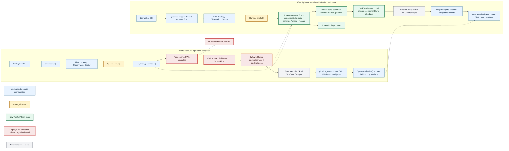

# Rapthor Prefect and Dask Migration Plan

This document outlines a staged plan for migrating Rapthor from Toil/CWL-based
operation execution to pure Python orchestration using Prefect and Dask. It is
based on a review of this repository, the prototype in
`../ska-sdp-rapthor-prefect-prototype`, and the Prefect-based pipeline in
`../ska-sdp-cimg`.

## Goals

- Replace CWL workflow templates and Toil/CWL runner execution with Python
  flows and tasks.
- Preserve Rapthor's science-facing behaviour, parset contract, output
  locations, restart semantics, and operation ordering during the migration.
- Use Prefect for workflow orchestration, observability, retries, and failure
  reporting.
- Use Dask for local and multi-node task execution, especially operation-level
  scatter over observations, sectors, image types, and calibration chunks.
- Keep migration incremental on the migration branch so each operation can be
  ported and tested against CWL-derived reference fixtures before the final
  cutover.

## Non-Goals For The First Migration

- Rewriting the scientific algorithms implemented by DP3, WSClean, EveryBeam,
  IDG, LoSoTo, PyBDSF, or Rapthor scripts.
- Replacing external command-line tools with native Python implementations.
- Changing user-facing strategy semantics or parset parameter names unless
  required by the Prefect/Dask implementation and documented with compatibility
  handling.
- Shipping a user-visible mixed-backend transition. The migration branch will not
  be merged to `master` until the Prefect/Dask implementation is complete.

## Branch Strategy

This migration will happen on a branch that remains separate from `master` until
it is complete. That simplifies the plan:

- `master` can continue to provide the current Toil/CWL implementation while the
  branch is in progress.
- The migration branch does not need to expose a public `cwl` versus `prefect`
  backend selector.
- The branch does not need to support mixed-backend production runs.
- CWL can remain on the branch only as an internal reference for generating
  parity fixtures and diagnosing regressions.
- Before the branch is merged, CWL runner code, CWL package data, Toil,
  StreamFlow, and cwltool should be removed from the production path.

The final merge should therefore present a single supported execution path:
Python orchestration with Prefect and Dask.

## Current Architecture Summary

Rapthor already has Python orchestration at the top level:

- `rapthor/process.py` reads the parset, creates a `Field`, chooses the
  strategy, chunks observations, and runs operation objects in science order.
- Operation classes under `rapthor/operations/` collect parameters from
  `Field`, `Sector`, and `Observation`, render Jinja CWL workflow templates,
  execute the selected CWL runner, parse CWL-shaped outputs, then mutate the
  shared `Field` in `finalize()`.
- CWL-specific code is concentrated in:
  - `rapthor/lib/operation.py`
  - `rapthor/lib/cwl.py`
  - `rapthor/lib/cwlrunner.py`
  - `rapthor/pipeline/parsets/**`
  - `rapthor/pipeline/steps/**`
- The strongest migration seam is the operation contract:
  `set_input_parameters() -> execute workflow -> outputs -> finalize()`.

The initial migration should keep `process.py` and the operation finalizers
mostly stable while swapping the execution engine under each operation.

## Architecture Diagram



## Lessons From The Prefect Prototype

The prototype demonstrates several useful patterns:

- Use `@flow` for top-level and major-cycle orchestration.
- Use `@task` for command-line work such as DP3 and WSClean.
- Use `prefect_shell.ShellOperation` for streamed command execution.
- Use `prefect_dask.DaskTaskRunner` locally or connect to an externally started
  Dask scheduler for Slurm runs.
- For multi-node Slurm, allocate nodes once, start a Dask scheduler and workers
  inside the allocation, export `DASK_SCHEDULER`, and let Prefect submit tasks
  to that cluster.

The prototype is intentionally small and should not be copied verbatim for
Rapthor's command construction. Rapthor should build commands from existing
operation inputs and CWL step definitions, then test those builders directly.

## Lessons From ska-sdp-cimg

The CIMG repository provides the cleaner production pattern:

- Use Pydantic models to make runtime configuration explicit.
- Keep command builders as ordinary pure Python functions.
- Wrap command builders in small Prefect tasks.
- Mock `prefect_shell.ShellOperation.run` in unit tests.
- Use `prefect.testing.utilities.prefect_test_harness` for flow tests.
- Keep integration tests separate and marked.
- Provide Slurm scripts for both simple production execution and development
  runs with a Prefect UI.

Rapthor should borrow this structure, but retain its existing parset and domain
model rather than replacing them up front.

## Target Architecture

Introduce a new execution layer, for example:

```text
rapthor/execution/
  __init__.py
  capabilities.py
  config.py
  outputs.py
  resources.py
  runtime.py
  shell.py
  task_runner.py
  workdirs.py
  tasks/
    dp3.py
    wsclean.py
    scripts.py
    filesystem.py
  flows/
    concatenate.py
    predict.py
    calibrate.py
    image.py
    mosaic.py
```

Recommended responsibilities:

- `capabilities.py`: runtime and feature preflight checks for strategy,
  cluster/runtime, container, and external-tool availability.
- `config.py`: runtime execution settings derived from the existing parset.
- `outputs.py`: helpers for file and directory output records. Initially these
  can preserve the current finalizer-compatible `{"class": "File", "path": ...}`
  and `{"class": "Directory", "path": ...}` structures.
- `resources.py`: per-task CPU, memory, thread, MPI, and concurrency settings.
- `runtime.py`: command environment construction, container wrapping, module or
  spack assumptions, and scratch-directory mapping.
- `shell.py`: safe command execution helpers, logging, environment handling,
  and optional dry-run support for tests.
- `task_runner.py`: Dask task runner construction for local and externally
  managed Slurm clusters.
- `workdirs.py`: deterministic task-local working directories, temp paths,
  atomic output helpers, and cleanup policy.
- `tasks/`: Prefect task wrappers around command builders and file operations.
- `flows/`: Python equivalents of current operation-level CWL DAGs.

The operation classes should stop calling `create_cwl_runner()` and instead
invoke the relevant Python flow, either directly or through a small flow
dispatcher. A generic dual-backend abstraction is not needed because the branch
will merge only after the Prefect/Dask path is complete.

## Execution Configuration

Do not add a user-facing `execution_backend` option. Before this branch merges,
Rapthor should have one production execution path: Prefect/Dask.

New optional settings may be needed under `[cluster]` or a dedicated execution
section:

- `prefect_task_runner = local_dask|external_dask|sync`
- `dask_scheduler = None`
- `prefect_stream_output = True`
- `prefect_retries = 0`
- `prefect_log_commands = True`

Prefer conservative defaults that preserve single-machine behaviour. Existing
`cwl_runner` and CWL-specific container options can stay on the branch while they
are still useful for reference runs, but they should be removed or replaced
before the final merge.

## Replacement Policy

Because the migration branch is not merged until complete, Rapthor does not need
to carry production compatibility code for partially ported operations:

- Implement operation flows incrementally on the branch.
- Test each flow directly before it is wired into the main pipeline.
- Keep CWL only as a reference source for fixtures and comparison while parity is
  being established.
- Make one final cutover that replaces the CWL runner path with Prefect/Dask for
  the whole supported pipeline.
- Delete the CWL production path before merge, rather than deprecating it after
  merge.

## Capability Preflight

The final Prefect/Dask pipeline still needs an explicit preflight step, but it no
longer needs to model "ported" versus "unported" operations for users. The
preflight should answer questions such as:

- Is this strategy within the feature set supported by the completed migration?
- Is the requested runtime available, for example local Dask, external Dask,
  Slurm, MPI WSClean, container execution, or no-container execution?
- Are required external tools and scripts discoverable before the run starts?
- Are resource settings valid for the selected local or Slurm allocation?

The execution layer should expose an interface equivalent to:

```text
preflight_execution(field, strategy_steps, execution_config) -> None
```

Failures should include the unsupported feature name and a short message that
tells the user which parset option, strategy feature, runtime setting, or missing
tool caused the failure. Full pipeline runs must run this preflight before the
first operation.

## Task Payload And State Boundary

Prefect and Dask tasks should not receive or mutate live `Field`, `Sector`, or
`Observation` objects. Those objects remain part of the driver-side Rapthor
domain model.

The boundary should be:

- Operation classes collect Python-native input dictionaries from the domain
  model.
- Prefect flows and tasks receive only serializable payloads: paths, strings,
  numbers, booleans, lists, dicts, and output specifications.
- External tasks produce output records and files, not mutated domain objects.
- Existing operation finalizers remain responsible for applying output records
  back to `Field`, `Sector`, and `Observation` state.

This keeps distributed workers from accidentally mutating state in another
process and makes task inputs easier to test, serialize, log, and cache.

## Runtime, Resources, And Filesystem Safety

The Prefect/Dask execution layer must preserve the important runtime behaviour
currently handled by CWL runners:

- Container settings: `use_container`, `container_type`, and no-container
  execution must have an explicit Prefect runtime mapping before those
  configurations are supported.
- Environment settings: command environments, module or spack assumptions,
  thread variables such as `OPENBLAS_NUM_THREADS`, and preserved environment
  variables must be centralized and testable.
- Scratch settings: `dir_local`, `local_scratch_dir`, and `global_scratch_dir`
  must map to deterministic task-local temporary directories.
- Task isolation: scattered tasks must write into unique working directories or
  unique output names so concurrent Dask execution cannot collide.
- Atomicity: tasks should write to temporary paths and move into final output
  paths where practical, especially for JSON outputs and small generated files.
- Resource control: DP3, WSClean, scripts, and MPI jobs need declared CPU,
  memory, thread, and concurrency limits. Dask worker count alone is not enough.
- MPI exclusivity: MPI WSClean should remain a controlled special case so it
  does not run concurrently with tasks that consume the same node allocation.

## Restart And Output Semantics

Preserve the existing operation-level restart contract:

- Each operation keeps a working directory under `dir_working/pipelines/<op>`.
- Each operation writes `.done` when completed.
- Each operation writes `.outputs.json`.
- On restart, a completed operation loads `.outputs.json` and skips execution.
- Finalizers continue to copy or move products into `images`, `solutions`,
  `skymodels`, `plots`, `regions`, and `visibilities`.

Within a Prefect operation flow, retries and partial task caching can be added
later. The first implementation should keep operation-level restart behaviour
simple and compatible with current `modifystate` expectations.

## Staged Implementation

### Stage 0: Baseline And Design Guardrails

- Record current non-integration and focused integration test results.
- Identify the operation and feature matrix that must be complete before the
  migration branch can merge.
- Add a short developer document describing the execution-layer shape and output
  object contract.
- Record the branch policy: no public mixed-backend transition and no merge to
  `master` until the Prefect/Dask path is complete.
- Define the serializable task-payload contract and the rule that Prefect/Dask
  tasks do not mutate live Rapthor domain objects.
- Inventory current CWL runner runtime behaviour: containers, scratch paths,
  preserved environment, MPI configuration, temporary output directories, and
  logging.
- Define a resource model for external commands: per-task threads, memory,
  process count, MPI exclusivity, and maximum concurrent external jobs.
- Capture representative CWL-generated command lines and output contracts that
  will become golden parity fixtures for the Python path.
- Keep CWL available on the branch only as a reference source.

Deliverables:

- Baseline test snapshot.
- Execution-layer design notes.
- Initial issue list for feature gaps.
- Preflight design and required feature matrix.
- Runtime parity inventory for container, scratch, environment, and MPI
  behaviour.
- Resource model notes and first-pass concurrency defaults.
- Golden command fixtures for common DP3, WSClean, script, `taql`, `fpack`, and
  MPI WSClean cases.
- Golden output-contract fixtures for each operation's expected output keys,
  nested shapes, filenames, optional outputs, and finalizer state changes.

### Stage 1: Add Execution Layer Skeleton

Status: partially complete. PR 1 added the dependency-free execution skeleton,
preflight checks, finalizer-compatible output records, initial concatenate
reference fixtures, package metadata, and focused tests. The production runner is
unchanged.

- Add the `rapthor/execution/` package without changing the production runner
  yet.
- Add execution config models or helpers for Prefect, Dask, Slurm, resources,
  runtime environment, and logging.
- Add the preflight interface for runtime, feature, tool, and resource checks.
- Add output-record helpers that match the current finalizer contract.
- Add a flow dispatcher or naming convention that maps operation classes to
  operation flows.
- Keep `Operation.run()` on the CWL path until all required operation flows have
  been ported and tested directly.

Remaining Stage 1 work:

- Add the operation-flow dispatcher or naming convention once the first concrete
  operation flow exists.
- Expand preflight inputs from simple feature/tool lists to strategy-derived
  feature checks.
- Decide whether execution config should be backed by Pydantic before command
  builders and task payload models are added.

Tests:

- Unit tests for execution config parsing and conservative defaults.
- Unit tests for output-record helpers.
- Preflight tests for unsupported strategy features, missing external tools,
  unsupported container settings, invalid resources, and unsupported runtime
  modes.
- Tests that the operation-flow dispatcher can find implemented flows and fails
  clearly for branch-internal missing flows.

PR 1 verification:

- `python3 -m pytest tests/execution tests/lib/test_parset.py` in the
  devcontainer: 52 passed.
- `python3 -m ruff check rapthor/execution tests/execution pyproject.toml` in the
  devcontainer: passed.
- `python3 -m ruff format --check rapthor/execution tests/execution` in the
  devcontainer: passed.
- `git diff --check`: passed.

### Stage 2: Shared Command And Output Primitives

Status: partially complete. PR 2 added import-safe task primitives for command
normalization, shell execution, task-runner construction, runtime environment,
work directories, resource requests, and serializable payload validation. The
helpers can still be tested with injected fakes for shell execution and Dask task
runner construction, but Prefect/Dask are now core dependencies and operation
flows can use Prefect decorators directly.

- Add command-builder functions for common tool classes:
  - DP3
  - WSClean serial
  - WSClean MPI
  - Rapthor Python scripts
  - `taql`
  - `fpack`
- Add Prefect shell task wrappers for those builders.
- Add output helpers that create and validate finalizer-compatible output
  records.
- Add task runner creation based on local Dask or external scheduler address.
- Add an early, mocked top-level Prefect flow skeleton that mirrors
  `process.run()` ordering without yet replacing the production operation runner.
- Add serializable task-payload models or validators for operation inputs.
- Add runtime environment builders for no-container execution first, with
  explicit unsupported errors for unimplemented container modes.
- Add workdir helpers for per-task directories, temp files, atomic moves, and
  cleanup.
- Add resource-setting helpers for command threads, memory, MPI exclusivity, and
  maximum external-job concurrency.

Remaining Stage 2 work:

- Add real DP3, WSClean, script, `taql`, `fpack`, and MPI WSClean command
  builders.
- Add actual Prefect `@task` wrappers now that Prefect/Dask dependencies are core.
- Expand golden command fixtures beyond the initial concatenate reference case.

Tests:

- Pure unit tests for command builders.
- Golden command parity tests comparing Python command builders against
  representative CWL-generated command lines.
- Shell task tests that mock `ShellOperation.run`.
- Output helper tests for files, directories, nested lists, missing outputs, and
  JSON serialization.
- Flow tests using `prefect_test_harness` and mocked shell execution.
- Top-level flow skeleton tests for strategy ordering, cycle numbering,
  final-pass decisions, and selfcal convergence branching with mocked
  operations.
- Serialization tests proving task payloads contain only serializable values and
  do not carry live `Field`, `Sector`, or `Observation` instances.
- Runtime tests for environment construction, scratch directory selection,
  unsupported container settings, and atomic output writes.
- Resource tests for command thread counts, memory settings, MPI exclusivity,
  and external-job concurrency limits.

PR 2 verification:

- `python3 -m pytest tests/execution tests/lib/test_parset.py` in the
  devcontainer: 81 passed.
- `python3 -m ruff check rapthor/execution tests/execution pyproject.toml` in the
  devcontainer: passed.
- `python3 -m ruff format --check rapthor/execution tests/execution` in the
  devcontainer: passed.
- `git diff --check`: passed.

### Stage 3: Port Concatenate

This is the smallest operation and should be the first real flow parity target.

Status: complete for direct flow parity in PR 3. The production `Operation.run()`
path is still unchanged, but the Concatenate operation now has a
finalizer-compatible Python flow, a Prefect task entry point, command parity
coverage, output-shape validation, missing-output failure coverage, and a
mocked Prefect flow test.

- Translate `concatenate_pipeline.cwl` into a Python flow that scatters
  `concat_ms.py` or equivalent `taql` calls over epochs.
- Reuse `Concatenate.set_input_parameters()` and `Concatenate.finalize()`.
- Return `concatenated_filenames` using the same output shape consumed by the
  current finalizer.

Tests:

- Added direct flow and task-wrapper tests for command execution with mocked
  `ShellOperation`.
- Added command parity coverage for frequency concatenation against the
  CWL-derived fixture.
- Added output-contract and finalizer-state coverage proving
  `Concatenate.finalize()` accepts Prefect-produced records.
- Added payload validation for mismatched inputs, non-basename outputs, and
  duplicate output paths.
- Added failure coverage for shell failures and missing expected output
  directories.

Remaining Stage 3 work before final cutover:

- Add operation-level restart tests once `Operation.run()` is switched from CWL
  to the Python flow path.
- Add a real lightweight concatenate integration test if suitable Measurement
  Set fixtures and `concat_ms.py` dependencies are available in CI.

### Stage 4: Port Mosaic

Mosaic has manageable scatter and mostly calls Rapthor scripts.

Status: complete for direct flow parity in PR 4. The production `Operation.run()`
path is still unchanged, but the Mosaic operation now has a
finalizer-compatible Python flow, command builders for the script steps and
optional compression, payload validation, mocked Prefect flow coverage,
skip-processing coverage, compressed-output coverage, and finalizer-state
coverage.

- Translate `mosaic_pipeline.cwl` and `mosaic_type_pipeline.cwl`.
- Preserve `skip_processing` behaviour for single-sector imaging.
- Preserve optional compression.
- Keep output filenames identical.

Tests:

- Added command-builder and golden command parity tests for
  `make_mosaic_template.py`, `regrid_image.py`, `make_mosaic.py`, and `fpack`.
- Added payload serialization and validation tests for multi-sector mosaic
  inputs and single-sector skip processing.
- Added direct runner and Prefect harness tests with mocked shell execution.
- Added output-contract coverage for normal and compressed mosaic outputs.
- Added finalizer-state coverage proving `Mosaic.finalize()` accepts
  Prefect-produced records and copies field images into the expected location.
- Added failure coverage for missing expected mosaic outputs.

Remaining Stage 4 work before final cutover:

- Add operation-level restart tests once `Operation.run()` is switched from CWL
  to the Python flow path.
- Replace or rework the currently placeholder `tests/operations/test_mosaic.py`
  cases when the production runner is cut over.
- Add a real image-to-mosaic integration test on the Prefect path once the Image
  flow is ported or suitable lightweight FITS fixtures are available.

### Stage 5: Port Predict

Predict introduces DP3 scatter and model subtraction.

Status: complete for direct flow parity on the migration branch.

- Translate `predict_di_pipeline.cwl`, `predict_pipeline.cwl`, and any
  non-calibrating predict variant that is still active.
- Split command construction from task submission:
  - predict model data per sector/observation
  - add sector models for DI prediction
  - subtract sector models for DD prediction
- Preserve handling of DD, DI, peeling, reweighting, and h5parm selection.

Tests:

- Added unit tests for DI and DD command construction.
- Added golden command parity tests for `predict_model_data`, `add_sector_models`,
  and `subtract_sector_models`.
- Added tests for scatter length, output shape, DI nested outputs, DD peeling
  outputs, and reweighting command flags.
- Added field mutation coverage around `Predict.finalize()`.
- Added mocked DP3/add/subtract execution tests using the Prefect test harness.
- Added failure tests for missing predicted model data, missing post-processing
  outputs, and shell failures.
- Added output filtering so DD collection does not accidentally treat
  intermediate `_modeldata` directories as final subtraction outputs when the
  Python flow uses a shared operation working directory.

Remaining Stage 5 work before final cutover:

- Add operation-level restart tests once `Operation.run()` is switched from CWL
  to the Python flow path.
- Add real lightweight script or Measurement Set coverage for
  `add_sector_models.py` and `subtract_sector_models.py` if suitable fixtures are
  available in CI.
- Revisit task-local working directories when the final Dask execution layout is
  introduced; the current direct-flow parity path preserves output contracts by
  filtering intermediates.

### Stage 6: Port Imaging Incrementally

Image is the largest migration target. Do it by feature slice rather than all
at once.

Status: first no-DDE Stokes-I slice complete for direct flow parity on the
migration branch.

Suggested slices:

1. Initial image and no-DDE Stokes I imaging.
2. Prepare imaging data with DP3 and time concatenation.
3. WSClean serial no-DDE imaging.
4. Mask generation and source filtering.
5. Facet imaging with h5parm and region file generation.
6. Normalization imaging.
7. Image cubes.
8. Full-Stokes imaging.
9. Screen/hybrid imaging.
10. MPI WSClean.

Keep `Image.set_input_parameters()` as the source of truth initially. The Python
flow should consume `input_parms` and emit the same output keys currently parsed
from CWL.

Tests:

- Added command-builder tests for the no-DDE Stokes-I slice:
  `prepare_imaging_data`, time concatenation, mask creation, serial WSClean,
  beam checking, filtering, and diagnostics.
- Added golden command parity tests for no-DDE prepare, concatenate, blank mask,
  and WSClean commands.
- Added a mocked no-DDE flow test covering DP3 prepare, time concatenation,
  `blank_image.py`, WSClean, beam checks, `filter_skymodel.py`, and
  `calculate_image_diagnostics.py`.
- Added `ImageInitial.finalize()` coverage against Prefect-produced no-DDE
  output records.
- Added output-contract fixtures for no-DDE Stokes-I images, skymodels,
  visibilities, masks, diagnostics, offsets, and plots.
- Still needed: command-builder tests for facet, screen, MPI, normalization,
  image-cube, full-Stokes, shared-facet, and clean-disabled modes.
- Still needed: flow tests for the remaining imaging slices.
- Still needed: tests for regular `Image.finalize()` and `ImageNormalize.finalize()`
  against Prefect output structures.
- Rework relevant `tests/operations/test_image.py` cases around command builders,
  flow structure, and finalizer-compatible output records.
- Replace CWL-specific rendered-template assertions with command-builder and
  flow-structure assertions for the Prefect/Dask path.
- Add output-contract fixtures for optional masks, cubes, filtered model images,
  compressed FITS files, and region files.
- Restart/failure tests for failed WSClean, missing diagnostics JSON, corrupt
  diagnostics JSON, failed finalizer copy, and rerun after deleting `.done`.
- Filesystem isolation tests for scattered sector imaging, temporary WSClean
  directories, image cubes, and compressed outputs.

### Stage 7: Port Calibration Incrementally

Calibration is the other high-risk area because it includes solve planning,
conditional branches, h5parm collection, plotting, combination, and source
adjustment.

Suggested slices:

1. DI full-Jones calibration.
2. DI scalar phase calibration.
3. DD fast phase calibration without image-based prediction.
4. DD medium phase and slow gains.
5. Pre-application of DI solutions before DD solves.
6. Image-based prediction.
7. IDG/screen generation.
8. Plotting and h5parm post-processing.

Reuse the existing solve planner in `rapthor/operations/calibrate.py`.

Tests:

- Unit tests for every calibration command-builder branch.
- Golden command parity tests for DDECal, IDGCal, image-based predict,
  h5parm collection, h5parm combination, plotting, source adjustment, and
  solution processing.
- Existing solve-planner tests remain backend-independent.
- Mocked flow tests for all solve lists supported by `CALIBRATION_STRATEGY.md`.
- Integration tests for DI-only, DD-only, DI-then-DD, and DD-then-DI using the
  Prefect/Dask flow once command execution is available.
- Output-contract and finalizer-state tests for every stable solution product,
  diagnostic product, and plotted product.
- Failure tests for missing h5parm outputs, failed h5parm combination, invalid
  solution tables, failed plotting, and restart after partial calibration output.
- Resource and isolation tests for scattered solve chunks, h5parm collection,
  plotting outputs, and screen-generation outputs.

### Stage 8: Cut Over To The Prefect Top-Level Flow

After the early mocked skeleton is in place and all required operation-level
Prefect flows are working, make the top-level Prefect flow executable for real
runs and route the CLI through it.

- Keep `process.run()` as the CLI entry point.
- Add `rapthor/flows/process.py` or similar with a Prefect flow that mirrors
  current `process.run()` sequencing.
- Decide whether operation flows are subflows or tasks from the top-level flow.
- Continue to respect selfcal convergence checks between cycles.
- Replace the CWL runner call in `Operation.run()` with the Python flow path.
- Remove branch-only CWL references from production execution code.

Tests:

- Mock operation classes and verify ordering through the Prefect top-level flow.
- Use `prefect_test_harness`.
- Keep current `tests/test_process.py` coverage backend-independent.
- Add full mocked-process tests for initial sky model generation, no-selfcal
  image-only strategy, selfcal convergence, selfcal divergence/failure,
  repeated final cycles, and preflight failure detection.
- Add preflight tests that inspect the chosen strategy and fail before execution
  when any required operation or feature slice is unsupported.

### Stage 9: Slurm And Multi-Node Execution

Start with the prototype's safer Slurm model:

- Slurm allocation starts one Dask scheduler and one worker per node.
- `DASK_SCHEDULER` is exported.
- Rapthor uses `DaskTaskRunner(address=...)`.
- MPI WSClean remains an explicitly controlled task so it can reserve/process
  nodes without Dask oversubscription.

Add scripts modelled after the prototype and CIMG:

- Simple production Slurm script with an ephemeral Prefect server.
- Development script that reports to a persistent Prefect server.
- Optional benchmark monitor integration if required by the deployment
  environment.

Tests:

- Unit tests for task runner selection.
- Unit tests for `DASK_SCHEDULER` handling, failed scheduler connection,
  local-cluster defaults, thread counts, memory settings, and Slurm node/task
  mapping.
- Command tests for MPI WSClean launch arguments and checks that Dask worker
  counts do not oversubscribe DP3/WSClean thread settings.
- Tests for maximum concurrent external jobs and MPI exclusivity controls.
- Script lint/smoke checks where possible.
- Manual or CI-marked integration tests on the target Slurm environment.

### Stage 10: Final Cleanup And Merge Readiness

Only after Prefect/Dask parity is demonstrated on the migration branch:

- Remove Toil, StreamFlow, and cwltool dependencies.
- Remove `rapthor/pipeline/parsets/**` and `rapthor/pipeline/steps/**` once no
  tests or docs depend on them.
- Remove `rapthor/lib/cwl.py`, `rapthor/lib/cwlrunner.py`, and any CWL-only
  operation plumbing that is no longer used.
- Remove CWL test utilities or move any useful reference fixtures into
  Prefect/Dask test fixtures.
- Update package data so CWL files are not shipped.
- Run the final non-integration and focused integration suites before merging to
  `master`.

## Operation Migration Matrix

| Operation | First target | Complexity | Notes |
| --- | --- | --- | --- |
| Concatenate | Stage 3 | Low | Simple scatter over epochs. Good first parity test. |
| Mosaic | Stage 4 | Low-medium | Mostly Python scripts and file handling. |
| Predict | Stage 5 | Medium | DP3 scatter plus DI/DD branch differences. |
| ImageInitial | Stage 6.1 | Medium | Useful first imaging slice. |
| ImageNormalize | Stage 6.6 | Medium-high | Depends on imaging plus normalization outputs. |
| Image | Stage 6 | High | Largest DAG and broadest feature matrix. |
| Calibrate DI | Stage 7.1-7.2 | High | Start with full-Jones, then scalar solves. |
| Calibrate DD | Stage 7.3-7.8 | Very high | Most conditional solve and h5parm logic. |

## Per-Operation Parity Gates

Before an operation can be considered ported to Prefect, it must satisfy all of
these gates:

1. Command parity:
   Representative Python-built commands match the equivalent CWL-generated
   commands for the operation's supported branches. Differences must be
   intentional, documented, and covered by tests.

2. Output contract parity:
   Prefect outputs expose the same keys, nested list shapes, file/directory
   object structure, filenames, and optional-output behaviour consumed by the
   existing finalizer.

3. Field-state parity:
   Running `finalize()` after Prefect execution mutates `Field`, `Observation`,
   and `Sector` state in the same way as the CWL-derived reference fixtures.

4. Restart parity:
   `.done`, `.outputs.json`, skip-on-restart, rerun after deleting `.done`, and
   recovery from partial or corrupt output state behave as expected.

5. Failure parity:
   Shell-command failures, missing expected outputs, invalid output files, and
   finalizer failures surface clear errors and do not mark the operation done.

6. Flow parity:
   The Prefect operation flow has mocked-flow coverage for scatter, conditional
   branches, optional outputs, and unsupported feature detection.

7. Focused integration parity:
   At least one focused integration path for the operation passes with real
   external tools, unless the operation is explicitly marked as mocked-only for
   the current milestone.

Once an operation satisfies these gates, its CWL templates should stop being the
source of truth on the migration branch. Keep only the reference fixtures needed
to diagnose regressions until all operations needed by supported strategies
satisfy the same gates.

## Testing Migration Plan

### Keep Existing Tests That Are Still Valuable

- `tests/lib/test_field.py`, `tests/lib/test_strategy.py`, and most parset tests
  should remain mostly unchanged.
- Script tests under `tests/scripts/` should remain valuable because the same
  scripts will be called by Prefect tasks.
- Operation finalizer tests should remain valuable if output shapes are
  preserved.

### Replace Operation-Run Tests At Cutover

Because the migration branch will not ship a dual-backend transition, tests do
not need to be parameterized over `cwl` and `prefect`. Instead:

- Keep existing operation tests useful while their operation is being ported.
- Add direct tests for each new Python operation flow as it is implemented.
- At the cutover stage, update `operation.run()` tests to expect the Prefect/Dask
  path only.
- Remove tests whose only purpose is proving the old CWL runner path still works.

### Replace CWL-Specific Assertions Gradually

Current tests under `tests/cwl/` and CWL-rendering assertions should be replaced
by:

- Golden command parity tests.
- Command-builder unit tests.
- Flow topology tests where useful.
- Output shape tests.
- Output-contract fixture tests.
- Field-state mutation tests.
- Scatter length tests.
- Restart tests.
- Failure-mode tests.
- Logging and diagnostics tests.
- End-to-end operation tests with mocked shell execution.

Do not delete CWL tests or reference helpers until the matching operation has
Prefect/Dask parity fixtures and flow tests.

### Golden Fixture Strategy

Add small, explicit golden fixtures rather than relying on broad integration
tests to detect drift:

- Command fixtures should store the normalized command generated from the CWL
  path and compare it to the Python command builder.
- Output fixtures should store expected output keys, path basenames, object
  classes, nested list depth, optional outputs, and compressed/uncompressed
  variants.
- State fixtures should record the relevant `Field`, `Observation`, and
  `Sector` attributes before and after finalization.
- Log fixtures should assert that operation log files, command logs, and failure
  messages remain useful and discoverable.

Fixtures should be intentionally representative rather than exhaustive. The
high-risk branches need coverage: DI-only, DD-only, DI-then-DD, DD-then-DI,
facets, screens, normalization, full-Stokes, image cubes, peeling, reweighting,
shared-facet options, and MPI imaging.

Command comparison should be normalized to avoid brittle noise:

- Compare tokenized commands rather than raw strings where possible.
- Normalize absolute working directories, temporary directories, and generated
  filenames that include run-specific paths.
- Normalize harmless whitespace differences.
- Keep argument order significant unless the tool explicitly treats the order as
  irrelevant.
- Compare command environment separately from command tokens.
- Document every intentional Python-vs-CWL command delta in the fixture.

### Serialization Boundary Tests

Every Prefect task should have tests proving its input payload is safe for
distributed execution:

- No live `Field`, `Sector`, or `Observation` instances are passed to tasks.
- Task payloads are JSON-serializable or pickle-safe, depending on the chosen
  task-runner requirement.
- Task functions do not mutate driver-side domain objects.
- Flow inputs can be logged without leaking huge arrays or entire domain object
  graphs.

### Runtime Environment Tests

Runtime tests should cover behaviour that was previously handled by CWL runners:

- No-container command execution.
- Unsupported container settings fail during preflight until implemented.
- Singularity/udocker wrapping once container support is added.
- Preserved environment variables and thread variables.
- `local_scratch_dir`, `global_scratch_dir`, and deprecated `dir_local`
  selection.
- Missing external tools fail early with clear messages.
- Module or spack assumptions are documented and testable.

### Filesystem Isolation Tests

Scattered tasks must not collide when Dask runs them concurrently. Add tests for:

- Unique task-local working directories.
- Unique temporary directories for WSClean and DP3.
- Unique output basenames for sector, observation, image-type, and solve-chunk
  scatter.
- Atomic writing or replacement of `.outputs.json` and small generated files.
- Cleanup behaviour for temporary task directories on success and failure.

### Resource-Control Tests

External tools can consume many cores and large memory allocations. Tests should
cover:

- Per-command thread counts from parset values.
- Memory settings passed to WSClean and Dask workers.
- Maximum concurrent external commands.
- MPI WSClean exclusivity.
- Dask worker count versus external command thread count.
- Behaviour when resource settings are invalid or oversubscribe the selected
  local/Slurm allocation.

### Mocking Strategy

Follow CIMG's pattern:

- Mock `prefect_shell.ShellOperation.run` for most unit tests.
- Use `prefect_test_harness` for flow tests.
- Materialize expected output files and directories in temporary directories so
  existing finalizers can run.
- Keep real external command execution in integration tests only.
- Mock Dask task-runner construction in unit tests unless the test explicitly
  checks local Dask execution.
- Include negative mocks for failed shell commands, non-zero return paths,
  missing files, and malformed JSON.

### Restart And Failure Matrix

Every ported operation should have focused tests for:

- First successful run creates expected outputs, `.outputs.json`, and `.done`.
- Second run with `.done` present loads `.outputs.json` and skips execution.
- Deleting `.done` reruns the operation.
- Missing `.outputs.json` with `.done` present fails clearly.
- Corrupt `.outputs.json` fails clearly.
- Shell command failure does not create `.done`.
- Missing expected output does not create `.done`.
- Finalizer failure does not create `.done`.
- Partial output files from a failed attempt are either cleaned up or safely
  overwritten on rerun.

### modifystate Compatibility Tests

The `bin/rapthor -r` reset path should keep working with the Prefect/Dask path.
Add tests that:

- Reset one operation and rerun it with Prefect outputs.
- Reset downstream operations without corrupting upstream `.outputs.json` files.
- Delete `.done` markers while preserving reusable products where current
  behaviour expects that.
- Reload Prefect-produced output records after reset.
- Preserve compatibility with existing operation names and working directory
  layout.

### Logging And Observability Tests

The Prefect/Dask path should preserve Rapthor's practical debuggability:

- Operation log directories are created in the expected locations.
- Command strings and relevant environment settings are logged.
- Shell stdout/stderr are streamed or captured according to execution settings.
- Prefect task and flow names include operation names and cycle numbers.
- Failure messages identify the operation, task, command, and missing or invalid
  output.

### Integration Strategy

Use markers to keep expensive or environment-sensitive tests explicit:

- `integration`: real DP3/WSClean/EveryBeam/IDG/Casacore execution.
- `internet`: tests that require downloads or catalog access.
- Do not add backend parameters; integration tests should target the final
  Prefect/Dask path once the relevant operation is ported.

Recommended focused integration sequence:

1. Concatenate with small Measurement Sets.
2. Mosaic from small mocked or prebuilt FITS products.
3. Predict DI/DD with small test Measurement Sets.
4. Initial image.
5. DI calibration.
6. DD calibration.
7. Full selfcal process.
8. Restart after injected failure.

High-risk integration combinations:

- DI-only, DD-only, DI-then-DD, and DD-then-DI calibration strategies.
- Facet imaging with and without shared-facet read/write options.
- Normalization followed by final imaging.
- Full-Stokes imaging and clean-disabled full-Stokes imaging.
- Image cube generation.
- Peeling and reweighting.
- MPI WSClean on the target Slurm environment.
- Restart after failure in `Predict`, `Image`, and `Calibrate`.

## Documentation Updates

Update docs as each stage lands:

- `README.md`: high-level statement that Rapthor now runs through Prefect/Dask.
- `docs/source/running.rst`: how to run the Prefect/Dask pipeline locally and on
  Slurm.
- `docs/source/parset.rst`: new cluster/execution options and removed CWL runner
  options.
- `docs/source/structure.rst`: replace CWL architecture details with Python
  execution layer details.
- `docs/source/operations.rst`: update operation descriptions to describe the
  Python flow structure where useful.
- Add Slurm/Prefect UI instructions based on the prototype and CIMG scripts.

## Dependency And Packaging Plan

During branch development, Prefect/Dask and CWL dependencies may coexist so
reference comparisons can run. Before merging to `master`:

- Keep Prefect/Dask dependencies as production execution dependencies. The core
  dependency uses `prefect[dask,shell]` so the Dask task runner and shell
  operation integrations are installed with Prefect.
- Remove `cwltool`, `toil[cwl]`, and `streamflow` unless they are still needed
  for unrelated tooling.
- Update tox, CI, docs, and installation instructions so normal test and runtime
  environments cover the Prefect/Dask path.
- Keep package-data cleanup explicit when removing CWL so
  `rapthor/pipeline/**` is not shipped after it is no longer used.

## Risks And Mitigations

- Risk: output naming drift breaks finalizers and downstream operations.
  Mitigation: preserve finalizer-compatible output records initially and add
  parity tests.

- Risk: Prefect task retries rerun non-idempotent external commands.
  Mitigation: default retries to zero; add idempotency checks before enabling
  retries for specific tasks.

- Risk: Dask oversubscribes nodes when DP3/WSClean also use many threads.
  Mitigation: centralize thread and worker configuration; keep MPI WSClean as a
  controlled special case.

- Risk: Slurm behaviour differs from current Toil dynamic scheduling.
  Mitigation: start with static allocations and an external Dask scheduler,
  matching the prototype's tested approach.

- Risk: removing CWL tests too early hides behavioural drift.
  Mitigation: keep CWL-derived fixtures and any needed reference helpers until
  each operation has parity tests and focused integration coverage.

- Risk: command strings become hard to maintain.
  Mitigation: use structured command builders and test them directly, following
  the CIMG pattern.

- Risk: live domain objects are accidentally passed into Dask workers and
  mutated out of process.
  Mitigation: enforce serializable task payloads and keep all `Field`, `Sector`,
  and `Observation` mutation in operation finalizers.

- Risk: scattered tasks overwrite each other's files.
  Mitigation: use deterministic task-local working directories, unique output
  basenames, and atomic writes for small generated outputs.

- Risk: container and environment behaviour drifts from current CWL execution.
  Mitigation: centralize runtime construction and add preflight/runtime parity
  tests before merging the branch.

## Open Decisions

- Whether Prefect operation flows should keep `{"class": "File", "path": ...}`
  style records long term or replace them with typed records before merge.
- Whether to introduce Pydantic models for operation inputs immediately or after
  the first operations are ported.
- How to represent task-level restart/caching without conflicting with the
  current operation-level `.done` semantics.
- How much of the existing CWL step metadata should be converted mechanically
  versus re-expressed manually as Python command builders.
- Which container modes are in scope for the first user-facing Prefect release.

Resolved decision:

- The migration happens on a branch that will not be merged to `master` until it
  is complete.
- There will be no user-facing mixed-backend transition and no production
  `execution_backend` selector.
- The final merged pipeline should use Prefect/Dask as the only supported
  execution path.
- Prefect/Dask dependencies are core dependencies, using the Prefect `dask` and
  `shell` extras.

## Initial Pull Requests

### PR 1: Execution Skeleton And Reference Fixtures

Status: complete on the migration branch.

- Add `rapthor/execution/` skeleton.
- Add execution config, preflight, and output-record helper skeletons.
- Capture initial CWL-derived command and output fixtures.
- Add tests for preflight, config defaults, and output records.

Implemented files:

- `rapthor/execution/__init__.py`
- `rapthor/execution/config.py`
- `rapthor/execution/capabilities.py`
- `rapthor/execution/outputs.py`
- `tests/execution/**`
- `pyproject.toml` package and lint-target updates.

Verified in the devcontainer with focused pytest and ruff checks.

### PR 2: Prefect Task Primitives

Status: complete on the migration branch for dependency-free primitives.

- Add task runner construction.
- Add shell task wrapper.
- Add output object helpers.
- Add runtime environment, workdir, and resource helper skeletons.
- Add serializable payload validators or models.
- Add golden command parity fixtures and command-builder tests.
- Add Prefect test harness setup.

Implemented files:

- `rapthor/execution/commands.py`
- `rapthor/execution/payloads.py`
- `rapthor/execution/resources.py`
- `rapthor/execution/runtime.py`
- `rapthor/execution/shell.py`
- `rapthor/execution/task_runner.py`
- `rapthor/execution/workdirs.py`
- `tests/execution/conftest.py`
- Additional `tests/execution/test_*.py` coverage for each primitive.

Verified in the devcontainer with focused pytest and ruff checks.

### PR 3: Concatenate Prefect Flow

Status: complete for direct flow parity on the migration branch.

- Implement the Concatenate Prefect flow.
- Exercise the flow directly without changing the production runner yet.
- Add parity tests against the current mocked CWL-derived output shape.
- Add command parity, output contract, finalizer-state, restart/failure, and
  mocked-flow tests.
- Add a small integration test if the environment supports `taql` or
  `concat_ms.py`.

Implemented files:

- `rapthor/execution/flows/__init__.py`
- `rapthor/execution/flows/concatenate.py`
- `tests/execution/test_concatenate_flow.py`
- Updates to `rapthor/execution/__init__.py`
- Updates to `tests/execution/test_reference_fixtures.py`
- Updates to `pyproject.toml` packaging and tox configuration so Prefect can
  import cleanly from the repository on Python 3.10.

Verified in the rebuilt devcontainer:

- `python3 -m pytest tests/execution tests/lib/test_parset.py`: 95 passed.
- `python3 -m ruff check rapthor/execution tests/execution pyproject.toml`:
  passed.
- `python3 -m ruff format --check rapthor/execution tests/execution`: passed.
- `python3 -c "import toml; toml.load('pyproject.toml')"`: passed, covering the
  Prefect Python 3.10 TOML parser compatibility issue.

Deferred to the cutover PR:

- Switch `Operation.run()` from CWL execution to the Python flow path.
- Add operation-level restart tests for `.done` and `.outputs.json` on the
  final Prefect/Dask execution path.
- Add real external-tool integration coverage for concatenate if lightweight
  Measurement Set fixtures are available.

### PR 4: Mosaic Prefect Flow

Status: complete for direct flow parity on the migration branch.

- Implement the Mosaic Prefect flow.
- Exercise the flow directly without changing the production runner yet.
- Add command builders for `make_mosaic_template.py`, `regrid_image.py`,
  `make_mosaic.py`, and `fpack`.
- Add parity tests against CWL-derived command and output fixtures.
- Add payload, skip-processing, compression, missing-output, mocked-flow, and
  finalizer-state tests.

Implemented files:

- `rapthor/execution/flows/mosaic.py`
- `tests/execution/test_mosaic_flow.py`
- Updates to `rapthor/execution/flows/__init__.py`
- Updates to `rapthor/execution/__init__.py`
- Updates to `tests/execution/fixtures/cwl_reference_commands.json`
- Updates to `tests/execution/fixtures/cwl_reference_outputs.json`

Verified in the rebuilt devcontainer:

- `python3 -m pytest tests/execution tests/lib/test_parset.py`: 105 passed.
- `python3 -m pytest tests/execution/test_mosaic_flow.py
  tests/execution/test_reference_fixtures.py`: 12 passed.
- `python3 -m ruff check rapthor/execution tests/execution pyproject.toml`:
  passed.
- `python3 -m ruff format --check rapthor/execution tests/execution`: passed.
- `git diff --check`: passed.

Deferred to the cutover PR:

- Switch `Operation.run()` from CWL execution to the Python flow path.
- Add operation-level restart tests for `.done` and `.outputs.json` on the final
  Prefect/Dask execution path.
- Add real image-to-mosaic integration coverage once the Image flow is ported or
  suitable lightweight FITS fixtures are available.

### PR 5: Predict Prefect Flow

Status: complete for direct flow parity on the migration branch.

- Implement the Predict Prefect flow for DI and DD prediction.
- Add command builders for `DP3` prediction, `add_sector_models.py`, and
  `subtract_sector_models.py`.
- Convert `Predict.set_input_parameters()` output into serializable task payloads
  without passing live `Field`, `Sector`, or `Observation` objects to tasks.
- Preserve h5parm, normalization, SAGECal predict, smearing, peeling,
  reweighting, and per-observation solution interval parameters.
- Return finalizer-compatible `msfiles_di_cal` and `subtract_models` output
  records.
- Filter intermediate `_modeldata` directories from DD output collection because
  the direct Python runner currently executes the predict and post-processing
  commands in the same operation working directory.

Implemented files:

- `rapthor/execution/flows/predict.py`
- `tests/execution/test_predict_flow.py`
- Updates to `rapthor/execution/flows/__init__.py`
- Updates to `rapthor/execution/__init__.py`
- Updates to `tests/execution/fixtures/cwl_reference_commands.json`
- Updates to `tests/execution/fixtures/cwl_reference_outputs.json`

Verified in the rebuilt devcontainer:

- `python3 -m pytest tests/execution/test_predict_flow.py`: 17 passed.
- `python3 -m pytest tests/execution tests/lib/test_parset.py`: 122 passed.
- `python3 -m ruff check rapthor/execution tests/execution pyproject.toml`:
  passed.
- `python3 -m ruff format --check rapthor/execution tests/execution`: passed.
- `git diff --check`: passed.

Deferred to the cutover PR:

- Switch `Operation.run()` from CWL execution to the Python flow path.
- Add operation-level restart tests for `.done` and `.outputs.json` on the final
  Prefect/Dask execution path.
- Decide whether Predict should use task-local Dask work directories or keep the
  shared operation directory with explicit intermediate filtering.
- Add real external-tool coverage for `DP3`, `add_sector_models.py`, and
  `subtract_sector_models.py` when lightweight Measurement Set fixtures are
  available.

### PR 6: Initial No-DDE Stokes-I Image Flow

Status: complete for the first direct-flow imaging slice on the migration
branch.

- Implement a no-DDE Stokes-I Prefect image flow.
- Add command builders for DP3 imaging preparation, time concatenation, blank
  mask creation, serial no-DDE WSClean, image beam checks, source filtering, and
  image diagnostics.
- Convert `Image.set_input_parameters()` output into serializable sector and
  observation payloads without passing live domain objects to tasks.
- Preserve the initial-image output contract consumed by `ImageInitial.finalize()`.
- Explicitly reject unsupported imaging branches in this slice: screens, facets,
  compression, bright-source restoration, filtered model images, and non-Stokes-I
  imaging.

Implemented files:

- `rapthor/execution/flows/image.py`
- `tests/execution/test_image_flow.py`
- Updates to `rapthor/execution/flows/__init__.py`
- Updates to `rapthor/execution/__init__.py`
- Updates to `tests/execution/fixtures/cwl_reference_commands.json`
- Updates to `tests/execution/fixtures/cwl_reference_outputs.json`

Verified in the rebuilt devcontainer:

- `python3 -m pytest tests/execution/test_image_flow.py`: 10 passed.
- `python3 -m pytest tests/execution tests/lib/test_parset.py`: 132 passed.
- `python3 -m ruff check rapthor/execution tests/execution pyproject.toml`:
  passed.
- `python3 -m ruff format --check rapthor/execution tests/execution`: passed.

Deferred to later imaging PRs:

- Add task-local WSClean temporary directory cleanup/isolation tests.
- Add compression and filtered-model-image handling.
- Add regular selfcal `Image` and `ImageNormalize` finalizer coverage.
- Add screen, MPI, image-cube, full-Stokes, and clean-disabled WSClean modes.
- Add real external-tool coverage once lightweight Measurement Set and FITS
  fixtures are available.

### PR 7: Facet Stokes-I Image Flow

Status: complete for the next direct-flow imaging slice on the migration branch.

- Extend the Image Prefect flow from no-DDE-only to no-DDE or serial
  facet-corrected Stokes-I imaging.
- Add `make_region_file.py` command construction and execution for per-sector
  DS9 facet regions.
- Add the serial facet WSClean command builder, including
  `-apply-facet-solutions`, `soltabs`, scalar/diagonal visibility flags,
  `-parallel-gridding`, and `shared_facet_rw` split into
  `-shared-facet-reads` and `-shared-facet-writes`.
- Preserve the finalizer-compatible image output contract and add the CWL
  `sector_region_file` output for facet runs.
- Keep unsupported branches explicit: screens, compression, bright-source
  restoration, filtered model images, and non-Stokes-I imaging remain deferred.

Implemented files:

- `rapthor/execution/flows/image.py`
- `tests/execution/test_image_flow.py`
- Updates to `rapthor/execution/flows/__init__.py`
- Updates to `rapthor/execution/__init__.py`
- Updates to `tests/execution/fixtures/cwl_reference_commands.json`
- Updates to `tests/execution/fixtures/cwl_reference_outputs.json`

Verified in the rebuilt devcontainer:

- `python3 -m pytest tests/execution/test_image_flow.py`: 13 passed.
- `python3 -m pytest tests/execution tests/lib/test_parset.py`: 135 passed.
- `python3 -m ruff check rapthor/execution tests/execution pyproject.toml`:
  passed.
- `python3 -m ruff format --check rapthor/execution tests/execution`: passed.
- `python -m py_compile rapthor/execution/__init__.py
  rapthor/execution/flows/__init__.py rapthor/execution/flows/image.py
  tests/execution/test_image_flow.py`: passed.
- `python -m json.tool tests/execution/fixtures/cwl_reference_commands.json`:
  passed.
- `python -m json.tool tests/execution/fixtures/cwl_reference_outputs.json`:
  passed.
- `git diff --check`: passed.

Deferred to later imaging PRs:

- Add image compression and filtered-model-image handling.
- Add regular selfcal `Image` and `ImageNormalize` finalizer coverage.
- Add MPI WSClean variants, image-cube outputs, full-Stokes imaging,
  clean-disabled branches, and task-local WSClean temporary directory
  cleanup/isolation tests.
- Add real external-tool coverage once lightweight Measurement Set and FITS
  fixtures are available.

### PR 8: Screen Stokes-I Image Flow

Status: complete for the next direct-flow imaging slice on the migration branch.

- Extend the Image Prefect flow to support serial screen-corrected Stokes-I
  imaging in addition to no-DDE and facet imaging.
- Add the screen WSClean command builder for the `wsclean_image_screens.cwl`
  parity path, including IDG gridder mode, `-major-iteration-mode single`,
  `-aterm-kernel-size 32`, `-aterm-config`, and the screen `-interval`.
- Add an a-term config helper that reproduces the CWL
  `InitialWorkDirRequirement` content for `aterm_plus_beam.cfg`.
- Validate that screen and facet modes are mutually exclusive, that screen mode
  has an h5parm, and that the screen interval is a two-element integer list.
- Preserve the existing finalizer-compatible image output contract for screen
  runs.

Implemented files:

- `rapthor/execution/flows/image.py`
- `tests/execution/test_image_flow.py`
- Updates to `rapthor/execution/flows/__init__.py`
- Updates to `rapthor/execution/__init__.py`
- Updates to `tests/execution/fixtures/cwl_reference_commands.json`
- Updates to `tests/execution/fixtures/cwl_reference_outputs.json`

Verified in the rebuilt devcontainer:

- `python3 -m pytest tests/execution/test_image_flow.py`: 16 passed.
- `python3 -m pytest tests/execution tests/lib/test_parset.py`: 138 passed.
- `python3 -m ruff check rapthor/execution tests/execution pyproject.toml`:
  passed.
- `python3 -m ruff format --check rapthor/execution tests/execution`: passed.

Deferred to later imaging PRs:

- Add regular selfcal `Image` and `ImageNormalize` finalizer coverage.
- Add MPI WSClean variants, image-cube outputs, full-Stokes imaging,
  clean-disabled branches, and task-local WSClean temporary directory
  cleanup/isolation tests.
- Add real external-tool coverage once lightweight Measurement Set and FITS
  fixtures are available.

### PR 9: Compressed And Filtered-Model Image Outputs

Status: complete for the next direct-flow imaging slice on the migration branch.

- Add sector image compression support matching `compress_sector_images.cwl`.
- Keep uncompressed WSClean images as the inputs to beam checks, source
  filtering, and diagnostics while returning compressed `sector_I_images` and
  `sector_extra_images` when compression is enabled. In the direct Python flow,
  run compression after diagnostics so `fpack` cannot remove images that later
  steps still need in the shared operation work directory.
- Add filtered-model image support matching `make_skymodel_image.cwl`, using
  `restore_skymodel.py` after source filtering and returning
  `sector_skymodel_image_fits` only when requested.
- Validate filtered-model output filenames as per-sector basenames.
- Preserve no-DDE, facet, and screen Stokes-I output contracts while adding
  compressed and filtered-model command/output parity fixtures.

Implemented files:

- `rapthor/execution/flows/image.py`
- `tests/execution/test_image_flow.py`
- Updates to `rapthor/execution/flows/__init__.py`
- Updates to `rapthor/execution/__init__.py`
- Updates to `tests/execution/fixtures/cwl_reference_commands.json`
- Updates to `tests/execution/fixtures/cwl_reference_outputs.json`

Verified in the rebuilt devcontainer:

- `python3 -m pytest tests/execution/test_image_flow.py`: 21 passed.
- `python3 -m pytest tests/execution tests/lib/test_parset.py`: 143 passed.
- `python3 -m ruff check rapthor/execution tests/execution pyproject.toml`:
  passed.
- `python3 -m ruff format --check rapthor/execution tests/execution`: passed.

Deferred to later imaging PRs:

- Add regular selfcal `Image` and `ImageNormalize` finalizer coverage.
- Add MPI WSClean variants, image-cube outputs, full-Stokes imaging,
  clean-disabled branches, and task-local WSClean temporary directory
  cleanup/isolation tests.
- Add real external-tool coverage once lightweight Measurement Set and FITS
  fixtures are available.

## Success Criteria

The migration is complete when:

- All supported Rapthor operations run through the Prefect/Dask path.
- Every supported operation satisfies the per-operation parity gates.
- Golden command, output-contract, finalizer-state, restart/failure, logging, and
  mocked-flow tests pass for the Prefect/Dask path.
- Prefect preflight detects unsupported feature slices, missing tools, invalid
  resource requests, and unsupported runtime/container modes before execution.
- Prefect task payloads are serializable and do not carry live Rapthor domain
  objects into Dask workers.
- Runtime, scratch, environment, resource, and filesystem-isolation tests pass
  for the supported local and Slurm modes.
- `modifystate` reset behaviour works with Prefect-produced operation state.
- Existing non-integration tests pass without requiring CWL.
- Focused integration tests pass for DI-only, DD-only, DI-then-DD, DD-then-DI,
  initial sky model generation, normalization, imaging, mosaicking, and restart.
- Slurm execution is documented and tested on the target environment.
- The branch has no production `execution_backend` selector and no mixed-backend
  production path.
- Toil, StreamFlow, cwltool, and CWL package data can be removed without losing
  supported functionality.
