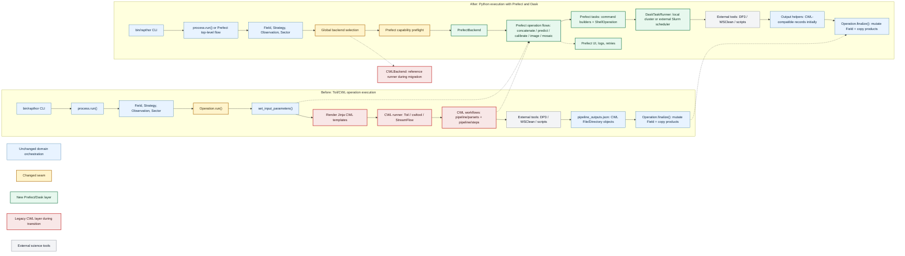

# Rapthor Prefect and Dask Migration Plan

This document outlines a staged plan for migrating Rapthor from Toil/CWL-based
operation execution to pure Python orchestration using Prefect and Dask. It is
based on a review of this repository, the prototype in
`../ska-sdp-rapthor-prefect-prototype`, and the Prefect-based pipeline in
`../ska-sdp-cimg`.

## Goals

- Replace CWL workflow templates and Toil/CWL runner execution with Python
  flows and tasks.
- Preserve Rapthor's science-facing behaviour, parset contract, output
  locations, restart semantics, and operation ordering during the migration.
- Use Prefect for workflow orchestration, observability, retries, and failure
  reporting.
- Use Dask for local and multi-node task execution, especially operation-level
  scatter over observations, sectors, image types, and calibration chunks.
- Keep migration incremental so each operation can be ported, tested, and
  compared against the current CWL backend before removing CWL.

## Non-Goals For The First Migration

- Rewriting the scientific algorithms implemented by DP3, WSClean, EveryBeam,
  IDG, LoSoTo, PyBDSF, or Rapthor scripts.
- Replacing external command-line tools with native Python implementations.
- Changing user-facing strategy semantics or parset parameter names unless
  required for the execution backend and documented with compatibility handling.
- Removing CWL immediately. CWL should remain as the reference backend until the
  Prefect backend has parity for the supported operation set.

## Current Architecture Summary

Rapthor already has Python orchestration at the top level:

- `rapthor/process.py` reads the parset, creates a `Field`, chooses the
  strategy, chunks observations, and runs operation objects in science order.
- Operation classes under `rapthor/operations/` collect parameters from
  `Field`, `Sector`, and `Observation`, render Jinja CWL workflow templates,
  execute the selected CWL runner, parse CWL-shaped outputs, then mutate the
  shared `Field` in `finalize()`.
- CWL-specific code is concentrated in:
  - `rapthor/lib/operation.py`
  - `rapthor/lib/cwl.py`
  - `rapthor/lib/cwlrunner.py`
  - `rapthor/pipeline/parsets/**`
  - `rapthor/pipeline/steps/**`
- The strongest migration seam is the operation contract:
  `set_input_parameters() -> execute backend -> outputs -> finalize()`.

The initial migration should keep `process.py` and the operation finalizers
mostly stable while swapping the execution engine under each operation.

## Architecture Diagram



## Lessons From The Prefect Prototype

The prototype demonstrates several useful patterns:

- Use `@flow` for top-level and major-cycle orchestration.
- Use `@task` for command-line work such as DP3 and WSClean.
- Use `prefect_shell.ShellOperation` for streamed command execution.
- Use `prefect_dask.DaskTaskRunner` locally or connect to an externally started
  Dask scheduler for Slurm runs.
- For multi-node Slurm, allocate nodes once, start a Dask scheduler and workers
  inside the allocation, export `DASK_SCHEDULER`, and let Prefect submit tasks
  to that cluster.

The prototype is intentionally small and should not be copied verbatim for
Rapthor's command construction. Rapthor should build commands from existing
operation inputs and CWL step definitions, then test those builders directly.

## Lessons From ska-sdp-cimg

The CIMG repository provides the cleaner production pattern:

- Use Pydantic models to make runtime configuration explicit.
- Keep command builders as ordinary pure Python functions.
- Wrap command builders in small Prefect tasks.
- Mock `prefect_shell.ShellOperation.run` in unit tests.
- Use `prefect.testing.utilities.prefect_test_harness` for flow tests.
- Keep integration tests separate and marked.
- Provide Slurm scripts for both simple production execution and development
  runs with a Prefect UI.

Rapthor should borrow this structure, but retain its existing parset and domain
model rather than replacing them up front.

## Target Architecture

Introduce a new execution layer, for example:

```text
rapthor/execution/
  __init__.py
  backend.py
  capabilities.py
  config.py
  outputs.py
  resources.py
  runtime.py
  shell.py
  task_runner.py
  workdirs.py
  tasks/
    dp3.py
    wsclean.py
    scripts.py
    filesystem.py
  flows/
    concatenate.py
    predict.py
    calibrate.py
    image.py
    mosaic.py
```

Recommended responsibilities:

- `backend.py`: common `OperationBackend` interface plus `CWLBackend` and
  `PrefectBackend`.
- `capabilities.py`: feature support declarations and preflight checks for
  operations, strategy slices, and cluster/runtime features.
- `config.py`: runtime execution settings derived from the existing parset.
- `outputs.py`: helpers for file and directory output records. Initially these
  can preserve the current CWL-shaped `{"class": "File", "path": ...}` and
  `{"class": "Directory", "path": ...}` structures.
- `resources.py`: per-task CPU, memory, thread, MPI, and concurrency settings.
- `runtime.py`: command environment construction, container wrapping, module or
  spack assumptions, and scratch-directory mapping.
- `shell.py`: safe command execution helpers, logging, environment handling,
  and optional dry-run support for tests.
- `task_runner.py`: Dask task runner construction for local and externally
  managed Slurm clusters.
- `workdirs.py`: deterministic task-local working directories, temp paths,
  atomic output helpers, and cleanup policy.
- `tasks/`: Prefect task wrappers around command builders and file operations.
- `flows/`: Python equivalents of current operation-level CWL DAGs.

The operation classes should call a backend object rather than directly calling
`create_cwl_runner()`. The current CWL backend can use existing code; the new
Prefect backend can dispatch to operation-specific Python flows.

## Execution Backend Configuration

Add a new parset option under `[cluster]`, for example:

```ini
execution_backend = cwl
```

Allowed values during migration:

- `cwl`: current behaviour using `cwl_runner = toil|cwltool|streamflow`.
- `prefect`: new Python execution backend.

Keep `cwl_runner` valid only for the `cwl` backend. This avoids overloading the
existing option and lets users opt into Prefect only when their selected
strategy is supported by the Prefect backend.

Additional optional settings may be needed later:

- `prefect_task_runner = local_dask|external_dask|sync`
- `dask_scheduler = None`
- `prefect_stream_output = True`
- `prefect_retries = 0`
- `prefect_log_commands = True`

Prefer conservative defaults that preserve single-machine behaviour.

## Backend Selection Policy

Rapthor should not support mixed-backend production runs. A run should select
one execution backend globally through the parset:

- `execution_backend = cwl`: every operation uses the current CWL backend.
- `execution_backend = prefect`: every operation required by the selected
  strategy must be supported by the Prefect backend.

During the migration, operation-level tests may instantiate a single operation
with the Prefect backend, but full pipeline runs should not silently fall back
from Prefect to CWL for unported operations. If the selected strategy requires
an operation or feature slice that the Prefect backend does not yet support,
Rapthor should fail early with a clear unsupported-feature error.

CWL remains useful as a reference implementation while building parity tests,
but it should not become a long-term compatibility path once Prefect has parity.

## Capability Preflight

The Prefect backend needs an explicit capability registry so unsupported feature
slices fail before any external command starts. The registry should answer
questions such as:

- Is this operation implemented by the Prefect backend?
- Is this operation implemented for this mode, for example DI calibration,
  DD calibration, screen generation, normalization imaging, or MPI imaging?
- Is the requested runtime available, for example local Dask, external Dask,
  Slurm, MPI WSClean, container execution, or no-container execution?
- Are required external tools and scripts discoverable before the run starts?

The backend should expose an interface equivalent to:

```text
PrefectBackend.supports(operation, field, step) -> CapabilityResult
PrefectBackend.preflight(field, strategy_steps) -> None
```

`CapabilityResult` should include the unsupported feature name and a short
message that tells the user which parset option, strategy feature, or operation
caused the failure. Full pipeline runs with `execution_backend = prefect` must
run this preflight before the first operation.

## Task Payload And State Boundary

Prefect and Dask tasks should not receive or mutate live `Field`, `Sector`, or
`Observation` objects. Those objects remain part of the driver-side Rapthor
domain model.

The boundary should be:

- Operation classes collect Python-native input dictionaries from the domain
  model.
- Prefect flows and tasks receive only serializable payloads: paths, strings,
  numbers, booleans, lists, dicts, and output specifications.
- External tasks produce output records and files, not mutated domain objects.
- Existing operation finalizers remain responsible for applying output records
  back to `Field`, `Sector`, and `Observation` state.

This keeps distributed workers from accidentally mutating state in another
process and makes task inputs easier to test, serialize, log, and cache.

## Runtime, Resources, And Filesystem Safety

The Prefect backend must preserve the important runtime behaviour currently
handled by CWL runners:

- Container settings: `use_container`, `container_type`, and no-container
  execution must have an explicit Prefect runtime mapping before the backend is
  advertised for those configurations.
- Environment settings: command environments, module or spack assumptions,
  thread variables such as `OPENBLAS_NUM_THREADS`, and preserved environment
  variables must be centralized and testable.
- Scratch settings: `dir_local`, `local_scratch_dir`, and `global_scratch_dir`
  must map to deterministic task-local temporary directories.
- Task isolation: scattered tasks must write into unique working directories or
  unique output names so concurrent Dask execution cannot collide.
- Atomicity: tasks should write to temporary paths and move into final output
  paths where practical, especially for JSON outputs and small generated files.
- Resource control: DP3, WSClean, scripts, and MPI jobs need declared CPU,
  memory, thread, and concurrency limits. Dask worker count alone is not enough.
- MPI exclusivity: MPI WSClean should remain a controlled special case so it
  does not run concurrently with tasks that consume the same node allocation.

## Restart And Output Semantics

Preserve the existing operation-level restart contract:

- Each operation keeps a working directory under `dir_working/pipelines/<op>`.
- Each operation writes `.done` when completed.
- Each operation writes `.outputs.json`.
- On restart, a completed operation loads `.outputs.json` and skips execution.
- Finalizers continue to copy or move products into `images`, `solutions`,
  `skymodels`, `plots`, `regions`, and `visibilities`.

Within a Prefect operation flow, retries and partial task caching can be added
later. The first implementation should keep operation-level restart behaviour
simple and compatible with current `modifystate` expectations.

## Staged Implementation

### Stage 0: Baseline And Design Guardrails

- Record current non-integration and focused integration test results.
- Identify the supported operation and feature matrix for the first Prefect
  backend release.
- Add a short developer document describing the backend interface and output
  object contract.
- Define the global backend selection policy: no mixed-backend production runs
  and no silent fallback from Prefect to CWL.
- Define the serializable task-payload contract and the rule that Prefect/Dask
  tasks do not mutate live Rapthor domain objects.
- Inventory current CWL runner runtime behaviour: containers, scratch paths,
  preserved environment, MPI configuration, temporary output directories, and
  logging.
- Define a resource model for external commands: per-task threads, memory,
  process count, MPI exclusivity, and maximum concurrent external jobs.
- Capture representative CWL-generated command lines and output contracts that
  will become golden parity fixtures for the Python backend.
- Keep CWL as the reference path.

Deliverables:

- Baseline test snapshot.
- Backend design notes.
- Initial issue list for feature gaps.
- Capability registry design and initial feature matrix.
- Runtime parity inventory for container, scratch, environment, and MPI
  behaviour.
- Resource model notes and first-pass concurrency defaults.
- Golden command fixtures for common DP3, WSClean, script, `taql`, `fpack`, and
  MPI WSClean cases.
- Golden output-contract fixtures for each operation's expected output keys,
  nested shapes, filenames, optional outputs, and finalizer state changes.

### Stage 1: Add Backend Abstraction

- Add `execution_backend` to defaults, parset validation, docs, and example
  parsets.
- Introduce an `OperationBackend` interface with methods equivalent to:
  - `setup(operation)`
  - `run(operation) -> dict`
  - `teardown(operation)`
- Add a capability/preflight interface to the backend contract.
- Move current CWL execution into `CWLBackend` without changing behaviour.
- Add a stub `PrefectBackend` that raises a clear unsupported-operation error.
- Update `Operation.run()` to use the backend interface.

Tests:

- Unit tests for parset validation and default value.
- Operation tests proving `execution_backend = cwl` still calls the existing
  CWL runner path.
- Tests that `execution_backend = prefect` fails clearly for unported
  operations.
- Tests that a Prefect run never falls back to CWL for an unsupported operation
  or unsupported feature slice.
- Preflight tests for unsupported operations, unsupported feature slices,
  missing external tools, unsupported container settings, and unsupported
  runtime modes.

### Stage 2: Shared Command And Output Primitives

- Add command-builder functions for common tool classes:
  - DP3
  - WSClean serial
  - WSClean MPI
  - Rapthor Python scripts
  - `taql`
  - `fpack`
- Add Prefect shell task wrappers for those builders.
- Add output helpers that create and validate CWL-compatible output records.
- Add task runner creation based on local Dask or external scheduler address.
- Add an early, mocked top-level Prefect flow skeleton that mirrors
  `process.run()` ordering without yet replacing operation-level execution.
- Add serializable task-payload models or validators for operation inputs.
- Add runtime environment builders for no-container execution first, with
  explicit unsupported errors for unimplemented container modes.
- Add workdir helpers for per-task directories, temp files, atomic moves, and
  cleanup.
- Add resource-setting helpers for command threads, memory, MPI exclusivity, and
  maximum external-job concurrency.

Tests:

- Pure unit tests for command builders.
- Golden command parity tests comparing Python command builders against
  representative CWL-generated command lines.
- Shell task tests that mock `ShellOperation.run`.
- Output helper tests for files, directories, nested lists, missing outputs, and
  JSON serialization.
- Flow tests using `prefect_test_harness` and mocked shell execution.
- Top-level flow skeleton tests for strategy ordering, cycle numbering,
  final-pass decisions, and selfcal convergence branching with mocked
  operations.
- Serialization tests proving task payloads contain only serializable values and
  do not carry live `Field`, `Sector`, or `Observation` instances.
- Runtime tests for environment construction, scratch directory selection,
  unsupported container settings, and atomic output writes.
- Resource tests for command thread counts, memory settings, MPI exclusivity,
  and external-job concurrency limits.

### Stage 3: Port Concatenate

This is the smallest operation and should be the first real backend parity
target.

- Translate `concatenate_pipeline.cwl` into a Python flow that scatters
  `concat_ms.py` or equivalent `taql` calls over epochs.
- Reuse `Concatenate.set_input_parameters()` and `Concatenate.finalize()`.
- Return `concatenated_filenames` using the same output shape as CWL.

Tests:

- Existing `tests/operations/test_concatenate.py` should run for both backends.
- Add command-builder tests for frequency concatenation.
- Add a backend parity test comparing input/output shapes from CWL mock and
  Prefect mock.
- Add restart/failure tests for failed concatenation, partial outputs, deleted
  `.done`, and reloading `.outputs.json`.
- Add a concurrency test proving scattered epoch outputs are written to unique
  paths and cannot collide.

### Stage 4: Port Mosaic

Mosaic has manageable scatter and mostly calls Rapthor scripts.

- Translate `mosaic_pipeline.cwl` and `mosaic_type_pipeline.cwl`.
- Preserve `skip_processing` behaviour for single-sector imaging.
- Preserve optional compression.
- Keep output filenames identical.

Tests:

- Existing mosaic unit tests parameterized over backend where practical.
- Mocked flow tests for image type scatter.
- Integration test from image output into mosaic output using mocked imaging
  products.
- Golden output-contract tests for single-sector skip, multi-sector mosaic,
  optional compression, and missing optional images.

### Stage 5: Port Predict

Predict introduces DP3 scatter and model subtraction.

- Translate `predict_di_pipeline.cwl`, `predict_pipeline.cwl`, and any
  non-calibrating predict variant that is still active.
- Split command construction from task submission:
  - predict model data per sector/observation
  - add sector models for DI prediction
  - subtract sector models for DD prediction
- Preserve handling of DD, DI, peeling, reweighting, and h5parm selection.

Tests:

- Unit tests for DI and DD command construction.
- Golden command parity tests for `predict_model_data`, `add_sector_models`,
  and `subtract_sector_models`.
- Tests for scatter length and output shape.
- Field mutation tests around `Predict.finalize()`.
- Focused integration tests with mocked DP3 and real lightweight script
  execution where possible.
- Failure tests for missing predicted model data, failed subtraction, peeling
  outputs, and reweighting outputs.
- Concurrency tests for sector/observation scatter paths and output basenames.

### Stage 6: Port Imaging Incrementally

Image is the largest migration target. Do it by feature slice rather than all
at once.

Suggested slices:

1. Initial image and no-DDE Stokes I imaging.
2. Prepare imaging data with DP3 and time concatenation.
3. WSClean serial no-DDE imaging.
4. Mask generation and source filtering.
5. Facet imaging with h5parm and region file generation.
6. Normalization imaging.
7. Image cubes.
8. Full-Stokes imaging.
9. Screen/hybrid imaging.
10. MPI WSClean.

Keep `Image.set_input_parameters()` as the source of truth initially. The Python
flow should consume `input_parms` and emit the same output keys currently parsed
from CWL.

Tests:

- Command-builder tests for each WSClean mode.
- Golden command parity tests for no-DDE, facet, screen, MPI, normalization,
  image-cube, full-Stokes, shared-facet, and clean-disabled modes.
- Flow tests for each imaging slice with mocked shell commands.
- Tests for `Image.finalize()` against Prefect output structures.
- Existing `tests/operations/test_image.py` gradually parameterized over both
  backends.
- Replace CWL-specific rendered-template assertions with command-builder and
  flow-structure assertions for the Prefect backend.
- Output-contract fixtures for all image output keys consumed by finalizers,
  including optional masks, diagnostic plots, cubes, filtered model images,
  compressed FITS files, visibilities, and region files.
- Restart/failure tests for failed WSClean, missing diagnostics JSON, corrupt
  diagnostics JSON, failed finalizer copy, and rerun after deleting `.done`.
- Filesystem isolation tests for scattered sector imaging, temporary WSClean
  directories, image cubes, and compressed outputs.

### Stage 7: Port Calibration Incrementally

Calibration is the other high-risk area because it includes solve planning,
conditional branches, h5parm collection, plotting, combination, and source
adjustment.

Suggested slices:

1. DI full-Jones calibration.
2. DI scalar phase calibration.
3. DD fast phase calibration without image-based prediction.
4. DD medium phase and slow gains.
5. Pre-application of DI solutions before DD solves.
6. Image-based prediction.
7. IDG/screen generation.
8. Plotting and h5parm post-processing.

Reuse the existing solve planner in `rapthor/operations/calibrate.py`.

Tests:

- Unit tests for every calibration command-builder branch.
- Golden command parity tests for DDECal, IDGCal, image-based predict,
  h5parm collection, h5parm combination, plotting, source adjustment, and
  solution processing.
- Existing solve-planner tests remain backend-independent.
- Mocked flow tests for all solve lists supported by `CALIBRATION_STRATEGY.md`.
- Integration tests for DI-only, DD-only, DI-then-DD, and DD-then-DI using the
  Prefect backend once command execution is available.
- Output-contract and finalizer-state tests for every stable solution product,
  diagnostic product, and plotted product.
- Failure tests for missing h5parm outputs, failed h5parm combination, invalid
  solution tables, failed plotting, and restart after partial calibration output.
- Resource and isolation tests for scattered solve chunks, h5parm collection,
  plotting outputs, and screen-generation outputs.

### Stage 8: Add A Prefect Top-Level Flow

After the early mocked skeleton is in place and operation-level Prefect flows
are working, make the top-level Prefect flow executable for real runs.

- Keep `process.run()` as the CLI entry point.
- Add `rapthor/flows/process.py` or similar with a Prefect flow that mirrors
  current `process.run()` sequencing.
- Decide whether operation flows are subflows or tasks from the top-level flow.
- Continue to respect selfcal convergence checks between cycles.

Tests:

- Mock operation classes and verify ordering through the Prefect top-level flow.
- Use `prefect_test_harness`.
- Keep current `tests/test_process.py` coverage backend-independent.
- Add full mocked-process tests for initial sky model generation, no-selfcal
  image-only strategy, selfcal convergence, selfcal divergence/failure,
  repeated final cycles, and unsupported Prefect feature detection.
- Add preflight tests that inspect the chosen strategy and fail before execution
  when any required operation or feature slice is unsupported.

### Stage 9: Slurm And Multi-Node Execution

Start with the prototype's safer Slurm model:

- Slurm allocation starts one Dask scheduler and one worker per node.
- `DASK_SCHEDULER` is exported.
- Rapthor uses `DaskTaskRunner(address=...)`.
- MPI WSClean remains an explicitly controlled task so it can reserve/process
  nodes without Dask oversubscription.

Add scripts modelled after the prototype and CIMG:

- Simple production Slurm script with an ephemeral Prefect server.
- Development script that reports to a persistent Prefect server.
- Optional benchmark monitor integration if required by the deployment
  environment.

Tests:

- Unit tests for task runner selection.
- Unit tests for `DASK_SCHEDULER` handling, failed scheduler connection,
  local-cluster defaults, thread counts, memory settings, and Slurm node/task
  mapping.
- Command tests for MPI WSClean launch arguments and checks that Dask worker
  counts do not oversubscribe DP3/WSClean thread settings.
- Tests for maximum concurrent external jobs and MPI exclusivity controls.
- Script lint/smoke checks where possible.
- Manual or CI-marked integration tests on the target Slurm environment.

### Stage 10: Deprecate And Remove CWL

Only after Prefect backend parity is demonstrated:

- Mark CWL backend deprecated for one release.
- Stop adding new functionality to CWL templates.
- Freeze CWL as a reference backend while parity failures are still being fixed.
- Remove Toil, StreamFlow, and cwltool dependencies.
- Remove `rapthor/pipeline/parsets/**` and `rapthor/pipeline/steps/**` once no
  tests or docs depend on them.
- Remove CWL test utilities and replace them with execution-flow tests.

## Operation Migration Matrix

| Operation | First target | Complexity | Notes |
| --- | --- | --- | --- |
| Concatenate | Stage 3 | Low | Simple scatter over epochs. Good first parity test. |
| Mosaic | Stage 4 | Low-medium | Mostly Python scripts and file handling. |
| Predict | Stage 5 | Medium | DP3 scatter plus DI/DD branch differences. |
| ImageInitial | Stage 6.1 | Medium | Useful first imaging slice. |
| ImageNormalize | Stage 6.6 | Medium-high | Depends on imaging plus normalization outputs. |
| Image | Stage 6 | High | Largest DAG and broadest feature matrix. |
| Calibrate DI | Stage 7.1-7.2 | High | Start with full-Jones, then scalar solves. |
| Calibrate DD | Stage 7.3-7.8 | Very high | Most conditional solve and h5parm logic. |

## Per-Operation Parity Gates

Before an operation can be considered ported to Prefect, it must satisfy all of
these gates:

1. Command parity:
   Representative Python-built commands match the equivalent CWL-generated
   commands for the operation's supported branches. Differences must be
   intentional, documented, and covered by tests.

2. Output contract parity:
   Prefect outputs expose the same keys, nested list shapes, file/directory
   object structure, filenames, and optional-output behaviour consumed by the
   existing finalizer.

3. Field-state parity:
   Running `finalize()` after Prefect execution mutates `Field`, `Observation`,
   and `Sector` state in the same way as the CWL backend.

4. Restart parity:
   `.done`, `.outputs.json`, skip-on-restart, rerun after deleting `.done`, and
   recovery from partial or corrupt output state behave as expected.

5. Failure parity:
   Shell-command failures, missing expected outputs, invalid output files, and
   finalizer failures surface clear errors and do not mark the operation done.

6. Flow parity:
   The Prefect operation flow has mocked-flow coverage for scatter, conditional
   branches, optional outputs, and unsupported feature detection.

7. Focused integration parity:
   At least one focused integration path for the operation passes with real
   external tools, unless the operation is explicitly marked as mocked-only for
   the current milestone.

Once an operation satisfies these gates, its CWL implementation should be frozen
for new feature development. CWL should remain available only to diagnose
regressions until all operations needed by supported strategies satisfy the
same gates.

## Testing Migration Plan

### Keep Existing Tests That Are Still Valuable

- `tests/lib/test_field.py`, `tests/lib/test_strategy.py`, and most parset tests
  should remain mostly unchanged.
- Script tests under `tests/scripts/` should remain valuable because the same
  scripts will be called by Prefect tasks.
- Operation finalizer tests should remain valuable if output shapes are
  preserved.

### Add Backend-Aware Tests

Where tests currently call `operation.run()`, parameterize over:

- `execution_backend = cwl` for existing behaviour.
- `execution_backend = prefect` once the operation is ported.

For unported operations, assert the Prefect backend raises a clear unsupported
error rather than silently falling back.

### Replace CWL-Specific Assertions Gradually

Current tests under `tests/cwl/` and CWL-rendering assertions should be replaced
by:

- Golden command parity tests.
- Command-builder unit tests.
- Flow topology tests where useful.
- Output shape tests.
- Output-contract fixture tests.
- Field-state mutation tests.
- Scatter length tests.
- Restart tests.
- Failure-mode tests.
- Logging and diagnostics tests.
- End-to-end operation tests with mocked shell execution.

Do not delete CWL tests until the matching operation has Prefect parity.

### Golden Fixture Strategy

Add small, explicit golden fixtures rather than relying on broad integration
tests to detect drift:

- Command fixtures should store the normalized command generated from the CWL
  path and compare it to the Python command builder.
- Output fixtures should store expected output keys, path basenames, object
  classes, nested list depth, optional outputs, and compressed/uncompressed
  variants.
- State fixtures should record the relevant `Field`, `Observation`, and
  `Sector` attributes before and after finalization.
- Log fixtures should assert that operation log files, command logs, and failure
  messages remain useful and discoverable.

Fixtures should be intentionally representative rather than exhaustive. The
high-risk branches need coverage: DI-only, DD-only, DI-then-DD, DD-then-DI,
facets, screens, normalization, full-Stokes, image cubes, peeling, reweighting,
shared-facet options, and MPI imaging.

Command comparison should be normalized to avoid brittle noise:

- Compare tokenized commands rather than raw strings where possible.
- Normalize absolute working directories, temporary directories, and generated
  filenames that include run-specific paths.
- Normalize harmless whitespace differences.
- Keep argument order significant unless the tool explicitly treats the order as
  irrelevant.
- Compare command environment separately from command tokens.
- Document every intentional Python-vs-CWL command delta in the fixture.

### Serialization Boundary Tests

Every Prefect task should have tests proving its input payload is safe for
distributed execution:

- No live `Field`, `Sector`, or `Observation` instances are passed to tasks.
- Task payloads are JSON-serializable or pickle-safe, depending on the chosen
  task-runner requirement.
- Task functions do not mutate driver-side domain objects.
- Flow inputs can be logged without leaking huge arrays or entire domain object
  graphs.

### Runtime Environment Tests

Runtime tests should cover behaviour that was previously handled by CWL runners:

- No-container command execution.
- Unsupported container settings fail during preflight until implemented.
- Singularity/udocker wrapping once container support is added.
- Preserved environment variables and thread variables.
- `local_scratch_dir`, `global_scratch_dir`, and deprecated `dir_local`
  selection.
- Missing external tools fail early with clear messages.
- Module or spack assumptions are documented and testable.

### Filesystem Isolation Tests

Scattered tasks must not collide when Dask runs them concurrently. Add tests for:

- Unique task-local working directories.
- Unique temporary directories for WSClean and DP3.
- Unique output basenames for sector, observation, image-type, and solve-chunk
  scatter.
- Atomic writing or replacement of `.outputs.json` and small generated files.
- Cleanup behaviour for temporary task directories on success and failure.

### Resource-Control Tests

External tools can consume many cores and large memory allocations. Tests should
cover:

- Per-command thread counts from parset values.
- Memory settings passed to WSClean and Dask workers.
- Maximum concurrent external commands.
- MPI WSClean exclusivity.
- Dask worker count versus external command thread count.
- Behaviour when resource settings are invalid or oversubscribe the selected
  local/Slurm allocation.

### Mocking Strategy

Follow CIMG's pattern:

- Mock `prefect_shell.ShellOperation.run` for most unit tests.
- Use `prefect_test_harness` for flow tests.
- Materialize expected output files and directories in temporary directories so
  existing finalizers can run.
- Keep real external command execution in integration tests only.
- Mock Dask task-runner construction in unit tests unless the test explicitly
  checks local Dask execution.
- Include negative mocks for failed shell commands, non-zero return paths,
  missing files, and malformed JSON.

### Restart And Failure Matrix

Every ported operation should have focused tests for:

- First successful run creates expected outputs, `.outputs.json`, and `.done`.
- Second run with `.done` present loads `.outputs.json` and skips execution.
- Deleting `.done` reruns the operation.
- Missing `.outputs.json` with `.done` present fails clearly.
- Corrupt `.outputs.json` fails clearly.
- Shell command failure does not create `.done`.
- Missing expected output does not create `.done`.
- Finalizer failure does not create `.done`.
- Partial output files from a failed attempt are either cleaned up or safely
  overwritten on rerun.

### modifystate Compatibility Tests

The `bin/rapthor -r` reset path should keep working with the Prefect backend.
Add tests that:

- Reset one operation and rerun it with Prefect outputs.
- Reset downstream operations without corrupting upstream `.outputs.json` files.
- Delete `.done` markers while preserving reusable products where current
  behaviour expects that.
- Reload Prefect-produced output records after reset.
- Preserve compatibility with existing operation names and working directory
  layout.

### Logging And Observability Tests

The Prefect backend should preserve Rapthor's practical debuggability:

- Operation log directories are created in the expected locations.
- Command strings and relevant environment settings are logged.
- Shell stdout/stderr are streamed or captured according to backend settings.
- Prefect task and flow names include operation names and cycle numbers.
- Failure messages identify the operation, task, command, and missing or invalid
  output.

### Integration Strategy

Use markers to keep expensive or environment-sensitive tests explicit:

- `integration`: real DP3/WSClean/EveryBeam/IDG/Casacore execution.
- `internet`: tests that require downloads or catalog access.
- Add a backend parameter only after the operation supports Prefect.

Recommended focused integration sequence:

1. Concatenate with small Measurement Sets.
2. Mosaic from small mocked or prebuilt FITS products.
3. Predict DI/DD with small test Measurement Sets.
4. Initial image.
5. DI calibration.
6. DD calibration.
7. Full selfcal process.
8. Restart after injected failure.

High-risk integration combinations:

- DI-only, DD-only, DI-then-DD, and DD-then-DI calibration strategies.
- Facet imaging with and without shared-facet read/write options.
- Normalization followed by final imaging.
- Full-Stokes imaging and clean-disabled full-Stokes imaging.
- Image cube generation.
- Peeling and reweighting.
- MPI WSClean on the target Slurm environment.
- Restart after failure in `Predict`, `Image`, and `Calibrate`.

## Documentation Updates

Update docs as each stage lands:

- `README.md`: high-level statement that Prefect backend is available or
  experimental.
- `docs/source/running.rst`: how to run with `execution_backend = prefect`.
- `docs/source/parset.rst`: new cluster/execution options.
- `docs/source/structure.rst`: replace CWL architecture details with Python
  execution layer details when ready.
- `docs/source/operations.rst`: note backend support per operation during the
  migration.
- Add Slurm/Prefect UI instructions based on the prototype and CIMG scripts.

## Dependency And Packaging Plan

During the transition:

- Add Prefect/Dask dependencies deliberately, either as core dependencies once
  the Prefect backend is user-facing or as an optional extra while it is
  experimental.
- Candidate dependencies include `prefect`, `prefect-shell`, `prefect-dask`,
  `dask`, and `distributed`.
- Consider moving `cwltool`, `toil[cwl]`, and `streamflow` to a `cwl` optional
  extra once the Prefect backend is mature enough that new installations do not
  need CWL by default.
- Update tox, CI, docs, and installation instructions so test environments cover
  both the transition backend set and the final Prefect-only backend set.
- Keep package-data cleanup explicit when removing CWL so
  `rapthor/pipeline/**` is not shipped after it is no longer used.

## Risks And Mitigations

- Risk: output naming drift breaks finalizers and downstream operations.
  Mitigation: preserve CWL-shaped output JSON initially and add parity tests.

- Risk: Prefect task retries rerun non-idempotent external commands.
  Mitigation: default retries to zero; add idempotency checks before enabling
  retries for specific tasks.

- Risk: Dask oversubscribes nodes when DP3/WSClean also use many threads.
  Mitigation: centralize thread and worker configuration; keep MPI WSClean as a
  controlled special case.

- Risk: Slurm behaviour differs from current Toil dynamic scheduling.
  Mitigation: start with static allocations and an external Dask scheduler,
  matching the prototype's tested approach.

- Risk: removing CWL tests too early hides behavioural drift.
  Mitigation: keep CWL backend as the reference until each operation has
  backend parity tests and focused integration coverage.

- Risk: command strings become hard to maintain.
  Mitigation: use structured command builders and test them directly, following
  the CIMG pattern.

- Risk: live domain objects are accidentally passed into Dask workers and
  mutated out of process.
  Mitigation: enforce serializable task payloads and keep all `Field`, `Sector`,
  and `Observation` mutation in operation finalizers.

- Risk: scattered tasks overwrite each other's files.
  Mitigation: use deterministic task-local working directories, unique output
  basenames, and atomic writes for small generated outputs.

- Risk: container and environment behaviour drifts from current CWL execution.
  Mitigation: centralize runtime construction and add preflight/runtime parity
  tests before advertising container-backed Prefect runs.

## Open Decisions

- Whether Prefect operation flows should return CWL-shaped dictionaries forever
  or only during the transition.
- Whether to introduce Pydantic models for operation inputs immediately or after
  the first operations are ported.
- How to represent task-level restart/caching without conflicting with the
  current operation-level `.done` semantics.
- How much of the existing CWL step metadata should be converted mechanically
  versus re-expressed manually as Python command builders.
- Whether Prefect/Dask dependencies are initially a development extra or become
  core dependencies as soon as the backend skeleton lands.
- Which container modes are in scope for the first user-facing Prefect release.

Resolved decision:

- Mixed-backend production runs are out of scope. A full Rapthor run uses one
  globally selected backend and fails early if that backend cannot support the
  requested strategy.

## First Three Pull Requests

### PR 1: Backend Skeleton

- Add `execution_backend` parset option.
- Add backend interface.
- Add capability/preflight interface and no-fallback policy.
- Move current CWL execution behind `CWLBackend`.
- Add unsupported `PrefectBackend`.
- Add no-fallback tests and docs for the new option.

### PR 2: Prefect Task Primitives

- Add task runner construction.
- Add shell task wrapper.
- Add output object helpers.
- Add runtime environment, workdir, and resource helper skeletons.
- Add serializable payload validators or models.
- Add golden command parity fixtures and command-builder tests.
- Add Prefect test harness setup.

### PR 3: Concatenate Prefect Backend

- Implement the Concatenate Prefect flow.
- Wire `PrefectBackend` for `Concatenate`.
- Add parity tests against the current mocked CWL output shape.
- Add command parity, output contract, finalizer-state, restart/failure, and
  mocked-flow tests.
- Add a small integration test if the environment supports `taql` or
  `concat_ms.py`.

## Success Criteria

The migration is complete when:

- All supported Rapthor operations run through the Prefect backend.
- Every supported operation satisfies the per-operation parity gates.
- Golden command, output-contract, finalizer-state, restart/failure, logging, and
  mocked-flow tests pass for the Prefect backend.
- Prefect preflight detects unsupported operations, unsupported feature slices,
  missing tools, and unsupported runtime/container modes before execution.
- Prefect task payloads are serializable and do not carry live Rapthor domain
  objects into Dask workers.
- Runtime, scratch, environment, resource, and filesystem-isolation tests pass
  for the supported local and Slurm modes.
- `modifystate` reset behaviour works with Prefect-produced operation state.
- Existing non-integration tests pass without requiring CWL.
- Focused integration tests pass for DI-only, DD-only, DI-then-DD, DD-then-DI,
  initial sky model generation, normalization, imaging, mosaicking, and restart.
- Slurm execution is documented and tested on the target environment.
- A full `execution_backend = prefect` run fails early for unsupported feature
  slices instead of silently falling back to CWL.
- Toil, StreamFlow, cwltool, and CWL package data can be removed without losing
  supported functionality.
