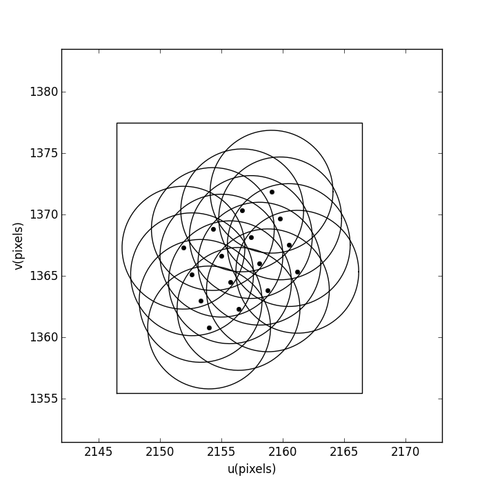

============================
Kernel size and subgrid size
============================

The kernel size is the width of the convolution kernel.
In image domain gridding the convolution kernel is never actually computed.
Instead all direction dependent effects (DDEs) are applied in the image domain.
Nevertheless, the Fourier transform of the DDEs exists and is here refered to
as 'convolution kernel'.

Usually the theoretical support of the convolution kernel is infinite.
Though practically the low tails can be cut off and the width of the 
area that remains is the kernel size.

The kernel needs to be smaller than the subgrid.
For performance reasons the subgrid size is always a multiple of eight.
The subgrid needs to be large enough to fit the uv span in time and frequency of the visibilities assigned to it,
plus the size of the kernel, as is shown in the image below.

The larger the difference between kernel size and
subgrid size, the more visibilities will fit within a subgrid.
How many visibilities will fit depends on the density of the samples.
When the data is averaged such that there is little time and bandwidth smearing
the uv stepsize between the timesteps and channels is smaller than a pixel.

Increasing the subgrid size means more work per visibility.
But for a fixed kernel size, a larger subgrid also means that more visibilities fit on the subgrid.
The cost of FFT-ing the subgrid is shared by more visibilities, reducing the cost per 
visibility. There is an optimum subgrid size minimizing the per visibility cost.
Instead of computing the exact optimum size as simple heuristic is to reserve a fixed
number of pixels or fraction of the subgrid for the uv span over time and frequency.

The direction dependent effects that contribute to the kernel size are

* Tapering function
* A-term
* W-term

