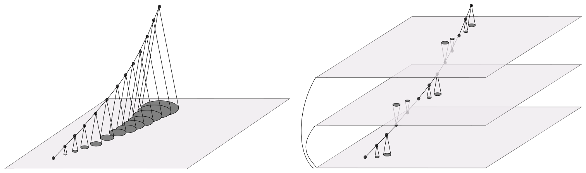
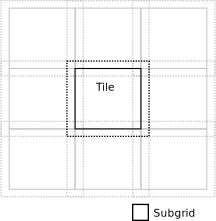

# W-stacking and W-tiling

## Introduction
The amount of work that needs to be done per visibility depends on the size of subgrid.
Per visibility, all pixels of a subgrid need to be computed. The work of the FFT of the subgrid is shared over all visibilities in a subgrid.

The subgrid pixel budget is divided over the following terms
* Taper 
* W-term
* A-term
* uv-coverage, or time-freqency coverage

For performance reasons the subgrid size is a multiple of 8. A typical subgrid size is 32x32 pixels. For some smaller cases a 24x24 subgrid is sufficient. A subgrid size of about 128x128 is still feasible, albeit slow.

The number of pixels needed for the W-term, the [w-support](w-support.md), scales with the w-coordinate and image size (in radians) squared . For larger images the support becomes excessively large. Already for a full scale LOFAR image excluding international stations, the support goes up to a few hundred pixels.

Computing subgrids of a few hundred by a few hundred pixels is not feasible. To handle large W-terms other techniques are required.

## W-stacking

The correction for the W-term is a multiplication by a complex exponential in the image domain. The correction for w-coordinate can therefore be factored in two successive corrections for w1 and w2, where w=w1+w2.

The w-stacking method exploits this by keeping multiple versions of the uv-grid in memory. Each uv-grid, or w-layer, corresponds to a certain w-offset. Visibilities are gridded onto the nearest (up or down) w-layer. This greatly reduces the support of the W-term. After all visibilities have been gridded, all w-layers are FFTed to the image domain. Each w-layer is then multiplied by the correction term corresponding to the w-offset of the layer.
The final image is the sum of all layers.

The correction at subgrid level can go either upwards or downwards, so the w step size between the layers is twice the distance covered by the w-support reserved in the subgrid.

Baselines are symmetric in the sense that swapping the two antennes does not result in any new information, but only a hermitian transpose (complex conjugate + transpose) of the data. Swapping the antennas also negates the uvw coordinates. Negative w can be made positive by a swap, so the w-stack only needs to cover the positive w. This leads to nr_w_layers w-layers centered at $`(w\_layer\_idx+1/2)w\_step`$. Where the $`w_step`$ is given by $`w_max/nr_w_layers`$, and the maximum that w-distance that the subgrids need to cover is $`w_step/2`$.

The w-stacking method costs extra memory and compute time for the large scale FFT. This cost does not scale with the number of visibilities, while the cost per visibility is reduced. For larger images however the amount of memory needed to store the W-stack becomes excessive. For example to make a 30k x 30k image almost 40GB per layers is needed, while there need to be a few tens of layers. For these cases a more efficient method is needed.

## W-tiling

The antennas are based on the ground. Except for possibly some curvature of the earth's surface they lie in a plane. The baselines lie also in this plane. This plane slices through the W-stack, and only in the neighborhood of the intersections, pixels are updated. Over time, due to earth rotation, the plane rotates through the W-stack. At any given time only a limited part of the W-stack is active. The idea behind the W-tiling method is to further divide the layers of the W-stack into tiles, and to have only those tiles in memory that are active.

Subgrids are added to the grid, or w-layer. When a w-layer is subdivided into tiles, a subgrid might overlap with multiple tiles. Keeping track of multiple overlaps is a administrative burden, and splitting the addition over multiple tiles can be inefficient. Therefore each tile is padded around with a border of half a subgrid size. Then there is always at least one tile in which the subgrid falls in its entirety.

Keeping track of the tiles and deciding which ones to retire is something that should not be done on the GPU. The compute kernels should keep the arithmetic units busy, and branching is very bad for that. So all decisions need te be taken beforehand. The natural place to do that is the Plan. The Plan partitions the visibilities over subgrids. For W-tiling it now also needs to assign a subgrid to a tile.

The memory structure for storing the active tiles is very similar to the W-stack. Except that the tiles are much smaller than the w-layers, and there can be many more w-tiles than w-layers. In contrast to the w-layer index, the w-tile index has no physical meaning. The mapping of a subgrid to a w-tile is not based on the w_offset of the grid, but only on what w-tile was free at the moment a new w-tile was needed.

Apart from a assigning subgrids to w-grids, the Plan also produces a list of update events. When all w-tiles in the buffer are in use and a new w-tile is needed then a number of tiles is retired. For gridding this means adding the contents of some w-tiles to the master grid, and filling the w-tiles with zeros. For degridding this means filling some w-tiles with data from the master grid. How many tiles are retired depends on the update fraction. What w-tiles are retired is decided by the simple Least Recently Used (LRU) policy. This method requires no information ahead of time, and is very effective in our case. The change in uvw coordinates over time is due to earth rotation, which results in a well behaved access pattern.

When a w-tiling enabled Plan is executed, the way the gridding to/degridding from the subgrids happens remains unaltered. However, adding to/splitting from the mastergrid is divided into two steps. The first step is to add/split subgrids to/from w-tiles. This is done until the next update event. The second step is to add to/split from the master grid those w-tiles that are retired in this update event. The first and second step alternate until all subgrids are added to/split from the master grid.

## Managing State

W-tiling is designed as an implementation detail of the Proxy. That means that its details are hidden behind the Proxy interface. A few changes to the interface were needed to support algorithms like w-tiling.

The gridding and degridding functions of the Proxy are stateless. When the call returns the result is ready and the next call could be for a different grid, although in practice it is often for the same grid. With w-tiling we would like to keep the cache of w-tiles alive between gridding/degridding calls, as long as they are for the same grid. On the other hand we would not like to expose the w-tile cache to the outside world. It needs to be stored internally. Two member functions have been added to the Proxy to announce the begin and end of a series of gridding/degridding calls om the same grid: `set_grid(Grid &grid)` and `get_grid()`. 

The Plan is a class separate from the Proxy. It needs information on the state of the w-tile cache to assign subgrids to w-tiles and to create the list of update events. To make this possible without exposing the w-tile cache, a `make_plan(...)` function has been added to the Proxy that creates a Plan by calling its constructor, passing along the arguments and adding one extra argument, the w-tile information.
