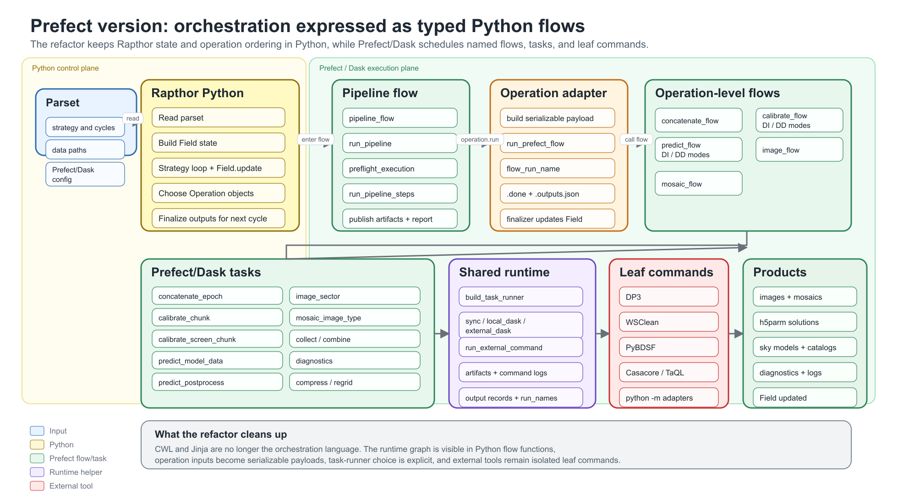

Development Architecture
========================

This page documents the intended architecture for the post-CWL/Toil
Prefect/Dask codebase. It is a working guide for refactors, not a claim that
every module has already reached the target shape.

Clean Architecture Rule
-----------------------

Rapthor should follow one-way dependencies:

* Domain code does not depend on execution frameworks.
* Application/use-case code may depend on the domain and plain serializable
  contracts, but not on Prefect task objects or live Dask runtime state.
* Interface adapters translate between use-case contracts and the outside world:
  command lines, execution-owned module adapters, output records, filesystems,
  and shell execution.
* Frameworks and drivers contain Prefect flows, Dask task runners, Slurm
  integration, artifacts, dashboards, and runtime resource checks.

The practical rule is that inner layers must not import outer layers. If a
dependency has to cross outward, introduce a small protocol, callback, or
adapter and inject it from the outer layer.

Layer Ownership
---------------

.. list-table::
   :header-rows: 1

   * - Area
     - Responsibility
     - Primary tests
   * - ``rapthor.lib``
     - Field, observation, sector, cluster, strategy, parset interpretation,
       operation lifecycle primitives, finalizer-compatible output records, and
       finalizer-visible domain state.
     - ``tests/lib``
   * - ``rapthor.application`` or ``rapthor.use_cases``
     - Future home for scheduler-independent operation planning, typed payload
       contracts, parset/field-to-payload mapping, restart decisions, and
       workflow decisions.
     - Contract and operation tests as the layer is introduced.
   * - ``rapthor.operations``
     - Operation adapters that connect domain objects to payload builders, run
       flows through the operation flow-execution bridge, update field state,
       and handle finalizer side effects.
     - ``tests/operations``
   * - ``rapthor.execution.commands`` and operation command modules such as
       ``rapthor.execution.image.commands`` and
       ``rapthor.execution.calibrate.commands``
     - Deterministic external-command token construction, display helpers, and
       operation-specific command builders that do not import Prefect.
     - ``tests/execution/test_commands.py``, operation flow tests, and command
       reference fixtures.
   * - Operation output-discovery modules such as
       ``rapthor.execution.image.outputs``
     - File/directory discovery and finalizer-compatible output-record creation
       for operation-specific products. These modules should stay free of
       Prefect, Dask, shell execution, and operation objects.
     - Focused output contract tests and operation flow tests.
   * - ``rapthor.execution.payloads`` and operation payload modules such as
       ``rapthor.execution.image.contracts``,
       ``rapthor.execution.image.builders``,
       ``rapthor.execution.image.validation``, and
       ``rapthor.execution.calibrate.contracts``,
       ``rapthor.execution.calibrate.builders``, and
       ``rapthor.execution.calibrate.validation``
     - Shared payload serialization checks plus operation-specific typed payload
       contracts, builders, and validators. As operation packages are
       introduced, move operation-specific contracts into the package that owns
       them.
     - ``tests/execution/test_payloads.py`` and operation flow tests.
   * - Operation work-unit modules such as ``rapthor.execution.image.sector``,
       ``rapthor.execution.calibrate.solves``,
       ``rapthor.execution.calibrate.collection``, and
       ``rapthor.execution.calibrate.prediction``
     - Scheduler-independent task bodies that run shell commands, discover
       outputs, publish task-local artifacts, and return serializable records.
     - Operation flow tests with shell execution mocked.
   * - Operation flow modules such as ``rapthor.execution.image.flow`` and
       ``rapthor.execution.calibrate.flow``
     - Prefect orchestration for one operation: task boundaries, scheduling,
       retries, artifacts, flow-level validation, and runtime integration.
     - ``tests/execution/test_*_flow.py``
   * - Execution-owned helper modules such as
       ``rapthor.execution.image.skymodel_filter``,
       ``rapthor.execution.image.cube_catalog_cli``, and
       ``rapthor.execution.calibrate.plotting``
     - Importable implementations for migrated helper utilities, plus thin
       ``python -m`` adapters where shell isolation is still useful.
     - Focused execution tests and command reference fixtures.
   * - ``rapthor.execution.pipeline``
     - Top-level pipeline orchestration, lifecycle hooks, preflight feature
       detection, and preflight integration.
     - ``tests/execution/test_pipeline_flow.py``
   * - ``rapthor.execution.task_runner``, ``outputs``, ``resources``,
       ``slurm``, ``artifacts``, and ``shell``
     - Runtime infrastructure and adapters for local, Dask, Slurm, shell, and
       artifact behaviour.
     - Focused tests under ``tests/execution``

``rapthor.scripts`` is no longer a production pipeline layer. New or migrated
helper logic should live under the execution package that owns it, for example
``rapthor.execution.image`` for imaging helpers or
``rapthor.execution.calibrate`` for calibration helpers. The
``concat_linc_files`` utility remains a supported installed command, but its
implementation is owned by ``rapthor.execution.concatenate`` and exposed through
the package entry point ``rapthor.execution.concatenate.linc_cli:main``.

Public Export Guidance
----------------------

``rapthor.execution`` and operation package initializers are intentionally
light. They should not re-export flow functions, command builders, payload
builders, task bodies, or runtime helpers.

New code should import from the module that owns the behaviour, for example:

* command helpers from ``rapthor.execution.commands`` and operation-specific
  command modules such as ``rapthor.execution.image.commands`` or
  ``rapthor.execution.calibrate.commands``
* payload helpers from the payload/use-case module that owns the contract, such
  as ``rapthor.execution.image.contracts``,
  ``rapthor.execution.image.builders``, ``rapthor.execution.image.validation``,
  ``rapthor.execution.calibrate.contracts``,
  ``rapthor.execution.calibrate.builders``, or
  ``rapthor.execution.calibrate.validation`` for operation payload mapping
* finalizer-compatible file/directory record helpers from
  ``rapthor.lib.records``
* output discovery helpers from operation-specific modules such as
  ``rapthor.execution.image.outputs``
* task bodies from operation work-unit modules such as
  ``rapthor.execution.image.sector``, ``rapthor.execution.calibrate.solves``,
  ``rapthor.execution.calibrate.collection``, or
  ``rapthor.execution.calibrate.prediction``
* Prefect flows from the concrete ``rapthor.execution.<operation>.flow`` module
  or ``rapthor.execution.pipeline.flow`` for the top-level pipeline
* runtime helpers from their concrete runtime module
* module-adapter command construction from
  ``rapthor.execution.commands.python_module_command``

Do not add new package-level facade exports unless there is a documented
compatibility reason.

Execution-Owned Module Adapters
-------------------------------

Most migrated helper logic should be called directly as Python functions from
the relevant flow or work-unit module. Use a ``python -m`` module adapter only
when a helper benefits from a separate process boundary, for example because a
third-party library manages global state, multiprocessing, or native resources.

Current examples:

* sky-model filtering lives in
  ``rapthor.execution.image.skymodel_filter.filter_image_skymodel``. It may run
  through ``rapthor.execution.image.skymodel_filter_cli`` when PyBDSF or
  ``lsmtool`` isolation is useful.
* image-cube catalog generation uses
  ``rapthor.execution.image.cube_catalog_cli`` as the thin module adapter around
  execution-owned image-cube helpers.
* calibration solution plotting lives in
  ``rapthor.execution.calibrate.plotting.plot_solutions``. Flow code may invoke
  ``rapthor.execution.calibrate.plotting_cli`` through shell execution so plot
  generation remains isolated from worker state.

Build these commands with ``python_module_command`` rather than hand-written
``python3 -m`` token lists. Keep adapters thin: parse CLI arguments, call the
owned Python function, and return a process status.

Compatibility Shim Lifecycle
----------------------------

Compatibility shims and broad facades are temporary unless explicitly documented
as stable public APIs. Each shim should have:

* an owner and reason for existing
* a target module that new code should import instead
* an import migration plan
* tests or search checks that prove the old import path is no longer used
* a removal condition

When a refactor stage finishes, do a shim cleanup pass before adding more
abstractions. Remove shims, deprecated exports, and architecture-test allowlist
entries that no longer protect a real supported contract.

There are no standalone compatibility shims documented here at the moment.

Current Boundary Exceptions
---------------------------

There are no documented clean-architecture boundary exceptions at the moment.
If a future exception becomes necessary, document the owner, reason, removal
condition, and architecture-test allowlist entry in the same change.

Prefect/Dask Orchestration Diagram
----------------------------------

The editable SVG source for the current Prefect/Dask orchestration and
refactored package ownership is kept in
``docs/source/development/prefect_dask_architecture.svg``. It is intended as the
post-CWL counterpart to the historical workflow diagram and should be updated
when operation ownership, flow boundaries, or task naming conventions change.

   Current Prefect/Dask orchestration and package ownership after the CWL
   migration.

Change Workflow
---------------

When changing a parset option:

* update defaults and documentation
* update the domain or use-case mapping that owns the meaning
* update the payload contract and command builder if execution changes
* add focused payload, command, operation, and process tests as needed

When changing an operation:

* keep lifecycle/finalizer effects in the operation adapter
* keep parset/field-to-payload mapping in pure helpers
* keep command construction deterministic and independently testable
* cover restart/reuse and field hand-off behaviour

When changing runtime behaviour:

* keep Prefect/Dask/Slurm details outside domain and command modules
* test configuration, resource validation, task-runner selection, and failure
  messages without real external tools where possible
* use integration or target-environment tests only for behaviour that needs the
  deployment stack

When converting a legacy utility to an execution module:

* extract an importable Python function first
* place the function under the execution package that owns the work
* add a ``python -m`` adapter only when subprocess isolation is still useful
* add Python function tests and adapter tests when an adapter exists
* update command fixtures and architecture tests so retired script paths cannot
  reappear accidentally
* keep large data movement explicit and Dask-friendly
