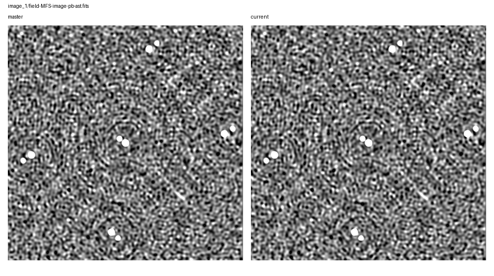
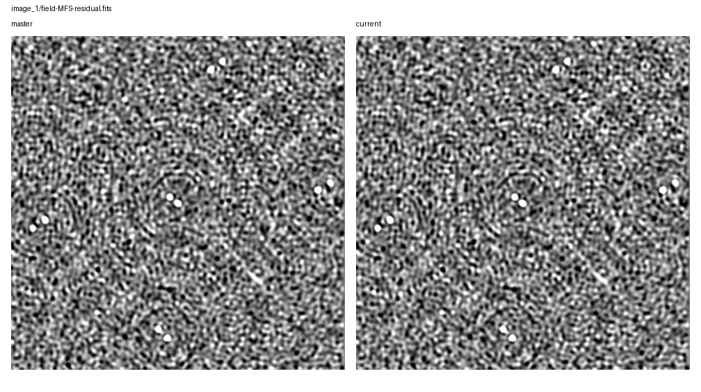

# Rapthor Branch Equivalence

Scenario: `dd-phase-plus-di-fulljones`
Run root: `/app/runs/rbe-dd-phase-plus-di-fulljones-20260705`

## Branch Runs

| Side | Ref | Return Code | Parset | Work Dir | Log | Input Snapshot |
| --- | --- | ---: | --- | --- | --- | --- |
| base | `master` | 0 | `/app/docs/source/development/equivalence_runs/2026-07-05-dd-phase-plus-di-fulljones-master-ref/inputs/base/master_dd_phase_plus_di_fulljones.parset` | `/tmp/rbe-master-dd-phase-plus-di-fulljones-work` | `/app/runs/rbe-dd-phase-plus-di-fulljones-20260705/base/rapthor-command.log` | parset: `inputs/base/master_dd_phase_plus_di_fulljones.parset`, strategy: `inputs/base/master_dd_phase_plus_di_fulljones_strategy.py` |
| current | `current` | 0 | `/app/docs/source/development/equivalence_runs/2026-07-05-dd-phase-plus-di-fulljones-master-ref/inputs/current/current_dd_phase_plus_di_fulljones.parset` | `/tmp/rbe-current-dd-phase-plus-di-fulljones-work` | `/app/runs/rbe-dd-phase-plus-di-fulljones-20260705/current/rapthor-command.log` | parset: `inputs/current/current_dd_phase_plus_di_fulljones.parset`, strategy: `inputs/current/current_dd_phase_plus_di_fulljones_strategy.py` |

## Comparison Summary

| Result | Ops | Records | FITS | Image HDUs | Table HDUs | H5 | Text | Diagnostics | Visuals |
| --- | ---: | ---: | ---: | ---: | ---: | ---: | ---: | ---: | ---: |
| fail | 5 | 5 | 7 | 6 | 1 | 3 | 10 | 1 | 5 |

## FITS Residual Metrics

| Product | Max Abs Delta | P99 Abs Delta | Residual RMS | RMS / Ref RMS | RMS / Ref MAD |
| --- | ---: | ---: | ---: | ---: | ---: |
| `field-MFS-image-pb-ast.fits` | 1.025e-02 | 1.066e-04 | 1.673e-04 | 2.239e-03 | 1.009e-02 |
| `field-MFS-image-pb.fits` | 1.025e-02 | 1.066e-04 | 1.673e-04 | 2.239e-03 | 1.009e-02 |
| `field-MFS-image.fits` | 1.025e-02 | 1.046e-04 | 1.651e-04 | 2.239e-03 | 1.016e-02 |
| `field-MFS-dirty.fits` | 1.016e-02 | 9.260e-04 | 3.872e-04 | 2.239e-03 | 2.499e-03 |
| `field-MFS-model-pb.fits` | 3.433e-03 | 0.000e+00 | 3.884e-06 | 2.239e-03 | n/a |
| `field-MFS-residual.fits` | 5.147e-04 | 9.897e-05 | 3.876e-05 | 2.239e-03 | 2.392e-03 |

## Image Diagnostics

| Operation | Sector | Field | Reference | Current | Delta | Relative Delta |
| --- | --- | --- | ---: | ---: | ---: | ---: |
| `image_1` | `sector_1` | `nsources` | 1.100e+01 | 1.100e+01 | 0.000e+00 | 0.000% |
| `image_1` | `sector_1` | `theoretical_rms` | 9.006e-03 | 9.006e-03 | 0.000e+00 | 0.000% |
| `image_1` | `sector_1` | `min_rms_flat_noise` | 8.311e-03 | 8.330e-03 | 1.962e-05 | 0.236% |
| `image_1` | `sector_1` | `median_rms_flat_noise` | 1.589e-02 | 1.592e-02 | 3.552e-05 | 0.224% |
| `image_1` | `sector_1` | `dynamic_range_global_flat_noise` | 5.506e+02 | 5.506e+02 | -6.659e-02 | -0.012% |
| `image_1` | `sector_1` | `min_rms_true_sky` | 8.438e-03 | 8.458e-03 | 1.982e-05 | 0.235% |
| `image_1` | `sector_1` | `median_rms_true_sky` | 1.622e-02 | 1.625e-02 | 3.625e-05 | 0.224% |
| `image_1` | `sector_1` | `dynamic_range_global_true_sky` | 5.423e+02 | 5.423e+02 | -5.915e-02 | -0.011% |

## Visual Comparisons

### Image: `image_1/field-MFS-image-pb-ast.fits`

### Image: `image_1/field-MFS-image-pb.fits`

### Image: `image_1/field-MFS-residual.fits`

### Solution: `calibrate_1/fast_phase_dir[Patch_rich_centre].png`

![calibrate_1/fast_phase_dir[Patch_rich_centre].png](visual-comparisons/solutions/calibrate_1-fast_phase_dir-patch_rich_centre-.png.png)

### Solution: `calibrate_1/medium1_phase_dir[Patch_rich_centre].png`

![calibrate_1/medium1_phase_dir[Patch_rich_centre].png](visual-comparisons/solutions/calibrate_1-medium1_phase_dir-patch_rich_centre-.png.png)

## Warnings

- output-record summary differs for calibrate_1
- output-record summary differs for calibrate_di_1

## Failures

- FITS std differs for field-MFS-dirty.fits: 0.17292158740976585 != 0.17330874379656377
- FITS rms differs for field-MFS-dirty.fits: 0.17292200578741182 != 0.1733091631092017
- FITS min differs for field-MFS-dirty.fits: -0.7253921627998352 != -0.7270155549049377
- FITS max differs for field-MFS-dirty.fits: 4.537002086639404 != 4.547160625457764
- FITS image pixels differ for field-MFS-dirty.fits: max_abs_delta=0.010158538818359375, p99_abs_delta=0.0009259581565856934, residual_rms=0.00038715995751489136
- FITS mean differs for field-MFS-image-pb-ast.fits: 0.0029854774982761927 != 0.0029921630094860282
- FITS std differs for field-MFS-image-pb-ast.fits: 0.0746869606627249 != 0.07485416841218472
- FITS rms differs for field-MFS-image-pb-ast.fits: 0.07474660640409116 != 0.07491394775444053
- FITS min differs for field-MFS-image-pb-ast.fits: -0.08084568381309509 != -0.0810261219739914
- FITS max differs for field-MFS-image-pb-ast.fits: 4.576261520385742 != 4.586507797241211
- FITS image pixels differ for field-MFS-image-pb-ast.fits: max_abs_delta=0.01024627685546875, p99_abs_delta=0.0001066215708851806, residual_rms=0.00016734766623172423
- FITS mean differs for field-MFS-image-pb.fits: 0.0029854774982761927 != 0.0029921630094860282
- FITS std differs for field-MFS-image-pb.fits: 0.0746869606627249 != 0.07485416841218472
- FITS rms differs for field-MFS-image-pb.fits: 0.07474660640409116 != 0.07491394775444053
- FITS min differs for field-MFS-image-pb.fits: -0.08084568381309509 != -0.0810261219739914
- FITS max differs for field-MFS-image-pb.fits: 4.576261520385742 != 4.586507797241211
- FITS image pixels differ for field-MFS-image-pb.fits: max_abs_delta=0.01024627685546875, p99_abs_delta=0.0001066215708851806, residual_rms=0.00016734766623172423
- FITS mean differs for field-MFS-image.fits: 0.002942199728386923 != 0.002948788781113404
- FITS std differs for field-MFS-image.fits: 0.07370320008187257 != 0.07386820614790406
- FITS rms differs for field-MFS-image.fits: 0.07376190237209358 != 0.07392703994334462
- FITS min differs for field-MFS-image.fits: -0.08031637221574783 != -0.08049559593200684
- FITS max differs for field-MFS-image.fits: 4.5762529373168945 != 4.586499214172363
- FITS image pixels differ for field-MFS-image.fits: max_abs_delta=0.01024627685546875, p99_abs_delta=0.00010456893593072808, residual_rms=0.0001651437247351332
- FITS std differs for field-MFS-model-pb.fits: 0.0017346313720537979 != 0.0017385154893418539
- FITS rms differs for field-MFS-model-pb.fits: 0.0017346341398638736 != 0.0017385182633489708
- FITS max differs for field-MFS-model-pb.fits: 1.5328218936920166 != 1.5362552404403687
- FITS image pixels differ for field-MFS-model-pb.fits: max_abs_delta=0.0034333467483520508, p99_abs_delta=0.0, residual_rms=3.88412361072628e-06
- FITS std differs for field-MFS-residual.fits: 0.017308981143429755 != 0.017347713840723686
- FITS rms differs for field-MFS-residual.fits: 0.017308987113834867 != 0.017347719823743505
- FITS min differs for field-MFS-residual.fits: -0.08031634986400604 != -0.08049558848142624
- FITS max differs for field-MFS-residual.fits: 0.2298308163881302 != 0.2303454875946045
- FITS image pixels differ for field-MFS-residual.fits: max_abs_delta=0.0005146712064743042, p99_abs_delta=9.896982461213982e-05, residual_rms=3.87589077540044e-05
- HDF5 numeric dataset differs for fulljones-solutions.h5:sol000/amplitude000/val (max_abs=0.00113655)
- FITS table column differs for sector_1.source_catalog.fits:Total_flux
- FITS table column differs for sector_1.source_catalog.fits:E_Total_flux
- FITS table column differs for sector_1.source_catalog.fits:Peak_flux
- FITS table column differs for sector_1.source_catalog.fits:E_Peak_flux
- FITS table column differs for sector_1.source_catalog.fits:E_PA
- FITS table column differs for sector_1.source_catalog.fits:E_PA_img_plane
- FITS table column differs for sector_1.source_catalog.fits:E_DC_PA
- FITS table column differs for sector_1.source_catalog.fits:E_DC_PA_img_plane
- FITS table column differs for sector_1.source_catalog.fits:Isl_Total_flux
- FITS table column differs for sector_1.source_catalog.fits:E_Isl_Total_flux
- FITS table column differs for sector_1.source_catalog.fits:Isl_rms
- FITS table column differs for sector_1.source_catalog.fits:Resid_Isl_rms
- FITS table column differs for sector_1.source_catalog.fits:Resid_Isl_mean
- text product differs for sector_1_facets_ds9.reg
