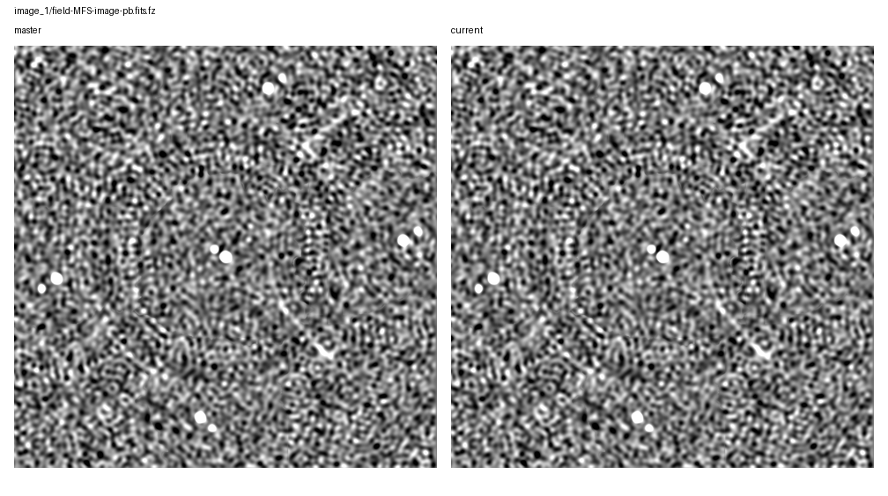
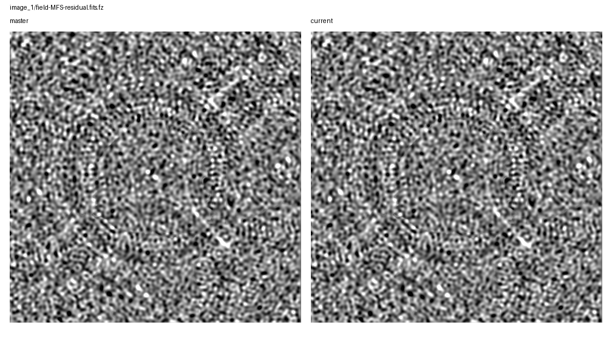
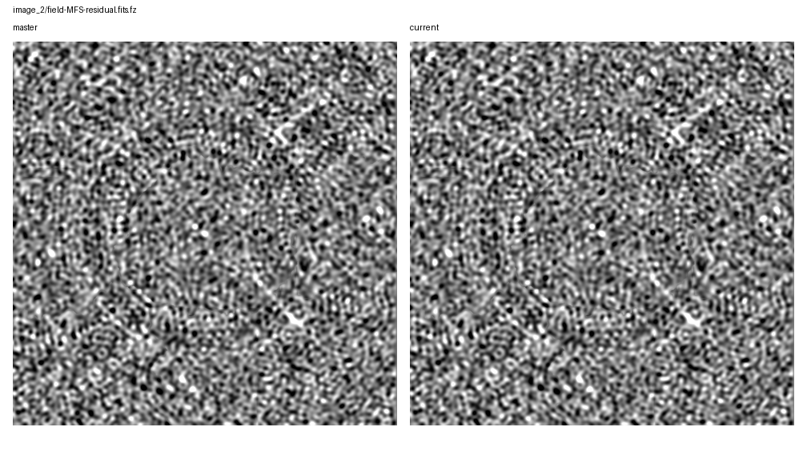

# Rapthor Branch Equivalence

Scenario: `dd-then-di-mode-boundary`
Run root: `/app/runs/rbe-dd-then-di-mode-boundary-20260705`

## Branch Runs

| Side | Ref | Return Code | Parset | Work Dir | Log | Input Snapshot |
| --- | --- | ---: | --- | --- | --- | --- |
| base | `master` | 0 | `/app/docs/source/development/equivalence_runs/2026-07-05-dd-then-di-mode-boundary-master-ref/inputs/base/master_dd_then_di_mode_boundary.parset` | `/tmp/rbe-master-dd-then-di-mode-boundary-work` | `/app/runs/rbe-dd-then-di-mode-boundary-20260705/base/rapthor-command.log` | parset: `inputs/base/master_dd_then_di_mode_boundary.parset`, strategy: `inputs/base/master_dd_then_di_mode_boundary_strategy.py` |
| current | `current` | 0 | `/app/docs/source/development/equivalence_runs/2026-07-05-dd-then-di-mode-boundary-master-ref/inputs/current/current_dd_then_di_mode_boundary.parset` | `/tmp/rbe-current-dd-then-di-mode-boundary-work` | `/app/runs/rbe-dd-then-di-mode-boundary-20260705/current/rapthor-command.log` | parset: `inputs/current/current_dd_then_di_mode_boundary.parset`, strategy: `inputs/current/current_dd_then_di_mode_boundary_strategy.py` |

## Comparison Summary

| Result | Ops | Records | FITS | Image HDUs | Table HDUs | H5 | Text | Diagnostics | Visuals |
| --- | ---: | ---: | ---: | ---: | ---: | ---: | ---: | ---: | ---: |
| fail | 8 | 8 | 14 | 12 | 2 | 5 | 19 | 2 | 10 |

## FITS Residual Metrics

| Product | Max Abs Delta | P99 Abs Delta | Residual RMS | RMS / Ref RMS | RMS / Ref MAD |
| --- | ---: | ---: | ---: | ---: | ---: |
| `field-MFS-image.fits.fz` | 5.131e-01 | 1.380e-02 | 9.387e-03 | 1.107e-01 | 2.154e-01 |
| `field-MFS-image-pb-ast.fits.fz` | 5.131e-01 | 1.409e-02 | 9.529e-03 | 1.107e-01 | 2.142e-01 |
| `field-MFS-image-pb.fits.fz` | 5.131e-01 | 1.409e-02 | 9.529e-03 | 1.107e-01 | 2.142e-01 |
| `field-MFS-dirty.fits.fz` | 4.966e-01 | 4.546e-02 | 1.894e-02 | 1.107e-01 | 1.232e-01 |
| `field-MFS-model-pb.fits.fz` | 3.687e-01 | 0.000e+00 | 4.398e-03 | 1.264e+00 | n/a |
| `field-MFS-model-pb.fits.fz` | 2.286e-01 | 0.000e+00 | 3.468e-03 | 1.143e+00 | n/a |
| `field-MFS-residual.fits.fz` | 3.792e-02 | 1.313e-02 | 4.916e-03 | 1.107e-01 | 1.132e-01 |
| `field-MFS-image-pb.fits.fz` | 1.809e-02 | 2.850e-06 | 7.632e-06 | 9.060e-05 | 1.830e-04 |
| `field-MFS-image-pb-ast.fits.fz` | 1.809e-02 | 2.850e-06 | 7.632e-06 | 9.060e-05 | 1.830e-04 |
| `field-MFS-residual.fits.fz` | 1.773e-02 | 2.772e-06 | 7.477e-06 | 1.793e-04 | 1.835e-04 |
| `field-MFS-image.fits.fz` | 1.773e-02 | 2.796e-06 | 7.478e-06 | 9.011e-05 | 1.830e-04 |
| `field-MFS-dirty.fits.fz` | 1.459e-05 | 9.939e-06 | 4.153e-06 | 2.404e-05 | 2.681e-05 |

## Image Diagnostics

| Operation | Sector | Field | Reference | Current | Delta | Relative Delta |
| --- | --- | --- | ---: | ---: | ---: | ---: |
| `image_1` | `sector_1` | `nsources` | 1.000e+01 | 1.000e+01 | 0.000e+00 | 0.000% |
| `image_1` | `sector_1` | `theoretical_rms` | 9.006e-03 | 9.006e-03 | 0.000e+00 | 0.000% |
| `image_1` | `sector_1` | `min_rms_flat_noise` | 1.987e-02 | 1.987e-02 | -9.313e-09 | -0.000% |
| `image_1` | `sector_1` | `median_rms_flat_noise` | 3.982e-02 | 3.982e-02 | 7.451e-09 | 0.000% |
| `image_1` | `sector_1` | `dynamic_range_global_flat_noise` | 2.296e+02 | 2.296e+02 | 1.076e-04 | 0.000% |
| `image_1` | `sector_1` | `min_rms_true_sky` | 2.038e-02 | 2.038e-02 | -4.657e-08 | -0.000% |
| `image_1` | `sector_1` | `median_rms_true_sky` | 4.061e-02 | 4.061e-02 | 0.000e+00 | 0.000% |
| `image_1` | `sector_1` | `dynamic_range_global_true_sky` | 2.239e+02 | 2.239e+02 | 4.882e-04 | 0.000% |
| `image_2` | `sector_1` | `nsources` | 1.100e+01 | 1.100e+01 | 0.000e+00 | 0.000% |
| `image_2` | `sector_1` | `theoretical_rms` | 9.006e-03 | 9.006e-03 | 0.000e+00 | 0.000% |
| `image_2` | `sector_1` | `min_rms_flat_noise` | 2.326e-02 | 2.583e-02 | 2.575e-03 | 11.070% |
| `image_2` | `sector_1` | `median_rms_flat_noise` | 4.233e-02 | 4.702e-02 | 4.685e-03 | 11.067% |
| `image_2` | `sector_1` | `dynamic_range_global_flat_noise` | 1.993e+02 | 1.993e+02 | -4.667e-03 | -0.002% |
| `image_2` | `sector_1` | `min_rms_true_sky` | 2.385e-02 | 2.649e-02 | 2.641e-03 | 11.070% |
| `image_2` | `sector_1` | `median_rms_true_sky` | 4.323e-02 | 4.802e-02 | 4.785e-03 | 11.067% |
| `image_2` | `sector_1` | `dynamic_range_global_true_sky` | 1.944e+02 | 1.944e+02 | -4.944e-03 | -0.003% |

## Visual Comparisons

### Image: `image_1/field-MFS-image-pb-ast.fits.fz`

### Image: `image_1/field-MFS-image-pb.fits.fz`

### Image: `image_1/field-MFS-residual.fits.fz`

### Image: `image_2/field-MFS-image-pb-ast.fits.fz`

### Image: `image_2/field-MFS-image-pb.fits.fz`

### Image: `image_2/field-MFS-residual.fits.fz`

### Solution: `calibrate_1/fast_phase_dir[Patch_rich_centre].png`

![calibrate_1/fast_phase_dir[Patch_rich_centre].png](visual-comparisons/solutions/calibrate_1-fast_phase_dir-patch_rich_centre-.png.png)

### Solution: `calibrate_1/medium1_phase_dir[Patch_rich_centre].png`

![calibrate_1/medium1_phase_dir[Patch_rich_centre].png](visual-comparisons/solutions/calibrate_1-medium1_phase_dir-patch_rich_centre-.png.png)

### Solution: `calibrate_2/fast_phase_dir[Patch_rich_centre].png`

![calibrate_2/fast_phase_dir[Patch_rich_centre].png](visual-comparisons/solutions/calibrate_2-fast_phase_dir-patch_rich_centre-.png.png)

### Solution: `calibrate_2/medium1_phase_dir[Patch_rich_centre].png`

![calibrate_2/medium1_phase_dir[Patch_rich_centre].png](visual-comparisons/solutions/calibrate_2-medium1_phase_dir-patch_rich_centre-.png.png)

## Warnings

- output-record summary differs for calibrate_1
- output-record summary differs for calibrate_2
- output-record summary differs for calibrate_di_2

## Failures

- FITS image pixels differ for field-MFS-dirty.fits.fz: max_abs_delta=1.4591030776500702e-05, p99_abs_delta=9.938613511621848e-06, residual_rms=4.152740952922363e-06
- FITS image pixels differ for field-MFS-image-pb-ast.fits.fz: max_abs_delta=0.018091417849063873, p99_abs_delta=2.8498470783233643e-06, residual_rms=7.63201171400999e-06
- FITS image pixels differ for field-MFS-image-pb.fits.fz: max_abs_delta=0.018092123791575432, p99_abs_delta=2.8498470783233643e-06, residual_rms=7.632280217706407e-06
- FITS image pixels differ for field-MFS-image.fits.fz: max_abs_delta=0.01772718783468008, p99_abs_delta=2.7958303689956665e-06, residual_rms=7.478345054446078e-06
- FITS std differs for field-MFS-model-pb.fits.fz: 0.0030344902915817326 != 0.003002490319386283
- FITS rms differs for field-MFS-model-pb.fits.fz: 0.0030344945590906757 != 0.003002494390013697
- FITS max differs for field-MFS-model-pb.fits.fz: 1.6739833354949951 != 1.6679761409759521
- FITS image pixels differ for field-MFS-model-pb.fits.fz: max_abs_delta=0.22859745472669601, p99_abs_delta=0.0, residual_rms=0.003467559393125333
- FITS image pixels differ for field-MFS-residual.fits.fz: max_abs_delta=0.017727304133586586, p99_abs_delta=2.771615982055664e-06, residual_rms=7.477014753774745e-06
- FITS mean differs for field-MFS-dirty.fits.fz: -0.00040821136138536083 != -0.00045339572708413036
- FITS std differs for field-MFS-dirty.fits.fz: 0.17116504712869965 != 0.19010839170880717
- FITS rms differs for field-MFS-dirty.fits.fz: 0.1711655338994552 != 0.19010893236719462
- FITS min differs for field-MFS-dirty.fits.fz: -0.7180031538009644 != -0.7974634170532227
- FITS max differs for field-MFS-dirty.fits.fz: 4.487440586090088 != 4.9840779304504395
- FITS image pixels differ for field-MFS-dirty.fits.fz: max_abs_delta=0.49663734436035156, p99_abs_delta=0.045458377003669725, residual_rms=0.01894339932110253
- FITS mean differs for field-MFS-image-pb-ast.fits.fz: 0.002614230154887998 != 0.0029035515301844145
- FITS std differs for field-MFS-image-pb-ast.fits.fz: 0.08606179251260687 != 0.09558650241796854
- FITS rms differs for field-MFS-image-pb-ast.fits.fz: 0.0861014885457025 != 0.09563059163253532
- FITS min differs for field-MFS-image-pb-ast.fits.fz: -0.22927221655845642 != -0.2546446621417999
- FITS max differs for field-MFS-image-pb-ast.fits.fz: 4.636378288269043 != 5.149500370025635
- FITS image pixels differ for field-MFS-image-pb-ast.fits.fz: max_abs_delta=0.5131220817565918, p99_abs_delta=0.01409214735031128, residual_rms=0.009529127338418666
- FITS mean differs for field-MFS-image-pb.fits.fz: 0.002614230154887998 != 0.0029035511465530703
- FITS std differs for field-MFS-image-pb.fits.fz: 0.08606179251260687 != 0.09558650378140848
- FITS rms differs for field-MFS-image-pb.fits.fz: 0.0861014885457025 != 0.09563059298369889
- FITS min differs for field-MFS-image-pb.fits.fz: -0.22927221655845642 != -0.2546428143978119
- FITS max differs for field-MFS-image-pb.fits.fz: 4.636378288269043 != 5.149500370025635
- FITS image pixels differ for field-MFS-image-pb.fits.fz: max_abs_delta=0.5131220817565918, p99_abs_delta=0.014092117995023717, residual_rms=0.009529128690273812
- FITS mean differs for field-MFS-image.fits.fz: 0.002575997416669184 != 0.0028610873387010876
- FITS std differs for field-MFS-image.fits.fz: 0.08477537076650897 != 0.09415771157026476
- FITS rms differs for field-MFS-image.fits.fz: 0.08481449906289461 != 0.09420117020986968
- FITS min differs for field-MFS-image.fits.fz: -0.22586679458618164 != -0.25086086988449097
- FITS max differs for field-MFS-image.fits.fz: 4.636364459991455 != 5.1494879722595215
- FITS image pixels differ for field-MFS-image.fits.fz: max_abs_delta=0.5131235122680664, p99_abs_delta=0.013800756484270066, residual_rms=0.009386695410788296
- FITS std differs for field-MFS-model-pb.fits.fz: 0.003479970368624636 != 0.003862924948599888
- FITS rms differs for field-MFS-model-pb.fits.fz: 0.0034799737443627697 != 0.0038629289454227603
- FITS min differs for field-MFS-model-pb.fits.fz: -0.17712710797786713 != -0.19673025608062744
- FITS max differs for field-MFS-model-pb.fits.fz: 2.282291889190674 != 2.6188833713531494
- FITS image pixels differ for field-MFS-model-pb.fits.fz: max_abs_delta=0.36872269213199615, p99_abs_delta=0.0, residual_rms=0.004397836880924374
- FITS mean differs for field-MFS-residual.fits.fz: -0.0003341000382625566 != -0.00037107626743730556
- FITS std differs for field-MFS-residual.fits.fz: 0.04442105594439936 != 0.04933708345808725
- FITS rms differs for field-MFS-residual.fits.fz: 0.04442231234471055 != 0.04933847891601975
- FITS min differs for field-MFS-residual.fits.fz: -0.2032788097858429 != -0.22577513754367828
- FITS max differs for field-MFS-residual.fits.fz: 0.21994900703430176 != 0.24429088830947876
- FITS image pixels differ for field-MFS-residual.fits.fz: max_abs_delta=0.03791908244602382, p99_abs_delta=0.013126425594091412, residual_rms=0.0049162128864455
- HDF5 numeric dataset differs for fulljones-solutions.h5:sol000/amplitude000/val (max_abs=0.0523122)
- FITS table column differs for sector_1.source_catalog.fits:Total_flux
- FITS table column differs for sector_1.source_catalog.fits:E_Total_flux
- FITS table column differs for sector_1.source_catalog.fits:Peak_flux
- FITS table column differs for sector_1.source_catalog.fits:E_Peak_flux
- FITS table column differs for sector_1.source_catalog.fits:PA
- ... 14 more failure(s)
