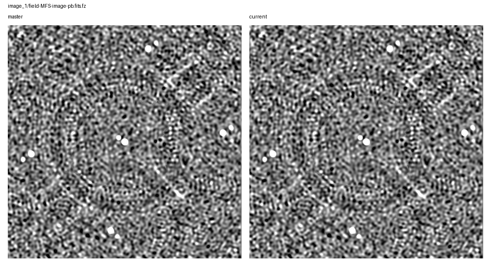
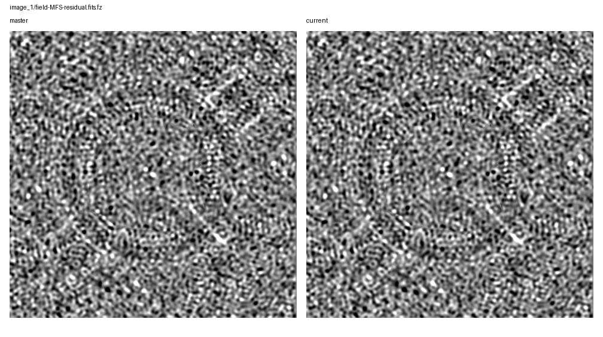
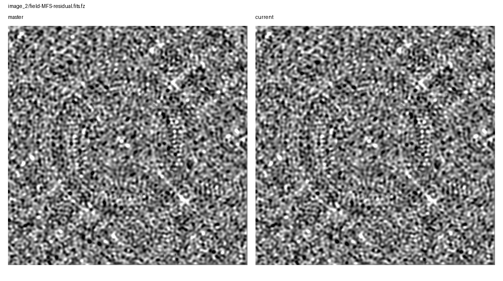

# Rapthor Branch Equivalence

Scenario: `di-multicycle-carryover`
Run root: `/app/runs/rbe-di-multicycle-carryover-20260705-v4`

## Branch Runs

| Side | Ref | Return Code | Parset | Work Dir | Log | Input Snapshot |
| --- | --- | ---: | --- | --- | --- | --- |
| base | `master` | 0 | `/app/docs/source/development/equivalence_runs/2026-07-05-di-multicycle-carryover-master-ref/inputs/base/master_di_multicycle_carryover.parset` | `/tmp/rbe-master-di-multicycle-carryover-v4-work` | `/app/runs/rbe-di-multicycle-carryover-20260705-v4/base/rapthor-command.log` | parset: `inputs/base/master_di_multicycle_carryover.parset`, strategy: `inputs/base/master_di_multicycle_carryover_strategy.py` |
| current | `current` | 0 | `/app/docs/source/development/equivalence_runs/2026-07-05-di-multicycle-carryover-master-ref/inputs/current/current_di_multicycle_carryover.parset` | `/tmp/rbe-current-di-multicycle-carryover-v4-work` | `/app/runs/rbe-di-multicycle-carryover-20260705-v4/current/rapthor-command.log` | parset: `inputs/current/current_di_multicycle_carryover.parset`, strategy: `inputs/current/current_di_multicycle_carryover_strategy.py` |

## Comparison Summary

| Result | Ops | Records | FITS | Image HDUs | Table HDUs | H5 | Text | Diagnostics | Visuals |
| --- | ---: | ---: | ---: | ---: | ---: | ---: | ---: | ---: | ---: |
| fail | 10 | 10 | 14 | 12 | 2 | 6 | 19 | 2 | 10 |

## FITS Residual Metrics

| Product | Max Abs Delta | P99 Abs Delta | Residual RMS | RMS / Ref RMS | RMS / Ref MAD |
| --- | ---: | ---: | ---: | ---: | ---: |
| `field-MFS-image-pb-ast.fits.fz` | 4.495e-01 | 1.263e-02 | 8.412e-03 | 9.754e-02 | 1.857e-01 |
| `field-MFS-image.fits.fz` | 4.495e-01 | 1.237e-02 | 8.286e-03 | 9.753e-02 | 1.867e-01 |
| `field-MFS-image-pb.fits.fz` | 4.495e-01 | 1.263e-02 | 8.412e-03 | 9.754e-02 | 1.857e-01 |
| `field-MFS-dirty.fits.fz` | 4.325e-01 | 3.982e-02 | 1.657e-02 | 9.707e-02 | 1.079e-01 |
| `field-MFS-model-pb.fits.fz` | 2.717e-01 | 0.000e+00 | 2.964e-03 | 1.084e+00 | n/a |
| `field-MFS-model-pb.fits.fz` | 2.013e-01 | 0.000e+00 | 3.848e-03 | 1.188e+00 | n/a |
| `field-MFS-residual.fits.fz` | 6.144e-02 | 1.185e-02 | 4.496e-03 | 9.979e-02 | 1.016e-01 |
| `field-MFS-image-pb.fits.fz` | 2.128e-02 | 2.637e-04 | 1.897e-04 | 2.256e-03 | 4.624e-03 |
| `field-MFS-image-pb-ast.fits.fz` | 2.128e-02 | 2.637e-04 | 1.897e-04 | 2.256e-03 | 4.624e-03 |
| `field-MFS-image.fits.fz` | 2.115e-02 | 2.582e-04 | 1.869e-04 | 2.256e-03 | 4.650e-03 |
| `field-MFS-residual.fits.fz` | 2.115e-02 | 2.455e-04 | 9.494e-05 | 2.310e-03 | 2.370e-03 |
| `field-MFS-dirty.fits.fz` | 1.016e-02 | 9.260e-04 | 3.872e-04 | 2.239e-03 | 2.499e-03 |

## Image Diagnostics

| Operation | Sector | Field | Reference | Current | Delta | Relative Delta |
| --- | --- | --- | ---: | ---: | ---: | ---: |
| `image_1` | `sector_1` | `nsources` | 1.000e+01 | 1.000e+01 | 0.000e+00 | 0.000% |
| `image_1` | `sector_1` | `theoretical_rms` | 9.006e-03 | 9.006e-03 | 0.000e+00 | 0.000% |
| `image_1` | `sector_1` | `min_rms_flat_noise` | 1.688e-02 | 1.692e-02 | 3.774e-05 | 0.224% |
| `image_1` | `sector_1` | `median_rms_flat_noise` | 3.931e-02 | 3.939e-02 | 8.798e-05 | 0.224% |
| `image_1` | `sector_1` | `dynamic_range_global_flat_noise` | 2.711e+02 | 2.711e+02 | 7.030e-04 | 0.000% |
| `image_1` | `sector_1` | `min_rms_true_sky` | 1.735e-02 | 1.739e-02 | 3.881e-05 | 0.224% |
| `image_1` | `sector_1` | `median_rms_true_sky` | 4.018e-02 | 4.027e-02 | 8.997e-05 | 0.224% |
| `image_1` | `sector_1` | `dynamic_range_global_true_sky` | 2.637e+02 | 2.637e+02 | 5.075e-04 | 0.000% |
| `image_2` | `sector_1` | `nsources` | 9.000e+00 | 9.000e+00 | 0.000e+00 | 0.000% |
| `image_2` | `sector_1` | `theoretical_rms` | 9.006e-03 | 9.006e-03 | 0.000e+00 | 0.000% |
| `image_2` | `sector_1` | `min_rms_flat_noise` | 2.720e-02 | 2.973e-02 | 2.530e-03 | 9.300% |
| `image_2` | `sector_1` | `median_rms_flat_noise` | 4.298e-02 | 4.724e-02 | 4.259e-03 | 9.910% |
| `image_2` | `sector_1` | `dynamic_range_global_flat_noise` | 1.708e+02 | 1.714e+02 | 5.879e-01 | 0.344% |
| `image_2` | `sector_1` | `min_rms_true_sky` | 2.719e-02 | 2.973e-02 | 2.541e-03 | 9.346% |
| `image_2` | `sector_1` | `median_rms_true_sky` | 4.392e-02 | 4.826e-02 | 4.338e-03 | 9.879% |
| `image_2` | `sector_1` | `dynamic_range_global_true_sky` | 1.709e+02 | 1.714e+02 | 5.149e-01 | 0.301% |

## Visual Comparisons

### Image: `image_1/field-MFS-image-pb-ast.fits.fz`

### Image: `image_1/field-MFS-image-pb.fits.fz`

### Image: `image_1/field-MFS-residual.fits.fz`

### Image: `image_2/field-MFS-image-pb-ast.fits.fz`

### Image: `image_2/field-MFS-image-pb.fits.fz`

### Image: `image_2/field-MFS-residual.fits.fz`

### Solution: `calibrate_1/fast_phase_dir[Patch_rich_centre].png`

![calibrate_1/fast_phase_dir[Patch_rich_centre].png](visual-comparisons/solutions/calibrate_1-fast_phase_dir-patch_rich_centre-.png.png)

### Solution: `calibrate_1/medium1_phase_dir[Patch_rich_centre].png`

![calibrate_1/medium1_phase_dir[Patch_rich_centre].png](visual-comparisons/solutions/calibrate_1-medium1_phase_dir-patch_rich_centre-.png.png)

### Solution: `calibrate_2/fast_phase_dir[Patch_patch_10_sector_1].png`

![calibrate_2/fast_phase_dir[Patch_patch_10_sector_1].png](visual-comparisons/solutions/calibrate_2-fast_phase_dir-patch_patch_10_sector_1-.png.png)

### Solution: `calibrate_2/medium1_phase_dir[Patch_patch_10_sector_1].png`

![calibrate_2/medium1_phase_dir[Patch_patch_10_sector_1].png](visual-comparisons/solutions/calibrate_2-medium1_phase_dir-patch_patch_10_sector_1-.png.png)

## Warnings

- output-record summary differs for calibrate_1
- output-record summary differs for calibrate_2
- output-record summary differs for calibrate_di_1
- output-record summary differs for calibrate_di_2

## Failures

- FITS std differs for field-MFS-dirty.fits.fz: 0.17292158506603453 != 0.17330873323822524
- FITS rms differs for field-MFS-dirty.fits.fz: 0.17292200344258407 != 0.17330915254765922
- FITS min differs for field-MFS-dirty.fits.fz: -0.7253910303115845 != -0.7270157337188721
- FITS max differs for field-MFS-dirty.fits.fz: 4.536999225616455 != 4.547160625457764
- FITS image pixels differ for field-MFS-dirty.fits.fz: max_abs_delta=0.010161399841308594, p99_abs_delta=0.0009259581565856934, residual_rms=0.00038717407190617487
- FITS mean differs for field-MFS-image-pb-ast.fits.fz: 0.0027208677085318843 != 0.0027269945950951532
- FITS std differs for field-MFS-image-pb-ast.fits.fz: 0.08404132716079937 != 0.08422948245804093
- FITS rms differs for field-MFS-image-pb-ast.fits.fz: 0.084085360152858 != 0.0842736151750422
- FITS min differs for field-MFS-image-pb-ast.fits.fz: -0.19207899272441864 != -0.1925095021724701
- FITS max differs for field-MFS-image-pb-ast.fits.fz: 4.575371265411377 != 4.585613250732422
- FITS image pixels differ for field-MFS-image-pb-ast.fits.fz: max_abs_delta=0.02128439210355282, p99_abs_delta=0.0002637207508087158, residual_rms=0.00018970005615530575
- FITS mean differs for field-MFS-image-pb.fits.fz: 0.0027208677085318843 != 0.0027269949778925156
- FITS std differs for field-MFS-image-pb.fits.fz: 0.08404132716079937 != 0.08422948240904546
- FITS rms differs for field-MFS-image-pb.fits.fz: 0.084085360152858 != 0.08427361513845924
- FITS min differs for field-MFS-image-pb.fits.fz: -0.19207899272441864 != -0.19250798225402832
- FITS max differs for field-MFS-image-pb.fits.fz: 4.575371265411377 != 4.585610866546631
- FITS image pixels differ for field-MFS-image-pb.fits.fz: max_abs_delta=0.021284820046275854, p99_abs_delta=0.00026372820138931274, residual_rms=0.00018970004129573813
- FITS mean differs for field-MFS-image.fits.fz: 0.002681086550041096 != 0.00268712551407587
- FITS std differs for field-MFS-image.fits.fz: 0.08279988126295294 != 0.08298525490350149
- FITS rms differs for field-MFS-image.fits.fz: 0.08284327710953929 != 0.08302874908685252
- FITS min differs for field-MFS-image.fits.fz: -0.1892225742340088 != -0.18964731693267822
- FITS max differs for field-MFS-image.fits.fz: 4.575361251831055 != 4.585604667663574
- FITS image pixels differ for field-MFS-image.fits.fz: max_abs_delta=0.02115050097927451, p99_abs_delta=0.00025822967290878296, residual_rms=0.0001869181591306927
- FITS std differs for field-MFS-model-pb.fits.fz: 0.0032386164909029994 != 0.003232377776157963
- FITS rms differs for field-MFS-model-pb.fits.fz: 0.0032386214627699284 != 0.0032323820051666295
- FITS min differs for field-MFS-model-pb.fits.fz: -0.10202363133430481 != -0.10225213319063187
- FITS max differs for field-MFS-model-pb.fits.fz: 1.531440258026123 != 1.536117672920227
- FITS image pixels differ for field-MFS-model-pb.fits.fz: max_abs_delta=0.20125026255846024, p99_abs_delta=0.0, residual_rms=0.0038477238132690337
- FITS std differs for field-MFS-residual.fits.fz: 0.04110365881240247 != 0.041195702680343595
- FITS rms differs for field-MFS-residual.fits.fz: 0.04110458201151136 != 0.041196627713409546
- FITS min differs for field-MFS-residual.fits.fz: -0.18922391533851624 != -0.1896468997001648
- FITS max differs for field-MFS-residual.fits.fz: 0.20585836470127106 != 0.20631743967533112
- FITS image pixels differ for field-MFS-residual.fits.fz: max_abs_delta=0.021148304920643568, p99_abs_delta=0.0002455189824104309, residual_rms=9.493780753534999e-05
- FITS mean differs for field-MFS-dirty.fits.fz: -0.00032019537033932285 != -0.000351386542845382
- FITS std differs for field-MFS-dirty.fits.fz: 0.17070519965309897 != 0.18717968287787728
- FITS rms differs for field-MFS-dirty.fits.fz: 0.170705499951465 != 0.18718001270104984
- FITS min differs for field-MFS-dirty.fits.fz: -0.7147074937820435 != -0.7833805084228516
- FITS max differs for field-MFS-dirty.fits.fz: 4.491455554962158 != 4.92396879196167
- FITS image pixels differ for field-MFS-dirty.fits.fz: max_abs_delta=0.4325132369995117, p99_abs_delta=0.03981712609529492, residual_rms=0.01657038517805027
- FITS mean differs for field-MFS-image-pb-ast.fits.fz: 0.0026052778047136837 != 0.002855203162852689
- FITS std differs for field-MFS-image-pb-ast.fits.fz: 0.08619845418628533 != 0.09458155502860972
- FITS rms differs for field-MFS-image-pb-ast.fits.fz: 0.0862378163948095 != 0.09462464127663092
- FITS min differs for field-MFS-image-pb-ast.fits.fz: -0.22667206823825836 != -0.2489233762025833
- FITS max differs for field-MFS-image-pb-ast.fits.fz: 4.6459150314331055 != 5.095445156097412
- FITS image pixels differ for field-MFS-image-pb-ast.fits.fz: max_abs_delta=0.44953012466430664, p99_abs_delta=0.012626625671982764, residual_rms=0.008411823352652064
- FITS mean differs for field-MFS-image-pb.fits.fz: 0.0026052778047136837 != 0.0028552023237739927
- FITS std differs for field-MFS-image-pb.fits.fz: 0.08619845418628533 != 0.09458155529149011
- FITS rms differs for field-MFS-image-pb.fits.fz: 0.0862378163948095 != 0.09462464151407321
- FITS min differs for field-MFS-image-pb.fits.fz: -0.22667206823825836 != -0.24892336130142212
- FITS max differs for field-MFS-image-pb.fits.fz: 4.6459150314331055 != 5.095444202423096
- ... 73 more failure(s)
