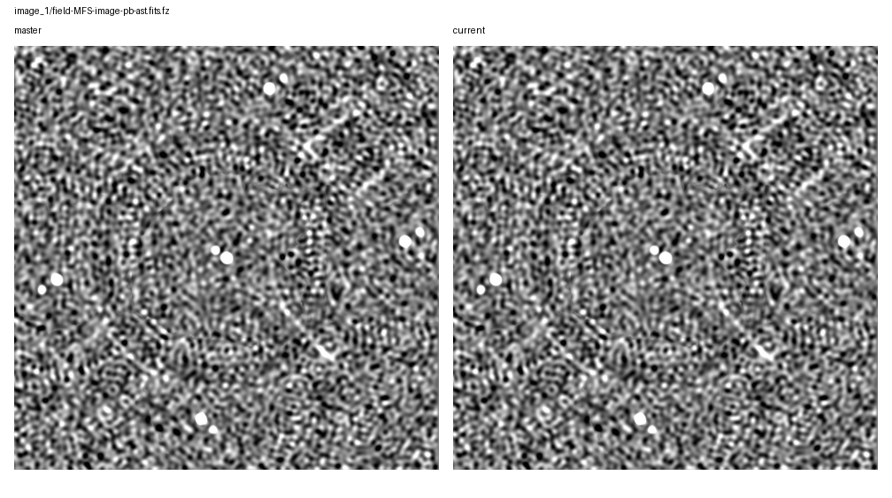
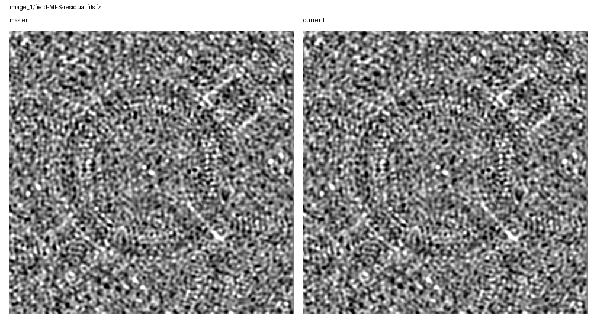
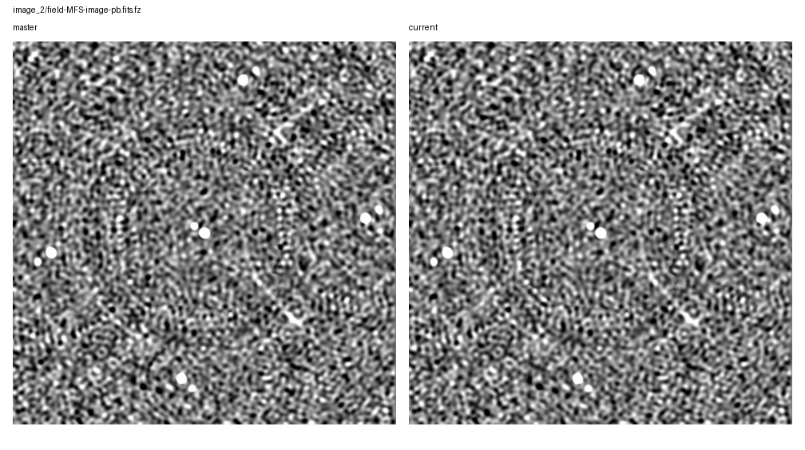
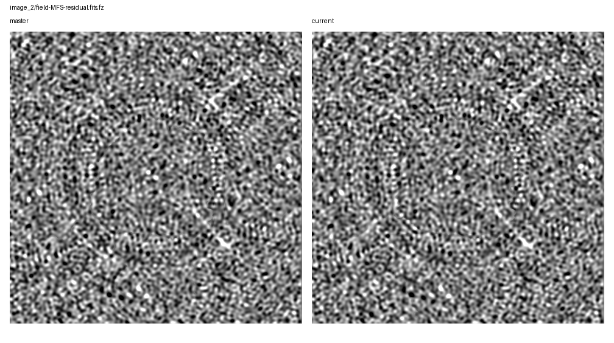

# Rapthor Branch Equivalence

Scenario: `di-then-dd-mode-boundary`
Run root: `/app/runs/rbe-di-then-dd-mode-boundary-20260705`

## Branch Runs

| Side | Ref | Return Code | Parset | Work Dir | Log | Input Snapshot |
| --- | --- | ---: | --- | --- | --- | --- |
| base | `master` | 0 | `/app/docs/source/development/equivalence_runs/2026-07-05-di-then-dd-mode-boundary-master-ref/inputs/base/master_di_then_dd_mode_boundary.parset` | `/tmp/rbe-master-di-then-dd-mode-boundary-work` | `/app/runs/rbe-di-then-dd-mode-boundary-20260705/base/rapthor-command.log` | parset: `inputs/base/master_di_then_dd_mode_boundary.parset`, strategy: `inputs/base/master_di_then_dd_mode_boundary_strategy.py` |
| current | `current` | 0 | `/app/docs/source/development/equivalence_runs/2026-07-05-di-then-dd-mode-boundary-master-ref/inputs/current/current_di_then_dd_mode_boundary.parset` | `/tmp/rbe-current-di-then-dd-mode-boundary-work` | `/app/runs/rbe-di-then-dd-mode-boundary-20260705/current/rapthor-command.log` | parset: `inputs/current/current_di_then_dd_mode_boundary.parset`, strategy: `inputs/current/current_di_then_dd_mode_boundary_strategy.py` |

## Comparison Summary

| Result | Ops | Records | FITS | Image HDUs | Table HDUs | H5 | Text | Diagnostics | Visuals |
| --- | ---: | ---: | ---: | ---: | ---: | ---: | ---: | ---: | ---: |
| fail | 8 | 8 | 14 | 12 | 2 | 5 | 19 | 2 | 10 |

## FITS Residual Metrics

| Product | Max Abs Delta | P99 Abs Delta | Residual RMS | RMS / Ref RMS | RMS / Ref MAD |
| --- | ---: | ---: | ---: | ---: | ---: |
| `field-MFS-model-pb.fits.fz` | 6.927e-01 | 0.000e+00 | 4.133e-03 | 1.284e+00 | n/a |
| `field-MFS-model-pb.fits.fz` | 1.997e-01 | 0.000e+00 | 3.867e-03 | 1.194e+00 | n/a |
| `field-MFS-image-pb.fits.fz` | 7.835e-02 | 2.721e-02 | 9.298e-03 | 1.074e-01 | 2.056e-01 |
| `field-MFS-image-pb-ast.fits.fz` | 7.835e-02 | 2.721e-02 | 9.298e-03 | 1.074e-01 | 2.056e-01 |
| `field-MFS-image.fits.fz` | 7.779e-02 | 2.680e-02 | 9.125e-03 | 1.070e-01 | 2.059e-01 |
| `field-MFS-residual.fits.fz` | 7.779e-02 | 2.658e-02 | 9.087e-03 | 2.015e-01 | 2.059e-01 |
| `field-MFS-dirty.fits.fz` | 4.055e-02 | 2.179e-02 | 8.308e-03 | 4.830e-02 | 5.367e-02 |
| `field-MFS-image-pb-ast.fits.fz` | 2.129e-02 | 2.636e-04 | 1.897e-04 | 2.256e-03 | 4.624e-03 |
| `field-MFS-image-pb.fits.fz` | 2.128e-02 | 2.636e-04 | 1.897e-04 | 2.256e-03 | 4.624e-03 |
| `field-MFS-residual.fits.fz` | 2.115e-02 | 2.454e-04 | 9.489e-05 | 2.308e-03 | 2.369e-03 |
| `field-MFS-image.fits.fz` | 2.115e-02 | 2.582e-04 | 1.869e-04 | 2.256e-03 | 4.650e-03 |
| `field-MFS-dirty.fits.fz` | 1.016e-02 | 9.259e-04 | 3.872e-04 | 2.239e-03 | 2.499e-03 |

## Image Diagnostics

| Operation | Sector | Field | Reference | Current | Delta | Relative Delta |
| --- | --- | --- | ---: | ---: | ---: | ---: |
| `image_1` | `sector_1` | `nsources` | 1.000e+01 | 1.000e+01 | 0.000e+00 | 0.000% |
| `image_1` | `sector_1` | `theoretical_rms` | 9.006e-03 | 9.006e-03 | 0.000e+00 | 0.000% |
| `image_1` | `sector_1` | `min_rms_flat_noise` | 1.688e-02 | 1.692e-02 | 3.779e-05 | 0.224% |
| `image_1` | `sector_1` | `median_rms_flat_noise` | 3.931e-02 | 3.939e-02 | 8.814e-05 | 0.224% |
| `image_1` | `sector_1` | `dynamic_range_global_flat_noise` | 2.711e+02 | 2.711e+02 | -7.853e-05 | -0.000% |
| `image_1` | `sector_1` | `min_rms_true_sky` | 1.735e-02 | 1.739e-02 | 3.889e-05 | 0.224% |
| `image_1` | `sector_1` | `median_rms_true_sky` | 4.018e-02 | 4.027e-02 | 8.997e-05 | 0.224% |
| `image_1` | `sector_1` | `dynamic_range_global_true_sky` | 2.637e+02 | 2.637e+02 | -4.825e-04 | -0.000% |
| `image_2` | `sector_1` | `nsources` | 1.100e+01 | 1.100e+01 | 0.000e+00 | 0.000% |
| `image_2` | `sector_1` | `theoretical_rms` | 9.006e-03 | 9.006e-03 | 0.000e+00 | 0.000% |
| `image_2` | `sector_1` | `min_rms_flat_noise` | 2.711e-02 | 3.030e-02 | 3.194e-03 | 11.782% |
| `image_2` | `sector_1` | `median_rms_flat_noise` | 4.318e-02 | 4.388e-02 | 6.981e-04 | 1.617% |
| `image_2` | `sector_1` | `dynamic_range_global_flat_noise` | 1.720e+02 | 1.535e+02 | -1.854e+01 | -10.775% |
| `image_2` | `sector_1` | `min_rms_true_sky` | 2.750e-02 | 3.030e-02 | 2.796e-03 | 10.165% |
| `image_2` | `sector_1` | `median_rms_true_sky` | 4.411e-02 | 4.477e-02 | 6.590e-04 | 1.494% |
| `image_2` | `sector_1` | `dynamic_range_global_true_sky` | 1.696e+02 | 1.535e+02 | -1.605e+01 | -9.465% |

## Visual Comparisons

### Image: `image_1/field-MFS-image-pb-ast.fits.fz`

### Image: `image_1/field-MFS-image-pb.fits.fz`

### Image: `image_1/field-MFS-residual.fits.fz`

### Image: `image_2/field-MFS-image-pb-ast.fits.fz`

### Image: `image_2/field-MFS-image-pb.fits.fz`

### Image: `image_2/field-MFS-residual.fits.fz`

### Solution: `calibrate_1/fast_phase_dir[Patch_rich_centre].png`

![calibrate_1/fast_phase_dir[Patch_rich_centre].png](visual-comparisons/solutions/calibrate_1-fast_phase_dir-patch_rich_centre-.png.png)

### Solution: `calibrate_1/medium1_phase_dir[Patch_rich_centre].png`

![calibrate_1/medium1_phase_dir[Patch_rich_centre].png](visual-comparisons/solutions/calibrate_1-medium1_phase_dir-patch_rich_centre-.png.png)

### Solution: `calibrate_2/fast_phase_dir[Patch_rich_centre].png`

![calibrate_2/fast_phase_dir[Patch_rich_centre].png](visual-comparisons/solutions/calibrate_2-fast_phase_dir-patch_rich_centre-.png.png)

### Solution: `calibrate_2/medium1_phase_dir[Patch_rich_centre].png`

![calibrate_2/medium1_phase_dir[Patch_rich_centre].png](visual-comparisons/solutions/calibrate_2-medium1_phase_dir-patch_rich_centre-.png.png)

## Warnings

- output-record summary differs for calibrate_1
- output-record summary differs for calibrate_2
- output-record summary differs for calibrate_di_1

## Failures

- FITS std differs for field-MFS-dirty.fits.fz: 0.1729215828571637 != 0.17330874162481705
- FITS rms differs for field-MFS-dirty.fits.fz: 0.1729220012352156 != 0.17330916093760534
- FITS min differs for field-MFS-dirty.fits.fz: -0.7253966331481934 != -0.7270184755325317
- FITS max differs for field-MFS-dirty.fits.fz: 4.5370001792907715 != 4.547163009643555
- FITS image pixels differ for field-MFS-dirty.fits.fz: max_abs_delta=0.010162830352783203, p99_abs_delta=0.0009259283542633057, residual_rms=0.0003871846670304878
- FITS mean differs for field-MFS-image-pb-ast.fits.fz: 0.0027208664857912178 != 0.0027269968196330023
- FITS std differs for field-MFS-image-pb-ast.fits.fz: 0.08404132873095008 != 0.08422948569016775
- FITS rms differs for field-MFS-image-pb-ast.fits.fz: 0.08408536168262057 != 0.08427361847745986
- FITS min differs for field-MFS-image-pb-ast.fits.fz: -0.1920776069164276 != -0.19250962138175964
- FITS max differs for field-MFS-image-pb-ast.fits.fz: 4.5753703117370605 != 4.585615158081055
- FITS image pixels differ for field-MFS-image-pb-ast.fits.fz: max_abs_delta=0.021286117378622293, p99_abs_delta=0.0002636238932609558, residual_rms=0.000189694459162752
- FITS mean differs for field-MFS-image-pb.fits.fz: 0.0027208664857912178 != 0.002726996637843571
- FITS std differs for field-MFS-image-pb.fits.fz: 0.08404132873095008 != 0.08422948640191233
- FITS rms differs for field-MFS-image-pb.fits.fz: 0.08408536168262057 != 0.0842736191829493
- FITS min differs for field-MFS-image-pb.fits.fz: -0.1920776069164276 != -0.1925082504749298
- FITS max differs for field-MFS-image-pb.fits.fz: 4.5753703117370605 != 4.585612773895264
- FITS image pixels differ for field-MFS-image-pb.fits.fz: max_abs_delta=0.021284593734890223, p99_abs_delta=0.0002636462450027466, residual_rms=0.00018969497476193284
- FITS mean differs for field-MFS-image.fits.fz: 0.002681086708844042 != 0.002687126846594001
- FITS std differs for field-MFS-image.fits.fz: 0.08279988353993877 != 0.08298526313138999
- FITS rms differs for field-MFS-image.fits.fz: 0.08284327939047177 != 0.08302875735355617
- FITS min differs for field-MFS-image.fits.fz: -0.18922269344329834 != -0.18964634835720062
- FITS max differs for field-MFS-image.fits.fz: 4.575361251831055 != 4.585606098175049
- FITS image pixels differ for field-MFS-image.fits.fz: max_abs_delta=0.021152405999600887, p99_abs_delta=0.0002581849694252014, residual_rms=0.00018691647437352654
- FITS min differs for field-MFS-model-pb.fits.fz: -0.10202363133430481 != -0.10225213319063187
- FITS max differs for field-MFS-model-pb.fits.fz: 1.5396521091461182 != 1.527467966079712
- FITS image pixels differ for field-MFS-model-pb.fits.fz: max_abs_delta=0.19966821372509003, p99_abs_delta=0.0, residual_rms=0.003866799746664895
- FITS std differs for field-MFS-residual.fits.fz: 0.04110366066037581 != 0.04119567854885081
- FITS rms differs for field-MFS-residual.fits.fz: 0.04110458385929209 != 0.04119660356798169
- FITS min differs for field-MFS-residual.fits.fz: -0.189223513007164 != -0.1896476000547409
- FITS max differs for field-MFS-residual.fits.fz: 0.2058572769165039 != 0.20631884038448334
- FITS image pixels differ for field-MFS-residual.fits.fz: max_abs_delta=0.02115280833095312, p99_abs_delta=0.0002454295754432678, residual_rms=9.488605291376056e-05
- FITS mean differs for field-MFS-dirty.fits.fz: -0.00040902405273138395 != -0.0004059093597029719
- FITS min differs for field-MFS-dirty.fits.fz: -0.7264640927314758 != -0.7149259448051453
- FITS max differs for field-MFS-dirty.fits.fz: 4.50933313369751 != 4.496842384338379
- FITS image pixels differ for field-MFS-dirty.fits.fz: max_abs_delta=0.04055459797382355, p99_abs_delta=0.0217876736819744, residual_rms=0.008308424935217846
- FITS mean differs for field-MFS-image-pb-ast.fits.fz: 0.002708316281791294 != 0.002722318029484322
- FITS std differs for field-MFS-image-pb-ast.fits.fz: 0.08655072125703303 != 0.08680591731643614
- FITS rms differs for field-MFS-image-pb-ast.fits.fz: 0.08659308475389263 != 0.0868485940968626
- FITS min differs for field-MFS-image-pb-ast.fits.fz: -0.23459021747112274 != -0.2100444883108139
- FITS max differs for field-MFS-image-pb-ast.fits.fz: 4.663366794586182 != 4.651130199432373
- FITS image pixels differ for field-MFS-image-pb-ast.fits.fz: max_abs_delta=0.07835190533660352, p99_abs_delta=0.027205542895244416, residual_rms=0.009297964081973545
- FITS mean differs for field-MFS-image-pb.fits.fz: 0.002708316281791294 != 0.0027223179065093564
- FITS std differs for field-MFS-image-pb.fits.fz: 0.08655072125703303 != 0.08680591845093565
- FITS rms differs for field-MFS-image-pb.fits.fz: 0.08659308475389263 != 0.08684859522694995
- FITS min differs for field-MFS-image-pb.fits.fz: -0.23459021747112274 != -0.21004214882850647
- FITS max differs for field-MFS-image-pb.fits.fz: 4.663366794586182 != 4.651129245758057
- FITS image pixels differ for field-MFS-image-pb.fits.fz: max_abs_delta=0.07835459406487644, p99_abs_delta=0.02720524338074027, residual_rms=0.009297964559924985
- FITS mean differs for field-MFS-image.fits.fz: 0.0026689540483614107 != 0.0026823879737403527
- FITS std differs for field-MFS-image.fits.fz: 0.08525440919731382 != 0.08549857225396829
- FITS rms differs for field-MFS-image.fits.fz: 0.0852961757835325 != 0.08554063983106922
- ... 67 more failure(s)
