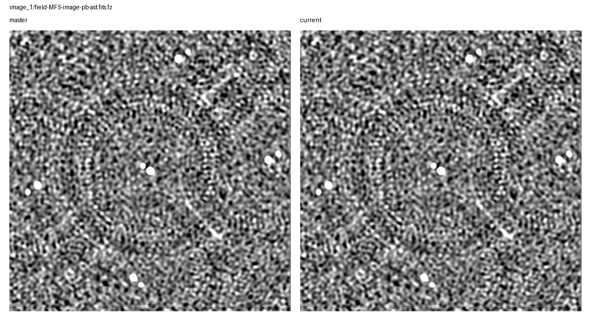
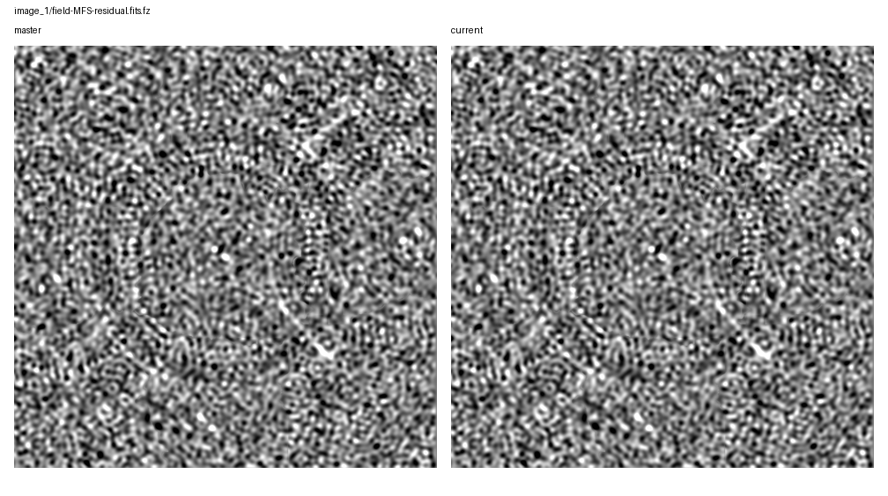

# Rapthor Branch Equivalence

Scenario: `fixed-facet-carryover`
Run root: `/app/runs/rbe-fixed-facet-carryover-20260705-v2`

## Branch Runs

| Side | Ref | Return Code | Parset | Work Dir | Log | Input Snapshot |
| --- | --- | ---: | --- | --- | --- | --- |
| base | `master` | 0 | `/app/docs/source/development/equivalence_runs/2026-07-05-fixed-facet-carryover-master-ref/inputs/base/master_fixed_facet_carryover.parset` | `/tmp/rbe-master-fixed-facet-carryover-v2-work` | `/app/runs/rbe-fixed-facet-carryover-20260705-v2/base/rapthor-command.log` | parset: `inputs/base/master_fixed_facet_carryover.parset`, strategy: `inputs/base/master_fixed_facet_carryover_strategy.py` |
| current | `current` | 0 | `/app/docs/source/development/equivalence_runs/2026-07-05-fixed-facet-carryover-master-ref/inputs/current/current_fixed_facet_carryover.parset` | `/tmp/rbe-current-fixed-facet-carryover-v2-work` | `/app/runs/rbe-fixed-facet-carryover-20260705-v2/current/rapthor-command.log` | parset: `inputs/current/current_fixed_facet_carryover.parset`, strategy: `inputs/current/current_fixed_facet_carryover_strategy.py` |

## Comparison Summary

| Result | Ops | Records | FITS | Image HDUs | Table HDUs | H5 | Text | Diagnostics | Visuals |
| --- | ---: | ---: | ---: | ---: | ---: | ---: | ---: | ---: | ---: |
| fail | 4 | 4 | 7 | 6 | 1 | 4 | 16 | 1 | 7 |

## FITS Residual Metrics

| Product | Max Abs Delta | P99 Abs Delta | Residual RMS | RMS / Ref RMS | RMS / Ref MAD |
| --- | ---: | ---: | ---: | ---: | ---: |
| `field-MFS-model-pb.fits.fz` | 2.341e-01 | 0.000e+00 | 3.481e-03 | 1.154e+00 | n/a |
| `field-MFS-dirty.fits.fz` | 1.463e-05 | 9.935e-06 | 4.153e-06 | 2.404e-05 | 2.681e-05 |
| `field-MFS-image-pb-ast.fits.fz` | 4.318e-06 | 2.847e-06 | 1.193e-06 | 1.416e-05 | 2.859e-05 |
| `field-MFS-image-pb.fits.fz` | 4.288e-06 | 2.848e-06 | 1.193e-06 | 1.416e-05 | 2.859e-05 |
| `field-MFS-image.fits.fz` | 4.210e-06 | 2.796e-06 | 1.170e-06 | 1.409e-05 | 2.862e-05 |
| `field-MFS-residual.fits.fz` | 4.189e-06 | 2.773e-06 | 1.162e-06 | 2.786e-05 | 2.851e-05 |

## Image Diagnostics

| Operation | Sector | Field | Reference | Current | Delta | Relative Delta |
| --- | --- | --- | ---: | ---: | ---: | ---: |
| `image_1` | `sector_1` | `nsources` | 1.000e+01 | 1.000e+01 | 0.000e+00 | 0.000% |
| `image_1` | `sector_1` | `theoretical_rms` | 9.006e-03 | 9.006e-03 | 0.000e+00 | 0.000% |
| `image_1` | `sector_1` | `min_rms_flat_noise` | 1.987e-02 | 1.987e-02 | 4.284e-08 | 0.000% |
| `image_1` | `sector_1` | `median_rms_flat_noise` | 3.982e-02 | 3.982e-02 | -7.451e-09 | -0.000% |
| `image_1` | `sector_1` | `dynamic_range_global_flat_noise` | 2.296e+02 | 2.296e+02 | -4.950e-04 | -0.000% |
| `image_1` | `sector_1` | `min_rms_true_sky` | 2.038e-02 | 2.038e-02 | 9.313e-09 | 0.000% |
| `image_1` | `sector_1` | `median_rms_true_sky` | 4.061e-02 | 4.061e-02 | 0.000e+00 | 0.000% |
| `image_1` | `sector_1` | `dynamic_range_global_true_sky` | 2.239e+02 | 2.239e+02 | -1.023e-04 | -0.000% |

## Visual Comparisons

### Image: `image_1/field-MFS-image-pb-ast.fits.fz`

### Image: `image_1/field-MFS-image-pb.fits.fz`

### Image: `image_1/field-MFS-residual.fits.fz`

### Solution: `calibrate_1/fast_phase_dir[Patch_rich_centre].png`

![calibrate_1/fast_phase_dir[Patch_rich_centre].png](visual-comparisons/solutions/calibrate_1-fast_phase_dir-patch_rich_centre-.png.png)

### Solution: `calibrate_1/medium1_phase_dir[Patch_rich_centre].png`

![calibrate_1/medium1_phase_dir[Patch_rich_centre].png](visual-comparisons/solutions/calibrate_1-medium1_phase_dir-patch_rich_centre-.png.png)

### Solution: `calibrate_2/fast_phase_dir[Patch_rich_centre].png`

![calibrate_2/fast_phase_dir[Patch_rich_centre].png](visual-comparisons/solutions/calibrate_2-fast_phase_dir-patch_rich_centre-.png.png)

### Solution: `calibrate_2/medium1_phase_dir[Patch_rich_centre].png`

![calibrate_2/medium1_phase_dir[Patch_rich_centre].png](visual-comparisons/solutions/calibrate_2-medium1_phase_dir-patch_rich_centre-.png.png)

## Warnings

- output-record summary differs for calibrate_1
- output-record summary differs for calibrate_2

## Failures

- FITS image pixels differ for field-MFS-dirty.fits.fz: max_abs_delta=1.4625489711761475e-05, p99_abs_delta=9.934883564710617e-06, residual_rms=4.152737824072065e-06
- FITS image pixels differ for field-MFS-image-pb-ast.fits.fz: max_abs_delta=4.317611455917358e-06, p99_abs_delta=2.847053110599518e-06, residual_rms=1.1926592919991108e-06
- FITS image pixels differ for field-MFS-image-pb.fits.fz: max_abs_delta=4.287809133529663e-06, p99_abs_delta=2.8479844331741333e-06, residual_rms=1.1925831754074975e-06
- FITS image pixels differ for field-MFS-image.fits.fz: max_abs_delta=4.209578037261963e-06, p99_abs_delta=2.7958303689956665e-06, residual_rms=1.1697144892352773e-06
- FITS std differs for field-MFS-model-pb.fits.fz: 0.003016528664153554 != 0.003031875622195684
- FITS rms differs for field-MFS-model-pb.fits.fz: 0.0030165320635801803 != 0.0030318794406903964
- FITS image pixels differ for field-MFS-model-pb.fits.fz: max_abs_delta=0.23408326506614685, p99_abs_delta=0.0, residual_rms=0.0034807848631552975
- FITS image pixels differ for field-MFS-residual.fits.fz: max_abs_delta=4.189088940620422e-06, p99_abs_delta=2.773478627204895e-06, residual_rms=1.1617421097846464e-06
- text product differs for sector_1_facets_ds9.reg
