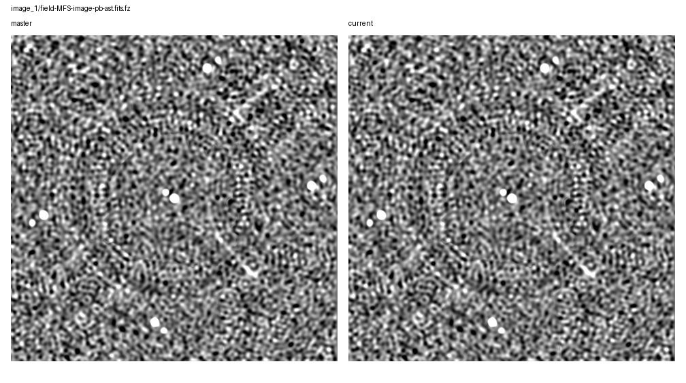
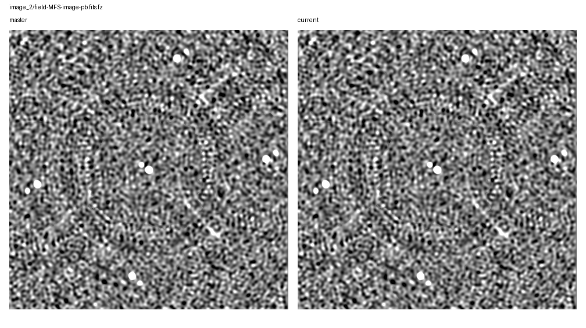
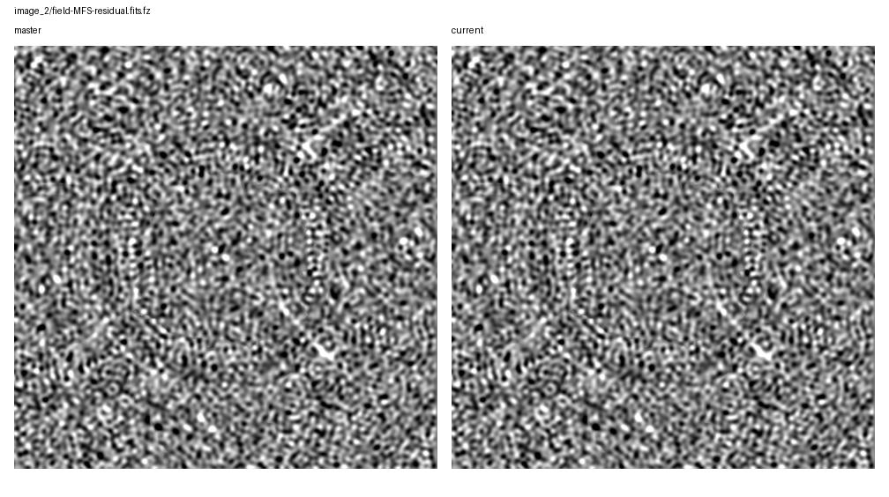
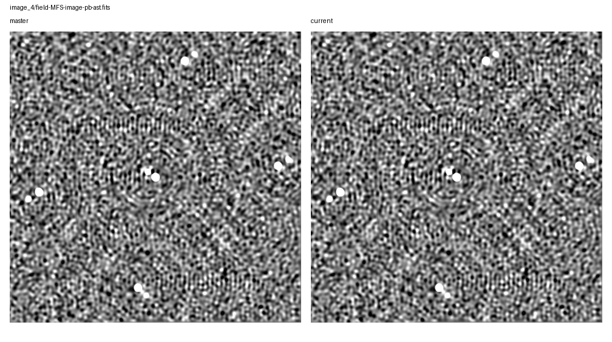
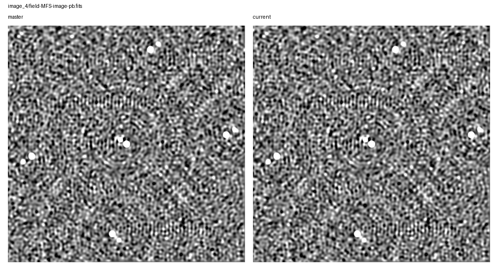
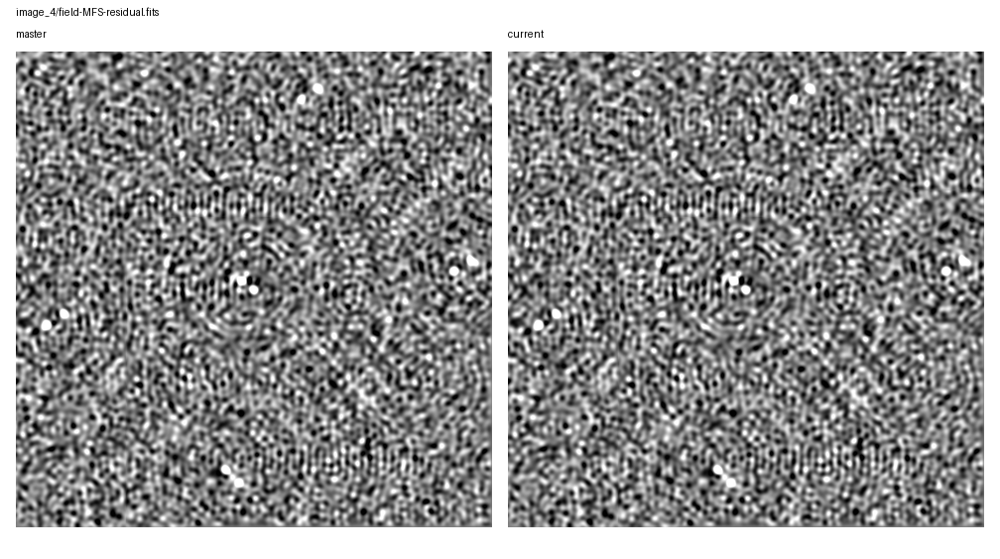

# Rapthor Branch Equivalence

Scenario: `benchmark-phase-only-initial-solutions-fast-only`
Run root: `/app/runs/rbe-phase-only-master-ref-20260705-initial-solutions-fast-only`

## Branch Runs

| Side | Ref | Return Code | Parset | Work Dir | Log | Input Snapshot |
| --- | --- | ---: | --- | --- | --- | --- |
| base | `master` | 0 | `/app/runs/master-benchmark-phase-only-manual/inputs/master_benchmark_phase_only.parset` | `/tmp/rbempi` | `/app/runs/rbe-phase-only-master-ref-20260705-initial-solutions-fast-only/base/rapthor-command.log` | parset: `inputs/base/master_benchmark_phase_only.parset`, strategy: `inputs/base/master_benchmark_phase_only_strategy.py` |
| current | `current` | 0 | `/app/runs/current-benchmark-phase-only-manual/inputs/current_benchmark_phase_only.parset` | `/tmp/rbecpi` | `/app/runs/rbe-phase-only-master-ref-20260705-initial-solutions-fast-only/current/rapthor-command.log` | parset: `inputs/current/current_benchmark_phase_only.parset`, strategy: `inputs/current/current_benchmark_phase_only_strategy.py` |

## Comparison Summary

| Result | Ops | Records | FITS | Image HDUs | Table HDUs | H5 | Text | Diagnostics | Visuals |
| --- | ---: | ---: | ---: | ---: | ---: | ---: | ---: | ---: | ---: |
| fail | 12 | 12 | 28 | 24 | 4 | 8 | 37 | 4 | 20 |

## FITS Residual Metrics

| Product | Max Abs Delta | P99 Abs Delta | Residual RMS | RMS / Ref RMS | RMS / Ref MAD |
| --- | ---: | ---: | ---: | ---: | ---: |
| `field-MFS-model-pb.fits.fz` | 4.334e-01 | 0.000e+00 | 4.631e-03 | 1.218e+00 | n/a |
| `field-MFS-model-pb.fits.fz` | 2.350e-01 | 0.000e+00 | 3.489e-03 | 1.158e+00 | n/a |
| `field-MFS-model-pb.fits.fz` | 1.669e-01 | 0.000e+00 | 2.695e-03 | 9.739e-01 | n/a |
| `field-MFS-image-pb-ast.fits.fz` | 1.410e-03 | 3.638e-06 | 1.621e-06 | 1.865e-05 | 3.503e-05 |
| `field-MFS-image-pb.fits.fz` | 1.410e-03 | 3.642e-06 | 1.622e-06 | 1.866e-05 | 3.504e-05 |
| `field-MFS-image.fits.fz` | 1.404e-03 | 3.580e-06 | 1.593e-06 | 1.861e-05 | 3.513e-05 |
| `field-MFS-residual.fits.fz` | 1.403e-03 | 3.557e-06 | 1.586e-06 | 3.443e-05 | 3.507e-05 |
| `field-MFS-dirty.fits.fz` | 1.452e-05 | 9.924e-06 | 4.154e-06 | 2.404e-05 | 2.682e-05 |
| `field-MFS-dirty.fits.fz` | 1.415e-05 | 9.906e-06 | 4.159e-06 | 2.420e-05 | 2.688e-05 |
| `field-MFS-dirty.fits.fz` | 1.400e-05 | 9.894e-06 | 4.156e-06 | 2.418e-05 | 2.686e-05 |
| `field-MFS-image.fits.fz` | 4.563e-06 | 3.159e-06 | 1.329e-06 | 1.558e-05 | 2.966e-05 |
| `field-MFS-image-pb-ast.fits.fz` | 4.560e-06 | 3.219e-06 | 1.356e-06 | 1.565e-05 | 2.964e-05 |
| `field-MFS-residual.fits.fz` | 4.557e-06 | 3.137e-06 | 1.320e-06 | 2.899e-05 | 2.955e-05 |
| `field-MFS-image-pb.fits.fz` | 4.537e-06 | 3.219e-06 | 1.355e-06 | 1.564e-05 | 2.963e-05 |
| `field-MFS-image-pb-ast.fits.fz` | 4.292e-06 | 2.850e-06 | 1.193e-06 | 1.417e-05 | 2.861e-05 |
| `field-MFS-image-pb.fits.fz` | 4.289e-06 | 2.846e-06 | 1.193e-06 | 1.416e-05 | 2.860e-05 |
| `field-MFS-residual.fits.fz` | 4.224e-06 | 2.772e-06 | 1.162e-06 | 2.786e-05 | 2.852e-05 |
| `field-MFS-image.fits.fz` | 4.216e-06 | 2.795e-06 | 1.170e-06 | 1.410e-05 | 2.862e-05 |
| `field-MFS-dirty.fits` | 1.594e-06 | 7.004e-07 | 1.680e-07 | 9.789e-07 | 1.091e-06 |
| `field-MFS-image-pb-ast.fits` | 1.192e-06 | 1.490e-07 | 4.531e-08 | 5.743e-07 | 1.605e-06 |
| `field-MFS-image-pb.fits` | 1.192e-06 | 1.490e-07 | 4.531e-08 | 5.743e-07 | 1.605e-06 |
| `field-MFS-image.fits` | 9.537e-07 | 1.471e-07 | 4.465e-08 | 5.738e-07 | 1.615e-06 |
| `field-MFS-residual.fits` | 2.943e-07 | 1.360e-07 | 3.932e-08 | 1.355e-06 | 1.424e-06 |
| `field-MFS-model-pb.fits` | 1.788e-07 | 0.000e+00 | 1.390e-10 | 7.049e-08 | n/a |

## Image Diagnostics

| Operation | Sector | Field | Reference | Current | Delta | Relative Delta |
| --- | --- | --- | ---: | ---: | ---: | ---: |
| `image_1` | `sector_1` | `nsources` | 1.000e+01 | 1.000e+01 | 0.000e+00 | 0.000% |
| `image_1` | `sector_1` | `theoretical_rms` | 9.006e-03 | 9.006e-03 | 0.000e+00 | 0.000% |
| `image_1` | `sector_1` | `min_rms_flat_noise` | 1.987e-02 | 1.987e-02 | 1.863e-09 | 0.000% |
| `image_1` | `sector_1` | `median_rms_flat_noise` | 3.982e-02 | 3.982e-02 | 7.451e-09 | 0.000% |
| `image_1` | `sector_1` | `dynamic_range_global_flat_noise` | 2.296e+02 | 2.296e+02 | -2.152e-05 | -0.000% |
| `image_1` | `sector_1` | `min_rms_true_sky` | 2.038e-02 | 2.038e-02 | 0.000e+00 | 0.000% |
| `image_1` | `sector_1` | `median_rms_true_sky` | 4.061e-02 | 4.061e-02 | 7.451e-09 | 0.000% |
| `image_1` | `sector_1` | `dynamic_range_global_true_sky` | 2.239e+02 | 2.239e+02 | 4.680e-05 | 0.000% |
| `image_2` | `sector_1` | `nsources` | 1.100e+01 | 1.100e+01 | 0.000e+00 | 0.000% |
| `image_2` | `sector_1` | `theoretical_rms` | 9.006e-03 | 9.006e-03 | 0.000e+00 | 0.000% |
| `image_2` | `sector_1` | `min_rms_flat_noise` | 3.012e-02 | 3.012e-02 | -1.621e-07 | -0.001% |
| `image_2` | `sector_1` | `median_rms_flat_noise` | 4.365e-02 | 4.365e-02 | 0.000e+00 | 0.000% |
| `image_2` | `sector_1` | `dynamic_range_global_flat_noise` | 1.543e+02 | 1.543e+02 | 8.300e-04 | 0.001% |
| `image_2` | `sector_1` | `min_rms_true_sky` | 3.012e-02 | 3.012e-02 | -1.285e-07 | -0.000% |
| `image_2` | `sector_1` | `median_rms_true_sky` | 4.453e-02 | 4.453e-02 | -3.725e-09 | -0.000% |
| `image_2` | `sector_1` | `dynamic_range_global_true_sky` | 1.543e+02 | 1.543e+02 | 6.585e-04 | 0.000% |
| `image_3` | `sector_1` | `nsources` | 1.100e+01 | 1.100e+01 | 0.000e+00 | 0.000% |
| `image_3` | `sector_1` | `theoretical_rms` | 9.006e-03 | 9.006e-03 | 0.000e+00 | 0.000% |
| `image_3` | `sector_1` | `min_rms_flat_noise` | 3.066e-02 | 3.066e-02 | -2.049e-08 | -0.000% |
| `image_3` | `sector_1` | `median_rms_flat_noise` | 4.414e-02 | 4.414e-02 | 0.000e+00 | 0.000% |
| `image_3` | `sector_1` | `dynamic_range_global_flat_noise` | 1.523e+02 | 1.523e+02 | 1.018e-04 | 0.000% |
| `image_3` | `sector_1` | `min_rms_true_sky` | 3.065e-02 | 3.065e-02 | 2.049e-08 | 0.000% |
| `image_3` | `sector_1` | `median_rms_true_sky` | 4.503e-02 | 4.503e-02 | 0.000e+00 | 0.000% |
| `image_3` | `sector_1` | `dynamic_range_global_true_sky` | 1.523e+02 | 1.523e+02 | -1.018e-04 | -0.000% |
| `image_4` | `sector_1` | `nsources` | 1.100e+01 | 1.100e+01 | 0.000e+00 | 0.000% |
| `image_4` | `sector_1` | `theoretical_rms` | 9.006e-03 | 9.006e-03 | 0.000e+00 | 0.000% |
| `image_4` | `sector_1` | `min_rms_flat_noise` | 1.610e-02 | 1.610e-02 | -1.583e-07 | -0.001% |
| `image_4` | `sector_1` | `median_rms_flat_noise` | 2.723e-02 | 2.723e-02 | -3.725e-09 | -0.000% |
| `image_4` | `sector_1` | `dynamic_range_global_flat_noise` | 2.951e+02 | 2.951e+02 | 2.903e-03 | 0.001% |
| `image_4` | `sector_1` | `min_rms_true_sky` | 1.610e-02 | 1.610e-02 | -7.991e-07 | -0.005% |
| `image_4` | `sector_1` | `median_rms_true_sky` | 2.781e-02 | 2.781e-02 | -5.588e-09 | -0.000% |
| `image_4` | `sector_1` | `dynamic_range_global_true_sky` | 2.951e+02 | 2.951e+02 | 1.459e-02 | 0.005% |

## Visual Comparisons

### Image: `image_1/field-MFS-image-pb-ast.fits.fz`

### Image: `image_1/field-MFS-image-pb.fits.fz`

### Image: `image_1/field-MFS-residual.fits.fz`

### Image: `image_2/field-MFS-image-pb-ast.fits.fz`

### Image: `image_2/field-MFS-image-pb.fits.fz`

### Image: `image_2/field-MFS-residual.fits.fz`

### Image: `image_3/field-MFS-image-pb-ast.fits.fz`

### Image: `image_3/field-MFS-image-pb.fits.fz`

### Image: `image_3/field-MFS-residual.fits.fz`

### Image: `image_4/field-MFS-image-pb-ast.fits`

### Image: `image_4/field-MFS-image-pb.fits`

### Image: `image_4/field-MFS-residual.fits`

### Solution: `calibrate_1/fast_phase_dir[Patch_rich_centre].png`

![calibrate_1/fast_phase_dir[Patch_rich_centre].png](visual-comparisons/solutions/calibrate_1-fast_phase_dir-patch_rich_centre-.png.png)

### Solution: `calibrate_1/medium1_phase_dir[Patch_rich_centre].png`

![calibrate_1/medium1_phase_dir[Patch_rich_centre].png](visual-comparisons/solutions/calibrate_1-medium1_phase_dir-patch_rich_centre-.png.png)

### Solution: `calibrate_2/fast_phase_dir[Patch_0].png`

![calibrate_2/fast_phase_dir[Patch_0].png](visual-comparisons/solutions/calibrate_2-fast_phase_dir-patch_0-.png.png)

### Solution: `calibrate_2/medium1_phase_dir[Patch_0].png`

![calibrate_2/medium1_phase_dir[Patch_0].png](visual-comparisons/solutions/calibrate_2-medium1_phase_dir-patch_0-.png.png)

### Solution: `calibrate_3/fast_phase_dir[Patch_0].png`

![calibrate_3/fast_phase_dir[Patch_0].png](visual-comparisons/solutions/calibrate_3-fast_phase_dir-patch_0-.png.png)

### Solution: `calibrate_3/medium1_phase_dir[Patch_0].png`

![calibrate_3/medium1_phase_dir[Patch_0].png](visual-comparisons/solutions/calibrate_3-medium1_phase_dir-patch_0-.png.png)

### Solution: `calibrate_4/fast_phase_dir[Patch_patch_10_sector_1].png`

![calibrate_4/fast_phase_dir[Patch_patch_10_sector_1].png](visual-comparisons/solutions/calibrate_4-fast_phase_dir-patch_patch_10_sector_1-.png.png)

### Solution: `calibrate_4/medium1_phase_dir[Patch_patch_10_sector_1].png`

![calibrate_4/medium1_phase_dir[Patch_patch_10_sector_1].png](visual-comparisons/solutions/calibrate_4-medium1_phase_dir-patch_patch_10_sector_1-.png.png)

## Warnings

- output-record summary differs for calibrate_1
- output-record summary differs for calibrate_2
- output-record summary differs for calibrate_3
- output-record summary differs for calibrate_4

## Failures

- FITS image pixels differ for field-MFS-dirty.fits.fz: max_abs_delta=1.4524906873703003e-05, p99_abs_delta=9.924173355102539e-06, residual_rms=4.1543796516587735e-06
- FITS image pixels differ for field-MFS-image-pb-ast.fits.fz: max_abs_delta=4.291534423828125e-06, p99_abs_delta=2.8498470783233643e-06, residual_rms=1.1933857990941982e-06
- FITS image pixels differ for field-MFS-image-pb.fits.fz: max_abs_delta=4.289206117391586e-06, p99_abs_delta=2.8461217880249023e-06, residual_rms=1.193127459798624e-06
- FITS image pixels differ for field-MFS-image.fits.fz: max_abs_delta=4.216097295284271e-06, p99_abs_delta=2.794899046421051e-06, residual_rms=1.1698202144931e-06
- FITS std differs for field-MFS-model-pb.fits.fz: 0.003013731554331453 != 0.0030437951262453898
- FITS rms differs for field-MFS-model-pb.fits.fz: 0.003013735271828697 != 0.0030437988284196748
- FITS image pixels differ for field-MFS-model-pb.fits.fz: max_abs_delta=0.2349652349948883, p99_abs_delta=0.0, residual_rms=0.0034887334077763235
- FITS image pixels differ for field-MFS-residual.fits.fz: max_abs_delta=4.2244791984558105e-06, p99_abs_delta=2.771615982055664e-06, residual_rms=1.1618587826645603e-06
- FITS image pixels differ for field-MFS-dirty.fits.fz: max_abs_delta=1.414865255355835e-05, p99_abs_delta=9.90554690361023e-06, residual_rms=4.158998561518373e-06
- FITS image pixels differ for field-MFS-image-pb-ast.fits.fz: max_abs_delta=4.559755325317383e-06, p99_abs_delta=3.2186508178710938e-06, residual_rms=1.3556371674031881e-06
- FITS image pixels differ for field-MFS-image-pb.fits.fz: max_abs_delta=4.537403583526611e-06, p99_abs_delta=3.2186508178710938e-06, residual_rms=1.35535221965979e-06
- FITS image pixels differ for field-MFS-image.fits.fz: max_abs_delta=4.562549293041229e-06, p99_abs_delta=3.159046173095703e-06, residual_rms=1.3292917992478437e-06
- FITS std differs for field-MFS-model-pb.fits.fz: 0.002767116109872723 != 0.0027838027630444845
- FITS rms differs for field-MFS-model-pb.fits.fz: 0.0027671198950254745 != 0.002783806439774278
- FITS image pixels differ for field-MFS-model-pb.fits.fz: max_abs_delta=0.16691149771213531, p99_abs_delta=0.0, residual_rms=0.0026948283818421597
- FITS image pixels differ for field-MFS-residual.fits.fz: max_abs_delta=4.556961357593536e-06, p99_abs_delta=3.1366944313049316e-06, residual_rms=1.3202130720549424e-06
- FITS image pixels differ for field-MFS-dirty.fits.fz: max_abs_delta=1.4000572264194489e-05, p99_abs_delta=9.894371032714844e-06, residual_rms=4.155547373886307e-06
- FITS image pixels differ for field-MFS-image-pb-ast.fits.fz: max_abs_delta=0.0014104078145464882, p99_abs_delta=3.637745976448059e-06, residual_rms=1.621405553068697e-06
- FITS image pixels differ for field-MFS-image-pb.fits.fz: max_abs_delta=0.001410219403624069, p99_abs_delta=3.6424025893211365e-06, residual_rms=1.6220380654662866e-06
- FITS image pixels differ for field-MFS-image.fits.fz: max_abs_delta=0.0014036704960744828, p99_abs_delta=3.5800039768218994e-06, residual_rms=1.5934086977437838e-06
- FITS std differs for field-MFS-model-pb.fits.fz: 0.003802654566760395 != 0.0038325484410738396
- FITS rms differs for field-MFS-model-pb.fits.fz: 0.003802658590386523 != 0.0038325522973926443
- FITS max differs for field-MFS-model-pb.fits.fz: 2.8423805236816406 != 3.100111961364746
- FITS image pixels differ for field-MFS-model-pb.fits.fz: max_abs_delta=0.43343718349933624, p99_abs_delta=0.0, residual_rms=0.004631369032725699
- FITS image pixels differ for field-MFS-residual.fits.fz: max_abs_delta=0.0014025433411006816, p99_abs_delta=3.5567209124565125e-06, residual_rms=1.5858001512100616e-06
- HDF5 numeric dataset differs for field-solutions-fast-phase.h5:sol000/phase000/val (max_abs=1.47047e-05)
- HDF5 numeric dataset differs for field-solutions.h5:sol000/phase000/val (max_abs=1.47047e-05)
- text product differs for sector_1_facets_ds9.reg
- text product differs for sector_1_facets_ds9.reg
- text product differs for sector_1_facets_ds9.reg
- text product differs for sector_1_facets_ds9.reg
