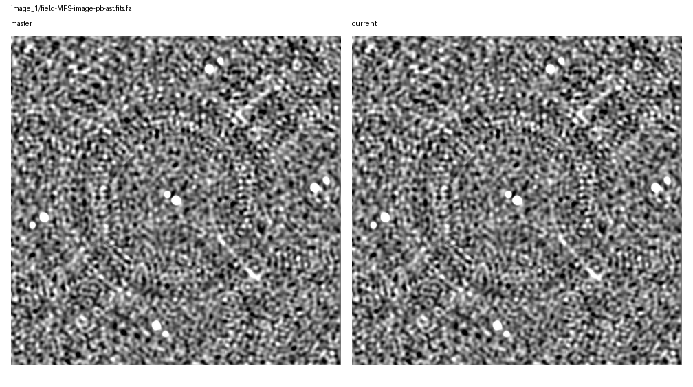
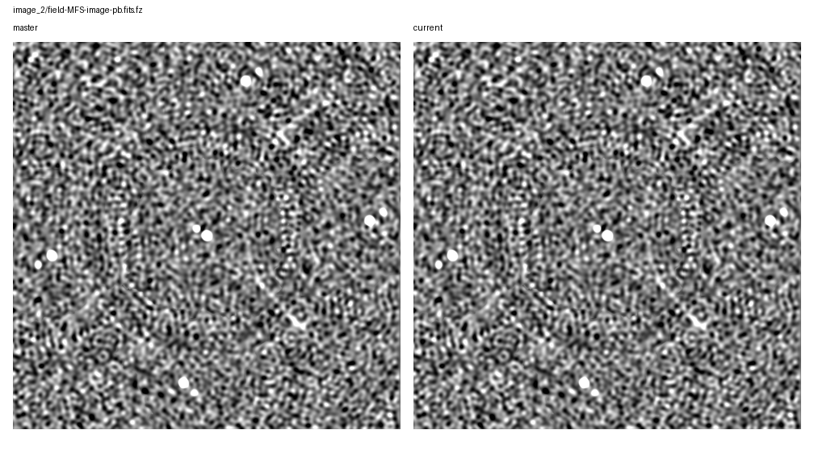
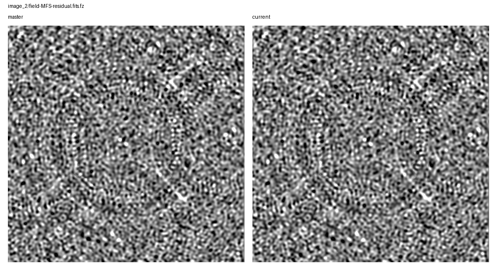
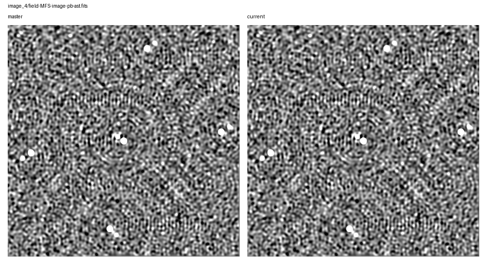
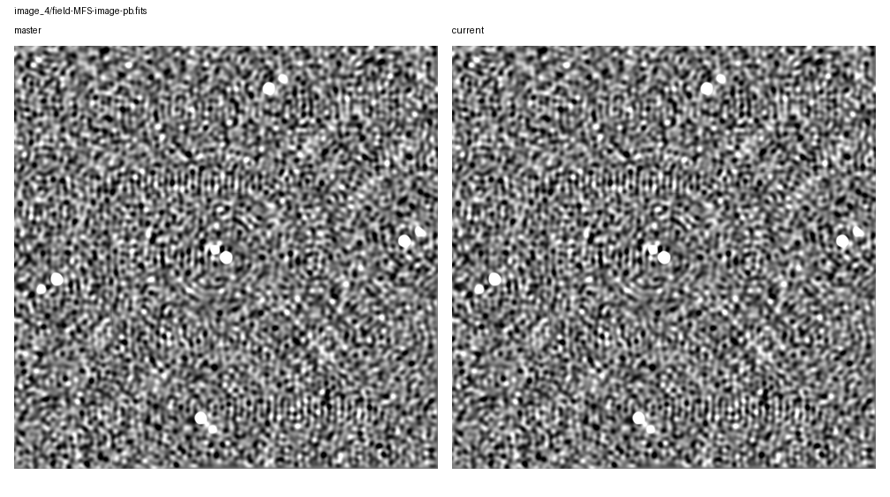
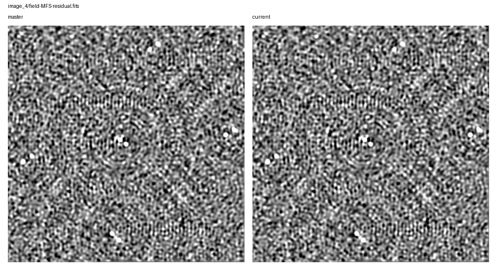

# Rapthor Branch Equivalence

Scenario: `benchmark-phase-only`
Run root: `/app/runs/rbe-phase-only-master-ref-20260705-integration-gate`

## Branch Runs

| Side | Ref | Return Code | Parset | Work Dir | Log | Input Snapshot |
| --- | --- | ---: | --- | --- | --- | --- |
| base | `master` | 0 | `/app/runs/master-benchmark-phase-only-manual/inputs/master_benchmark_phase_only.parset` | `/tmp/rbe-master-phase-only-work` | `/app/runs/rbe-phase-only-master-ref-20260705-integration-gate/base/rapthor-command.log` | parset: `inputs/base/master_benchmark_phase_only.parset`, strategy: `inputs/base/master_benchmark_phase_only_strategy.py` |
| current | `current` | 0 | `/app/runs/current-benchmark-phase-only-manual/inputs/current_benchmark_phase_only.parset` | `/tmp/rbe-current-phase-only-work` | `/app/runs/rbe-phase-only-master-ref-20260705-integration-gate/current/rapthor-command.log` | parset: `inputs/current/current_benchmark_phase_only.parset`, strategy: `inputs/current/current_benchmark_phase_only_strategy.py` |

## Comparison Summary

| Result | Ops | Records | FITS | Image HDUs | Table HDUs | H5 | Text | Diagnostics | Visuals |
| --- | ---: | ---: | ---: | ---: | ---: | ---: | ---: | ---: | ---: |
| fail | 12 | 12 | 28 | 24 | 4 | 8 | 37 | 4 | 20 |

## FITS Residual Metrics

| Product | Max Abs Delta | P99 Abs Delta | Residual RMS | RMS / Ref RMS | RMS / Ref MAD |
| --- | ---: | ---: | ---: | ---: | ---: |
| `field-MFS-model-pb.fits.fz` | 4.409e-01 | 0.000e+00 | 4.621e-03 | 1.215e+00 | n/a |
| `field-MFS-model-pb.fits.fz` | 2.314e-01 | 0.000e+00 | 3.443e-03 | 1.133e+00 | n/a |
| `field-MFS-model-pb.fits.fz` | 1.642e-01 | 0.000e+00 | 2.707e-03 | 9.758e-01 | n/a |
| `field-MFS-model-pb.fits` | 7.456e-02 | 0.000e+00 | 4.894e-05 | 2.482e-02 | n/a |
| `field-MFS-image-pb.fits.fz` | 6.172e-02 | 4.034e-04 | 1.959e-04 | 2.253e-03 | 4.231e-03 |
| `field-MFS-image-pb-ast.fits.fz` | 6.172e-02 | 4.034e-04 | 1.959e-04 | 2.253e-03 | 4.231e-03 |
| `field-MFS-residual.fits.fz` | 6.168e-02 | 3.966e-04 | 1.939e-04 | 4.210e-03 | 4.288e-03 |
| `field-MFS-image.fits.fz` | 6.168e-02 | 3.950e-04 | 1.926e-04 | 2.250e-03 | 4.247e-03 |
| `field-MFS-image-pb.fits.fz` | 5.214e-02 | 1.290e-04 | 8.314e-05 | 9.596e-04 | 1.818e-03 |
| `field-MFS-image-pb-ast.fits.fz` | 5.214e-02 | 1.290e-04 | 8.314e-05 | 9.596e-04 | 1.818e-03 |
| `field-MFS-image.fits.fz` | 5.199e-02 | 1.268e-04 | 8.230e-05 | 9.644e-04 | 1.836e-03 |
| `field-MFS-residual.fits.fz` | 5.199e-02 | 1.301e-04 | 8.696e-05 | 1.910e-03 | 1.947e-03 |
| `field-MFS-dirty.fits` | 1.868e-02 | 7.896e-03 | 2.037e-03 | 1.186e-02 | 1.322e-02 |
| `field-MFS-image-pb-ast.fits.fz` | 1.809e-02 | 2.847e-06 | 7.633e-06 | 9.061e-05 | 1.830e-04 |
| `field-MFS-image-pb.fits.fz` | 1.809e-02 | 2.846e-06 | 7.633e-06 | 9.060e-05 | 1.830e-04 |
| `field-MFS-image.fits.fz` | 1.773e-02 | 2.794e-06 | 7.479e-06 | 9.011e-05 | 1.830e-04 |
| `field-MFS-residual.fits.fz` | 1.773e-02 | 2.773e-06 | 7.477e-06 | 1.793e-04 | 1.835e-04 |
| `field-MFS-image-pb-ast.fits` | 4.474e-03 | 1.582e-03 | 4.638e-04 | 5.879e-03 | 1.643e-02 |
| `field-MFS-image-pb.fits` | 4.474e-03 | 1.582e-03 | 4.638e-04 | 5.879e-03 | 1.643e-02 |
| `field-MFS-image.fits` | 4.322e-03 | 1.530e-03 | 4.516e-04 | 5.802e-03 | 1.633e-02 |
| `field-MFS-residual.fits` | 4.322e-03 | 1.519e-03 | 4.499e-04 | 1.551e-02 | 1.629e-02 |
| `field-MFS-dirty.fits.fz` | 1.650e-03 | 2.706e-04 | 8.180e-05 | 4.760e-04 | 5.287e-04 |
| `field-MFS-dirty.fits.fz` | 1.466e-05 | 9.939e-06 | 4.155e-06 | 2.405e-05 | 2.683e-05 |
| `field-MFS-dirty.fits.fz` | 1.410e-05 | 9.902e-06 | 4.157e-06 | 2.419e-05 | 2.686e-05 |

## Image Diagnostics

| Operation | Sector | Field | Reference | Current | Delta | Relative Delta |
| --- | --- | --- | ---: | ---: | ---: | ---: |
| `image_1` | `sector_1` | `nsources` | 1.000e+01 | 1.000e+01 | 0.000e+00 | 0.000% |
| `image_1` | `sector_1` | `theoretical_rms` | 9.006e-03 | 9.006e-03 | 0.000e+00 | 0.000% |
| `image_1` | `sector_1` | `min_rms_flat_noise` | 1.987e-02 | 1.987e-02 | -5.774e-08 | -0.000% |
| `image_1` | `sector_1` | `median_rms_flat_noise` | 3.982e-02 | 3.982e-02 | -3.725e-09 | -0.000% |
| `image_1` | `sector_1` | `dynamic_range_global_flat_noise` | 2.296e+02 | 2.296e+02 | 6.912e-04 | 0.000% |
| `image_1` | `sector_1` | `min_rms_true_sky` | 2.038e-02 | 2.038e-02 | -3.725e-09 | -0.000% |
| `image_1` | `sector_1` | `median_rms_true_sky` | 4.061e-02 | 4.061e-02 | 0.000e+00 | 0.000% |
| `image_1` | `sector_1` | `dynamic_range_global_true_sky` | 2.239e+02 | 2.239e+02 | 4.092e-05 | 0.000% |
| `image_2` | `sector_1` | `nsources` | 1.100e+01 | 1.100e+01 | 0.000e+00 | 0.000% |
| `image_2` | `sector_1` | `theoretical_rms` | 9.006e-03 | 9.006e-03 | 0.000e+00 | 0.000% |
| `image_2` | `sector_1` | `min_rms_flat_noise` | 3.012e-02 | 3.014e-02 | 1.660e-05 | 0.055% |
| `image_2` | `sector_1` | `median_rms_flat_noise` | 4.365e-02 | 4.365e-02 | -2.682e-06 | -0.006% |
| `image_2` | `sector_1` | `dynamic_range_global_flat_noise` | 1.543e+02 | 1.542e+02 | -8.398e-02 | -0.054% |
| `image_2` | `sector_1` | `min_rms_true_sky` | 3.012e-02 | 3.014e-02 | 1.716e-05 | 0.057% |
| `image_2` | `sector_1` | `median_rms_true_sky` | 4.453e-02 | 4.452e-02 | -3.174e-06 | -0.007% |
| `image_2` | `sector_1` | `dynamic_range_global_true_sky` | 1.543e+02 | 1.542e+02 | -8.685e-02 | -0.056% |
| `image_3` | `sector_1` | `nsources` | 1.100e+01 | 1.100e+01 | 0.000e+00 | 0.000% |
| `image_3` | `sector_1` | `theoretical_rms` | 9.006e-03 | 9.006e-03 | 0.000e+00 | 0.000% |
| `image_3` | `sector_1` | `min_rms_flat_noise` | 3.066e-02 | 3.066e-02 | -9.835e-07 | -0.003% |
| `image_3` | `sector_1` | `median_rms_flat_noise` | 4.414e-02 | 4.414e-02 | -2.734e-06 | -0.006% |
| `image_3` | `sector_1` | `dynamic_range_global_flat_noise` | 1.523e+02 | 1.523e+02 | 1.247e-02 | 0.008% |
| `image_3` | `sector_1` | `min_rms_true_sky` | 3.065e-02 | 3.065e-02 | -7.171e-07 | -0.002% |
| `image_3` | `sector_1` | `median_rms_true_sky` | 4.503e-02 | 4.503e-02 | -1.259e-06 | -0.003% |
| `image_3` | `sector_1` | `dynamic_range_global_true_sky` | 1.523e+02 | 1.523e+02 | 1.117e-02 | 0.007% |
| `image_4` | `sector_1` | `nsources` | 1.100e+01 | 1.100e+01 | 0.000e+00 | 0.000% |
| `image_4` | `sector_1` | `theoretical_rms` | 9.006e-03 | 9.006e-03 | 0.000e+00 | 0.000% |
| `image_4` | `sector_1` | `min_rms_flat_noise` | 1.609e-02 | 1.606e-02 | -3.403e-05 | -0.211% |
| `image_4` | `sector_1` | `median_rms_flat_noise` | 2.723e-02 | 2.724e-02 | 4.709e-06 | 0.017% |
| `image_4` | `sector_1` | `dynamic_range_global_flat_noise` | 2.952e+02 | 2.958e+02 | 6.333e-01 | 0.215% |
| `image_4` | `sector_1` | `min_rms_true_sky` | 1.610e-02 | 1.606e-02 | -3.624e-05 | -0.225% |
| `image_4` | `sector_1` | `median_rms_true_sky` | 2.781e-02 | 2.781e-02 | 5.353e-06 | 0.019% |
| `image_4` | `sector_1` | `dynamic_range_global_true_sky` | 2.951e+02 | 2.958e+02 | 6.736e-01 | 0.228% |

## Visual Comparisons

### Image: `image_1/field-MFS-image-pb-ast.fits.fz`

### Image: `image_1/field-MFS-image-pb.fits.fz`

### Image: `image_1/field-MFS-residual.fits.fz`

### Image: `image_2/field-MFS-image-pb-ast.fits.fz`

### Image: `image_2/field-MFS-image-pb.fits.fz`

### Image: `image_2/field-MFS-residual.fits.fz`

### Image: `image_3/field-MFS-image-pb-ast.fits.fz`

### Image: `image_3/field-MFS-image-pb.fits.fz`

### Image: `image_3/field-MFS-residual.fits.fz`

### Image: `image_4/field-MFS-image-pb-ast.fits`

### Image: `image_4/field-MFS-image-pb.fits`

### Image: `image_4/field-MFS-residual.fits`

### Solution: `calibrate_1/fast_phase_dir[Patch_rich_centre].png`

![calibrate_1/fast_phase_dir[Patch_rich_centre].png](visual-comparisons/solutions/calibrate_1-fast_phase_dir-patch_rich_centre-.png.png)

### Solution: `calibrate_1/medium1_phase_dir[Patch_rich_centre].png`

![calibrate_1/medium1_phase_dir[Patch_rich_centre].png](visual-comparisons/solutions/calibrate_1-medium1_phase_dir-patch_rich_centre-.png.png)

### Solution: `calibrate_2/fast_phase_dir[Patch_0].png`

![calibrate_2/fast_phase_dir[Patch_0].png](visual-comparisons/solutions/calibrate_2-fast_phase_dir-patch_0-.png.png)

### Solution: `calibrate_2/medium1_phase_dir[Patch_0].png`

![calibrate_2/medium1_phase_dir[Patch_0].png](visual-comparisons/solutions/calibrate_2-medium1_phase_dir-patch_0-.png.png)

### Solution: `calibrate_3/fast_phase_dir[Patch_0].png`

![calibrate_3/fast_phase_dir[Patch_0].png](visual-comparisons/solutions/calibrate_3-fast_phase_dir-patch_0-.png.png)

### Solution: `calibrate_3/medium1_phase_dir[Patch_0].png`

![calibrate_3/medium1_phase_dir[Patch_0].png](visual-comparisons/solutions/calibrate_3-medium1_phase_dir-patch_0-.png.png)

### Solution: `calibrate_4/fast_phase_dir[Patch_patch_10_sector_1].png`

![calibrate_4/fast_phase_dir[Patch_patch_10_sector_1].png](visual-comparisons/solutions/calibrate_4-fast_phase_dir-patch_patch_10_sector_1-.png.png)

### Solution: `calibrate_4/medium1_phase_dir[Patch_patch_10_sector_1].png`

![calibrate_4/medium1_phase_dir[Patch_patch_10_sector_1].png](visual-comparisons/solutions/calibrate_4-medium1_phase_dir-patch_patch_10_sector_1-.png.png)

## Warnings

- output-record summary differs for calibrate_1
- output-record summary differs for calibrate_2
- output-record summary differs for calibrate_3
- output-record summary differs for calibrate_4

## Failures

- FITS image pixels differ for field-MFS-dirty.fits.fz: max_abs_delta=1.4659017324447632e-05, p99_abs_delta=9.939074516296387e-06, residual_rms=4.1553033187139075e-06
- FITS image pixels differ for field-MFS-image-pb-ast.fits.fz: max_abs_delta=0.018093821592628956, p99_abs_delta=2.8472859412431717e-06, residual_rms=7.632951753680657e-06
- FITS image pixels differ for field-MFS-image-pb.fits.fz: max_abs_delta=0.01809362042695284, p99_abs_delta=2.8461217880249023e-06, residual_rms=7.632750976209149e-06
- FITS image pixels differ for field-MFS-image.fits.fz: max_abs_delta=0.01772800786420703, p99_abs_delta=2.7939677238464355e-06, residual_rms=7.478624511124676e-06
- FITS std differs for field-MFS-model-pb.fits.fz: 0.0030398209669020232 != 0.0030222728774504212
- FITS rms differs for field-MFS-model-pb.fits.fz: 0.0030398246163428604 != 0.0030222771821346037
- FITS max differs for field-MFS-model-pb.fits.fz: 1.6757864952087402 != 1.6649447679519653
- FITS image pixels differ for field-MFS-model-pb.fits.fz: max_abs_delta=0.23139111697673798, p99_abs_delta=0.0, residual_rms=0.003443491680569351
- FITS image pixels differ for field-MFS-residual.fits.fz: max_abs_delta=0.017727395053952932, p99_abs_delta=2.773478627204895e-06, residual_rms=7.477155436964352e-06
- FITS image pixels differ for field-MFS-dirty.fits.fz: max_abs_delta=1.4096498489379883e-05, p99_abs_delta=9.901821613311768e-06, residual_rms=4.157352385970752e-06
- FITS image pixels differ for field-MFS-image-pb-ast.fits.fz: max_abs_delta=0.052141185849905014, p99_abs_delta=0.0001289844512939453, residual_rms=8.313823482811896e-05
- FITS image pixels differ for field-MFS-image-pb.fits.fz: max_abs_delta=0.05214239377528429, p99_abs_delta=0.00012901145964860916, residual_rms=8.313734194560421e-05
- FITS image pixels differ for field-MFS-image.fits.fz: max_abs_delta=0.05199414771050215, p99_abs_delta=0.0001267567276954651, residual_rms=8.230196253269788e-05
- FITS image pixels differ for field-MFS-model-pb.fits.fz: max_abs_delta=0.16418200731277466, p99_abs_delta=0.0, residual_rms=0.0027073598071415557
- FITS image pixels differ for field-MFS-residual.fits.fz: max_abs_delta=0.05199167225509882, p99_abs_delta=0.0001301020383834839, residual_rms=8.69619171110662e-05
- FITS image pixels differ for field-MFS-dirty.fits.fz: max_abs_delta=0.0016504526138305664, p99_abs_delta=0.00027060514781623943, residual_rms=8.17961024809948e-05
- FITS image pixels differ for field-MFS-image-pb-ast.fits.fz: max_abs_delta=0.06172359955962747, p99_abs_delta=0.0004034182149916885, residual_rms=0.00019586462348565944
- FITS image pixels differ for field-MFS-image-pb.fits.fz: max_abs_delta=0.061724577797576785, p99_abs_delta=0.0004034265875816345, residual_rms=0.00019586365755285446
- FITS image pixels differ for field-MFS-image.fits.fz: max_abs_delta=0.06168219819664955, p99_abs_delta=0.0003950074315071106, residual_rms=0.0001926285759140388
- FITS std differs for field-MFS-model-pb.fits.fz: 0.0038031024251028024 != 0.003790804264531334
- FITS rms differs for field-MFS-model-pb.fits.fz: 0.0038031066545765844 != 0.0037908077349081684
- FITS max differs for field-MFS-model-pb.fits.fz: 2.834251880645752 != 3.081184148788452
- FITS image pixels differ for field-MFS-model-pb.fits.fz: max_abs_delta=0.44093525409698486, p99_abs_delta=0.0, residual_rms=0.004621291971257653
- FITS image pixels differ for field-MFS-residual.fits.fz: max_abs_delta=0.061682650935836136, p99_abs_delta=0.000396579043008387, residual_rms=0.00019388541290395515
- FITS mean differs for field-MFS-dirty.fits: -0.0003435230627830375 != -0.00034176285842805397
- FITS image pixels differ for field-MFS-dirty.fits: max_abs_delta=0.018678363412618637, p99_abs_delta=0.007895916812121866, residual_rms=0.0020366133116040534
- FITS min differs for field-MFS-image-pb-ast.fits: -0.13746264576911926 != -0.1372925043106079
- FITS image pixels differ for field-MFS-image-pb-ast.fits: max_abs_delta=0.004474155604839325, p99_abs_delta=0.0015816949307918549, residual_rms=0.00046382398209233
- FITS min differs for field-MFS-image-pb.fits: -0.13746264576911926 != -0.1372925043106079
- FITS image pixels differ for field-MFS-image-pb.fits: max_abs_delta=0.004474155604839325, p99_abs_delta=0.0015816949307918549, residual_rms=0.00046382398209233
- FITS min differs for field-MFS-image.fits: -0.13742835819721222 != -0.13725827634334564
- FITS image pixels differ for field-MFS-image.fits: max_abs_delta=0.004321582615375519, p99_abs_delta=0.0015304760634899106, residual_rms=0.0004515789047116572
- FITS max differs for field-MFS-model-pb.fits: 2.8066883087158203 != 2.7986338138580322
- FITS image pixels differ for field-MFS-model-pb.fits: max_abs_delta=0.07455606386065483, p99_abs_delta=0.0, residual_rms=4.894167547328689e-05
- FITS min differs for field-MFS-residual.fits: -0.1397465467453003 != -0.13956958055496216
- FITS image pixels differ for field-MFS-residual.fits: max_abs_delta=0.004321552813053131, p99_abs_delta=0.0015194770134985443, residual_rms=0.0004498734825065053
- HDF5 numeric dataset differs for field-solutions-fast-phase.h5:sol000/phase000/val (max_abs=0.00160415)
- HDF5 numeric dataset differs for field-solutions.h5:sol000/phase000/val (max_abs=0.00160415)
- HDF5 numeric dataset differs for field-solutions-fast-phase.h5:sol000/phase000/val (max_abs=6.11638)
- HDF5 dataset differs for field-solutions-fast-phase.h5:sol000/source
- HDF5 numeric dataset differs for field-solutions.h5:sol000/phase000/val (max_abs=6.11638)
- HDF5 dataset differs for field-solutions.h5:sol000/source
- sky-model summary differs for calibration_skymodel.txt
- sky-model summary differs for calibrators_only_skymodel.txt
- sky-model summary differs for source_skymodel.txt
- sky-model summary differs for calibration_skymodel.txt
- sky-model summary differs for calibrators_only_skymodel.txt
- sky-model summary differs for source_skymodel.txt
- sky-model summary differs for sector_1.apparent_sky.txt
- FITS table column differs for sector_1.source_catalog.fits:PA
- ... 74 more failure(s)
