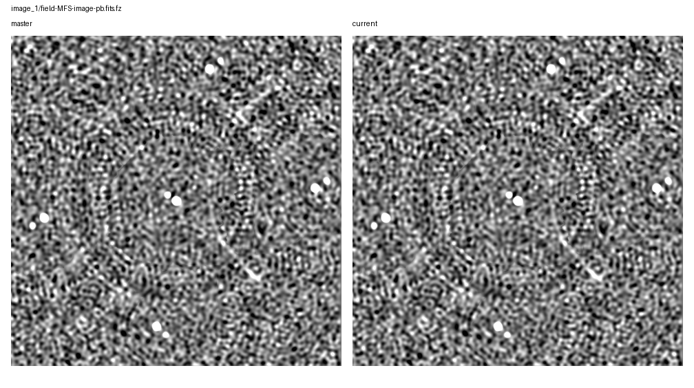
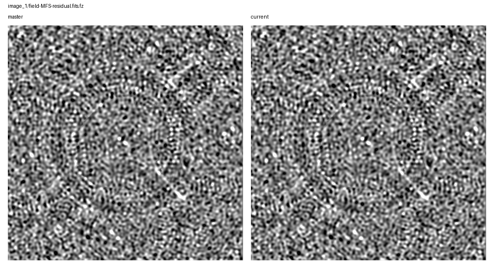

# Rapthor Branch Equivalence

Scenario: `changing-facet-carryover`
Run root: `/app/runs/rbe-changing-facet-carryover-20260705-v3`

## Branch Runs

| Side | Ref | Return Code | Parset | Work Dir | Log | Input Snapshot |
| --- | --- | ---: | --- | --- | --- | --- |
| base | `master` | 0 | `/app/docs/source/development/science_equivalence_runs/2026-07-05-changing-facet-carryover-master-ref/inputs/base/master_changing_facet_carryover.parset` | `/tmp/rbe-m-cf-v3-w` | `/app/runs/rbe-changing-facet-carryover-20260705-v3/base/rapthor-command.log` | parset: `inputs/base/master_changing_facet_carryover.parset`, strategy: `inputs/base/master_changing_facet_carryover_strategy.py` |
| current | `current` | 0 | `/app/docs/source/development/science_equivalence_runs/2026-07-05-changing-facet-carryover-master-ref/inputs/current/current_changing_facet_carryover.parset` | `/tmp/rbe-c-cf-v3-w` | `/app/runs/rbe-changing-facet-carryover-20260705-v3/current/rapthor-command.log` | parset: `inputs/current/current_changing_facet_carryover.parset`, strategy: `inputs/current/current_changing_facet_carryover_strategy.py` |

## Comparison Summary

| Result | Ops | Records | FITS | Image HDUs | Table HDUs | H5 | Text | Diagnostics | Visuals |
| --- | ---: | ---: | ---: | ---: | ---: | ---: | ---: | ---: | ---: |
| fail | 4 | 4 | 7 | 6 | 1 | 4 | 16 | 1 | 7 |

## FITS Residual Metrics

| Product | Max Abs Delta | P99 Abs Delta | Residual RMS | RMS / Ref RMS | RMS / Ref MAD |
| --- | ---: | ---: | ---: | ---: | ---: |
| `field-MFS-model-pb.fits.fz` | 2.377e-01 | 0.000e+00 | 3.502e-03 | 1.144e+00 | n/a |
| `field-MFS-dirty.fits.fz` | 1.443e-05 | 9.984e-06 | 4.168e-06 | 2.414e-05 | 2.693e-05 |
| `field-MFS-image-pb-ast.fits.fz` | 4.065e-06 | 2.861e-06 | 1.207e-06 | 1.432e-05 | 2.883e-05 |
| `field-MFS-image-pb.fits.fz` | 4.057e-06 | 2.861e-06 | 1.207e-06 | 1.432e-05 | 2.883e-05 |
| `field-MFS-image.fits.fz` | 4.053e-06 | 2.803e-06 | 1.183e-06 | 1.425e-05 | 2.883e-05 |
| `field-MFS-residual.fits.fz` | 3.979e-06 | 2.779e-06 | 1.174e-06 | 2.804e-05 | 2.871e-05 |

## Image Diagnostics

| Operation | Sector | Field | Reference | Current | Delta | Relative Delta |
| --- | --- | --- | ---: | ---: | ---: | ---: |
| `image_1` | `sector_1` | `nsources` | 1.000e+01 | 1.000e+01 | 0.000e+00 | 0.000% |
| `image_1` | `sector_1` | `theoretical_rms` | 9.006e-03 | 9.006e-03 | 0.000e+00 | 0.000% |
| `image_1` | `sector_1` | `min_rms_flat_noise` | 1.840e-02 | 1.840e-02 | -7.637e-08 | -0.000% |
| `image_1` | `sector_1` | `median_rms_flat_noise` | 3.997e-02 | 3.997e-02 | -3.725e-09 | -0.000% |
| `image_1` | `sector_1` | `dynamic_range_global_flat_noise` | 2.478e+02 | 2.478e+02 | 1.029e-03 | 0.000% |
| `image_1` | `sector_1` | `min_rms_true_sky` | 1.885e-02 | 1.885e-02 | -3.166e-08 | -0.000% |
| `image_1` | `sector_1` | `median_rms_true_sky` | 4.077e-02 | 4.077e-02 | 0.000e+00 | 0.000% |
| `image_1` | `sector_1` | `dynamic_range_global_true_sky` | 2.418e+02 | 2.418e+02 | 4.314e-04 | 0.000% |

## Visual Comparisons

### Image: `image_1/field-MFS-image-pb-ast.fits.fz`

### Image: `image_1/field-MFS-image-pb.fits.fz`

### Image: `image_1/field-MFS-residual.fits.fz`

### Solution: `calibrate_1/fast_phase_dir[Patch_0].png`

![calibrate_1/fast_phase_dir[Patch_0].png](visual-comparisons/solutions/calibrate_1-fast_phase_dir-patch_0-.png.png)

### Solution: `calibrate_1/medium1_phase_dir[Patch_0].png`

![calibrate_1/medium1_phase_dir[Patch_0].png](visual-comparisons/solutions/calibrate_1-medium1_phase_dir-patch_0-.png.png)

### Solution: `calibrate_2/fast_phase_dir[Patch_2].png`

![calibrate_2/fast_phase_dir[Patch_2].png](visual-comparisons/solutions/calibrate_2-fast_phase_dir-patch_2-.png.png)

### Solution: `calibrate_2/medium1_phase_dir[Patch_2].png`

![calibrate_2/medium1_phase_dir[Patch_2].png](visual-comparisons/solutions/calibrate_2-medium1_phase_dir-patch_2-.png.png)

## Warnings

- output-record summary differs for calibrate_1
- output-record summary differs for calibrate_2

## Failures

- FITS image pixels differ for field-MFS-dirty.fits.fz: max_abs_delta=1.4431774616241455e-05, p99_abs_delta=9.98377799987793e-06, residual_rms=4.1682144479227295e-06
- FITS image pixels differ for field-MFS-image-pb-ast.fits.fz: max_abs_delta=4.065223038196564e-06, p99_abs_delta=2.86102294921875e-06, residual_rms=1.2070779017178249e-06
- FITS image pixels differ for field-MFS-image-pb.fits.fz: max_abs_delta=4.056841135025024e-06, p99_abs_delta=2.86102294921875e-06, residual_rms=1.2070061413906675e-06
- FITS image pixels differ for field-MFS-image.fits.fz: max_abs_delta=4.0531158447265625e-06, p99_abs_delta=2.8032809495925903e-06, residual_rms=1.1826423452657169e-06
- FITS std differs for field-MFS-model-pb.fits.fz: 0.0030608898328251953 != 0.003085839344443902
- FITS rms differs for field-MFS-model-pb.fits.fz: 0.0030608936465511766 != 0.0030858436548701035
- FITS max differs for field-MFS-model-pb.fits.fz: 1.7052491903305054 != 1.6834800243377686
- FITS image pixels differ for field-MFS-model-pb.fits.fz: max_abs_delta=0.2376844808459282, p99_abs_delta=0.0, residual_rms=0.0035015987153325517
- FITS image pixels differ for field-MFS-residual.fits.fz: max_abs_delta=3.978610038757324e-06, p99_abs_delta=2.779066562652588e-06, residual_rms=1.1740580189591721e-06
- text product differs for sector_1_facets_ds9.reg
