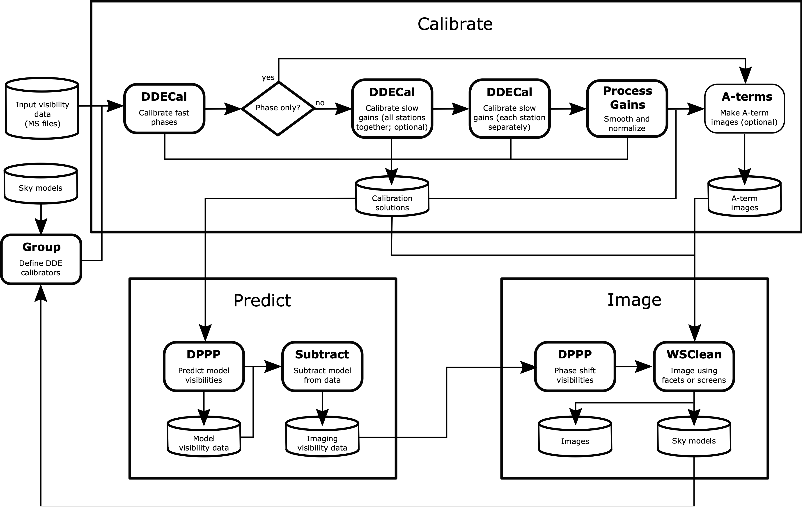

.. _structure:

General structure
=================

Rapthor is effectively a Python wrapper around CWL workflows. The wrapper sets up and executes the workflows as "operations" that then perform the actual processing. The overall structure of the processing as done by Rapthor is shown in the figure below. A full processing run is divided into a number of operations, each of which can be run (or not) as needed.

.. _rapthor-flowchart:

   Rapthor flowchart

The operations are described in detail in :ref:`operations`. Details of the Python and CWL code are given in :ref:`code`.
