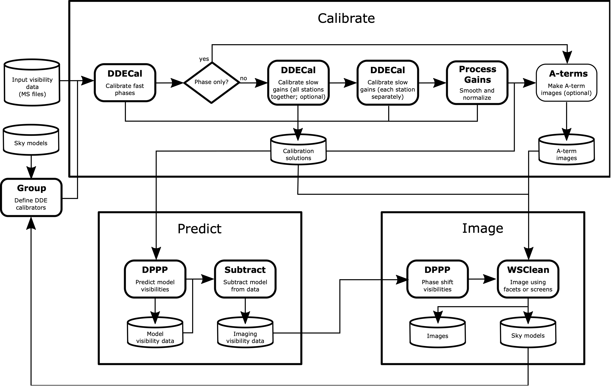

.. _structure:

General structure
=================

Rapthor is organized around Python operation classes and Prefect/Dask execution
flows. Each operation sets up the required inputs, runs the external radio
astronomy tools or helper scripts, records restart state, and publishes the
products needed by later operations. The overall structure of the processing as
done by Rapthor is shown in the figure below. A full processing run is divided
into a number of operations, each of which can be run (or not) as needed.

.. _rapthor-flowchart:

   Rapthor flowchart

The operations are described in detail in :ref:`operations`. Details of the
Python execution code and preserved CWL reference material are given in
:ref:`code`.
